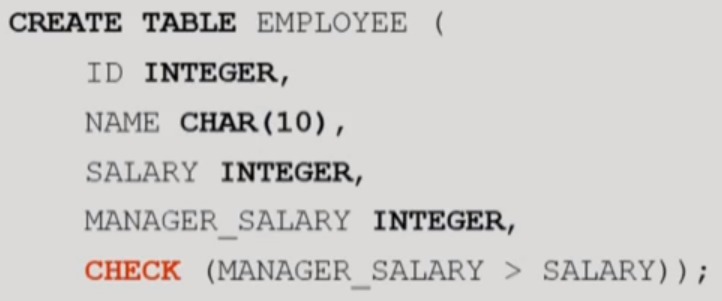

## 관계 대수와 SQL

#### 관계 데이터 모델

* 관계 해석(relational calculus)
  * 원하는 데이터만 명시하고 질의를 어떻게 수행할 것인가는 명시하지 않는 **선언적 언어**
* 관계 대수(relational algebra)
  * 어떻게 질의를 수행할 것인가를 명시하는 **절차적 언어**

 

#### 관계 대수  

 

* selection 연산자
  * 한 relation에서 selection condition을 만족하는 tuple들의 부분집합을 생성
  * 단항 연산자
  * 결과 relation의 차수는 입력 relation의 차수와 같다.
  * 결과 relation의 cardinality는 항상 원래 relation의 cardinality보다 같거나 작다.
    * cardinality : 중복도가 낮으면 cardinality가 높다고 표현하고 중복도가 높으면 cardinality가 높다고 표현한다. 전체 행에 대한 특정 컬럼의 중복 수치를 나타낸다. 주민등록번호는 cardinality가 높고 이름은 cardinality가 주민등록번호에 비해 상대적으로 낮다.
  * selection condition을 predicate라고 한다.
  * selection condituon은 비교 연산자와 부울 연산자를 포함할 수 있다.

 

* projection 연산자
  * 한 relation의 attribute들의 부분 집합
  * 결과로 생성되는 relation은 attribute list에 명시된 attribute만
  * selection의 결과 relation에는 중복 tuple이 존재할 수 없지만 projection의 결과 relation에는 중복된 tuple이 존재할 수 있다.
    * 중복을 제거하는데 연산이 오래 걸리기 때문에 사용자가 별도의 요구를 하지 않으면 projection에서 중복을 제거하지 않는다. projection은 중복이 허용된다.

 

* 집합 연산자
  * ralation이 tuple들의 집합이므로 기존 집합 연산이 relation에 적용
    * 합집합, 교집합, 차집합
  * **집합 연산자의 입력으로 사용되는 두 개의 relation은 합집합 호환(union compatible)이어야 함**
  * 이항 연산자  

 

* Cartesian product 연산자  

  

  

 

* 관계 대수의 완전성
  * 필수적인 연산자 외의 다른 관계 연산자들은 필수적인 관계 연산자를 두 개 이상 조합하여 표현할 수 있다.
  * 임의의 질의어가 적어도 필수적인 관계 대수 연산자들만큼의 표현력을 가지고 있으면 관계적으로 완전(relationally complete)하다고 말함

 

* join 연산자
  * 두 개의 relation으로부터 연관된 tuple들을 결합하는 연산자  

  

* 디비전은 아래의 예시에서 C에 해당되는 것을 모두 가지고 있는 tuple의 A를 뽑는 경우와 같은 케이스에 사용한다.
  * 운영체제, 네트워크 수업을 모두 들은 학생을 뽑는다거나 그런 경우에 사용할 수 있다.  

 

* 관계 대수의 한계
  * 산술 연산을 할 수 없다.
  * 집단 함수(aggregate function)을 지원하지 않는다.
  * 정렬을 나타낼 수 없다.
  * 데이터베이스를 수정할 수 없다.
  * project 연산의 결과에 중복된 tuple을 나타내는 것이 필요할 때가 있는데 이를 명시하지 못한다.

 

* 추가된 관계 대수 연산자
  * 집단 함수  
  
  * 그룹화   
  
  
  
  
  * 외부 조인
  
    * 상대 relation에 대응되는 tuple을 갖지 못하는 tuple이나 조인 attribute에 null값이 들어있는 tuple을 다루기 위해서 조인 연산을 확장한 조인
    * 두 relation에 대응되는 tuple들을 결합하면서 대응되는 tuple을 갖지 않는 tuple과 null 값을 갖는 tuple도 결과에 포함
    * 오른쪽 외부 조인, 왼쪽 외부 조인, 완전 외부 조인  
    
    
    
    
    
    

 

#### SQL 개요

* SQL 개요

  * SQL은 비절차적 언어(선언적 언어)이므로 사용자는 **자신이 원하는 바(what)**만 명시하며, 원하는 것을 **처리하는 방법(how)**는 명시할 수 없다.

  * 관계 DBMS는 사용자가 입력한 SQL문을 번역하여 사용자가 요구한 데이터를 찾는데 필요한 모든 과정 담당

  * 자연어에 가까운 구문을 사용하여 질의 표현 가능

  * 두 가지 인터페이스
    * 대화식 SQL(interactive SQL)
      * 내포된 SQL(embedded SQL)
  * SQL 구성 요소
    * 데이터 정의어
    * 데이터 조작어
    * 데이터 제어어  

    

  

 

#### 데이터 정의어와 무결성 제약조건

* 스키마의 생성과 제거
  * SQL2에서는 동일한 데이터베이스 응용에 속하는 relation, domain, 제약조건, view, 권한 등을 그룹화하기 위해서 스키마 개념을 지원  

 

* relation 정의
  * 원래는 domain을 만들고 나서 각각을 연결시켜야함  

 

* 제약조건
  * CHECK  

 

* 참조 무결성 제약조건 유지

 

* 무결성 제약조건의 추가 및 삭제

  

 

#### SELECT 문

* SELECT문

  * 관계 데이터베이스에서 정보를 검색하는 SQL문
  * 관계 대수의 Selection과 의미가 완전히 다르다.
  * 관계 대수의 Selection, projection, join, cartesian product 등을 결합한 것
  * 관계 데이터베이스에서 가장 자주 사용

  

  

  * SELECT 절과 FROM절만 필수적인 절이고 나머지는 선택사항
    * HAVING은 GROUP BY에 대한 조건

  

  * 별칭(alias)

    * 서로 다른 relation에 동일한 이름을 가진 attribute가 속해있을 때 attribute의 이름을 구분하는 방법

    

  * relation의 모든 attribute나 일부의 attribute 검색

  

  
  
  * 상이한 값들을 검색
  
  
  
  
  
  * 특정한 tuple들을 검색
  
  
  
  * 문자열 비교
  
  
  
  * 다수의 검색 조건
  
  
  
  
  
  * 범위를 사용한 검색
  
  
  
  * 리스트를 사용한 검색
  
  
  
  * 산술 연산자
  
  
  
  * null 값
    * null 값을 포함한 다른 값과 null 값을 +, - 등을 사용하여 연산하면 결과는 null
    * COUNT(*)를 제외한 집단 함수들은 null 값을 무시
    * 어떤 attribute에 들어있는 값이 null인가 비교하기 위해서 `DNO = NULL` 처럼 나타내면 안 됨

  

  

  

  * ORDER BY 절
  
    * 사용자가 SELECT문에 질의 결과의 순서를 명시하지 않으면 relation에 tuple들이 삽입된 순서대로 사용자에게 제시
    * ORDER BY 절에서 하나 이상의 attribute를 사용하여 검색 결과 정렬 가능
    * SELECT 문에서 가장 마지막에 사용되는 절
    * 디폴트 정렬 순서는 오름차(ASC)
    * DESC를 지정하여 내림차순으로 지정 가능
    * null은 오름차순에서 가장 마지막, 내림차순에서 가장 앞
    * SELECT 절에 사용한 attribute를 사용해서 정렬해야함
  
    
  
  * 집단 함수
  
    * 데이터베이스에서 검색된 여러 tuple들의 집단에 적용되는 함수
    * 한 relation의 한 개의 attribute에 적용되어 단일 값을 반환
    * SELECT 절과 HAVING 절에만 나타날 수 있음
    * COUNT(*)를 제외하고는 null값을 제거한 후 남아있는 값들에 대해서 집단 함수의 값을 구함
    * COUNT(*)는 결과 relation의 모든 행들의 총 개수를 구하는 반면에 COUNT(attribute)는 해당 attribute에서 null값이 아닌 값들의 개수를 구함
    * DISTINCT가 집단함수 앞에 사용되면 집단함수가 적용되기 전에 먼저 중복 제거
  
    
  
    
  
  * 그룹화
  
    * GROUP BY 절에 사용된 attribute에 동일한 값을 갖는 tuple들이 각각 하나의 그룹으로 묶임
    * 이 attribute를 grouping attribute라고 함
    * 각 그룹에 대하여 결과 relation에 하나의 tuple 생성
    * SELECT 절에는 각 그룹마다 하나의 값을 갖는 attribute, 집단 함수, 그룹화에 사용된 attribute만 나타날 수 있음
  
    

    
  
  * HAVING절
    * 어떤 조건을 만족하는 그룹에 대해서만 집단 함수를 적용할 수 있음
    * 각 그룹마다 하나의 값을 갖는 attribute를 사용하여 각 그룹이 만족해야하는 조건 명시
    * 그룹화 attribute에 같은 값을 갖는 tuple들의 그룹에 대한 조건을 나타내고, 이 조건을 만족하는 그룹들만 질의 결과에 나타남
    * HAVING절에 나타나는 attribute는 반드시 GROUP BY절에 나타나거나 집단 함수에 포함
  
    
  
  * 집합 연산
  
    * 집합 연산을 적용하려면 두 relation이 합집합 호환성을 가져야 한다.
      * UNION(합집합), EXCEPT(차집합), INTERSECT(교집합)
      * 뒤에 ALL이 붙으면 중복된 것 포함하는
  
    
  
  * 조인
  
    * 두 개 이상의 relation으로부터 연관된 tuple들을 결합
    * 조인의 일반적인 형식은 FROM절에 두 개 이상의 relation들이 열거되고, 두 relation에 속하는 attribute들을 비교하는 조인 조건이 WHERE절에 포함
    * 조인 조건은 두 relation 사이에 속하는 attribute 값들을 비교 연산자로 연결
    * 가장 흔히 사용되는 연산자는 =
    * 조인 조건이 틀리거나 없는 경우에는 cartesian 곱이 생성됨
  
    
  
  * 자체 조인(self join)
  
    * 한 relation에 속하는 tuple을 동일한 relation에 속하는 tuple들과 조인하는 것
    * 한 relation이 접근되지만 FROM절에 두 relation이 참조되는 것처럼 나타내기 위해서 그 relation에 대한 별칭을 두 개 지정해야한다.
  
    
  
    
  
  * 중첩 질의(nested query)
  
    * 외부 질의의 WHERE절에 다시 SELECT...FROM...WHERE 형태로 포함된 SELECT문
    * 부질의(subquery)라고 함
    * INSERT, DELETE, UPDATE문에도 사용될 수 있음
    * 중첩 질의의 결과로 한 개의 스칼라값, 한 개의 attribute로 이루어진 relation, 여러 attribute로 이루어진 relation이 반환될 수 있음
  
    
  
  * 한 개의 attribute로 이루어진 relation이 반환되는 경우
  
    * 중첩 질의의 결과로 한 개의 attribute로 이루어진 다수의 tuple이 반환될 수 있음
    * 외부 질의의 WHERE절에서 IN, ANY(SOME), ALL, EXISTS와 같은 연산자를 사용해야함
    * 키워드 IN은 한 attribute가 값들의 집합에 속하는가를 테스트할 때 사용
    * 한 attribute가 값들의 집합에 속하는 하나 이상의 값들과 어떤 관계를 갖는가를 테스트하는 경우 ANY
    * 한 attribute가 값들의 집합에 속하는 모든 값들과 어떤 관계를 갖는가를 테스트하는 경우 ALL
  
    
  
    
  
    
  
  * 상관 중첩 질의(correlated nested query)
  
    * 중첩 질의의 WHERE절에 있는 predicate에서 외부 질의에 선언된 relation의 일부 attribute를 참조하는 질의
  
    

 

* INSERT문

  * 기존의 relation에 tuple을 삽입
  * 참조되는 relation에 tuple이 삽입되는 경우에는 참조 무결성 제약조건의 위배가 발생하지 않으나 참조하는 relation에 tuple이 삽입되는 경우는 위배될 수 있다.
  * relation에 한 번에 한 tuple을 삽입하는 것

  

  

  * relation에 한 번에 여러 개의 tuple을 삽입하는 것

  

  

 

* DELETE문

  * 삭제 연산은 한 relation으로부터 한 개 이상의 tuple 삭제
  * 참조되는 relation의 삭제 연산의 결과로 참조 무결성 제약조건이 위배될 수 있지만 참조하는 relation에서 tuple을 삭제하면 참조 무결성 제약조건을 위배하지 않음  

  

 

* UPDATE문

  * 한 relation에 들어있는 tuple들의 attribute값을 수정
  * 기본 키나 외래 키에 속하는 attribute의 값이 수정되면 참조 무결성 제약조건 위배할 수 있음

  

  

 

#### 트리거와 주장

* 트리거

  * 명시된 이벤트(데이터베이스의 갱신)가 발생할 때마다 DBMS가 자동적으로 수행하는, 사용자가 정의하는 문(프로시저)
  * 데이터베이스의 무결성을 유지하기 위한 일반적이고 강력한 도구
  * 트리거를 이벤트-조건-동작(ECA) 규칙이라고도 부름
  * SQL3 표준에 포함되었으며 대부분 상용 관계 DBMS에서 제공됨

  

  

* 연쇄적으로 활성화되는 트리거

  * 하나의 트리거가 활성화되어 이 트리거 내의 한 SQL문이 수행되고, 그 결과로 다른 트리거를 활성화하여 그 트리거 내의 SQL문이 수행될 수 있음

* 주장(assertion)

  * 제약조건을 위반하는 연산이 수행되지 않도록 함  

    

  

  

 

#### 내포된 SQL(embedded SQL)

* ESQL/C
  * SQL문에 포함된 C 프로그램의 변수를 호스트 변수(host variable)라고 부름

