# 4. 관계 대수와 SQL

## 관계 데이터 모델에서 지원되는 두 가지 정형적인 언어

- **관계 해석** relational calculus
  - 원하는 데이터만 명시하고 질의를 어떻게 수행할 것인가는 명시하지 않는 선언적인 언어 
  - WHAT에 대한 것만 명세
- **관계 대수** relational algebra
  - 어떻게 질의를 수행할 것인가를 명시하는 절차적인 언어
  - WHAT 뿐만 아니라 HOW도 명세
  - 관계 대수는 상용 관계 DBMS들에서 널리 사용되는 SQL의 이론적인 기초
  - 관계 대수는 SQL을 구현하고 최적화하기 위해 DBMS의 내부 언어로서도 사용됨

관계 해석이 WHAT만 해도 되니까 더 좋음

관계 대수가 더 High level의 개념

## SQL

- 상용 관계는 DBMS 들의 사실상의 표준 질의어인 SQL을 이해하고 사용할 수 있는 능력은 매우 중요함
- 사용자는 SQL을 사용하여 관계 데이터베이스에 릴레이션을 정의하고, 관계 데이터베이스에서 정보를 검색하고, 관계 데이터베이스를 갱신하며, 여러 가지 무결성 제약조건들을 명시할 수 있음

관계 해석, 관계 대수 모두 표현

## 4.1 관계 대수

algebra 엘지브라

- 기존의 릴레이션들로부터 새로운 릴레이션을 생성
- 릴레이션이나 관계 대수식(이것의 결과도 릴레이션임)에 연산자들을 적용하여 보다 복잡한 관계 대수식을 점차적으로 만들 수 있음
- 기본적인 연산자들의 집합으로 이루어짐
- 산술 연산자와 유사하게 단일 릴레이션이나 두 개의 릴레이션을 입력으로 받아 하나의 결과 릴레이션을 생성
- 결과 릴레이션은 또 다른 관계 연산자의 입력으로 사용될 수 있음

### 관계 연산자들의 종류와 표기법

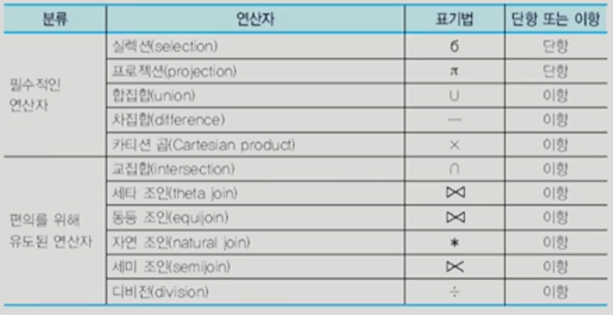

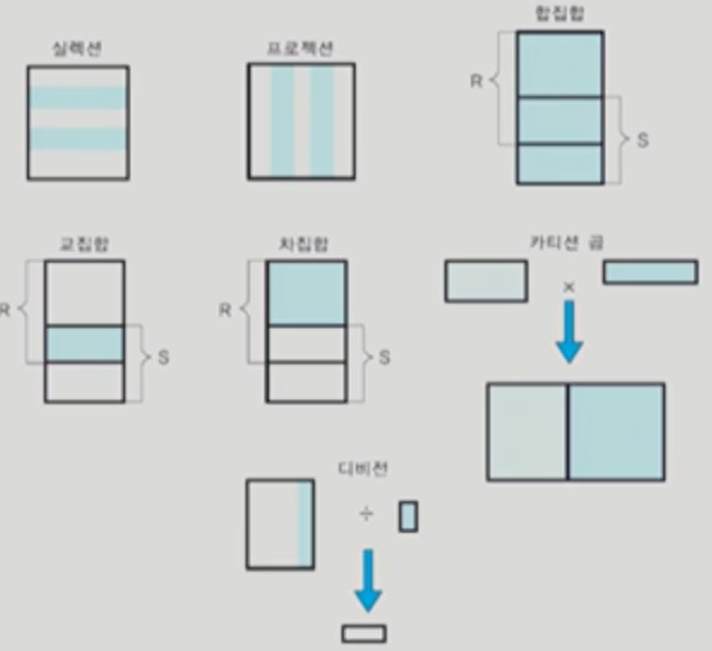

DBMS가 처리하고 연산

#### 셀렉션 연산자

- 한 릴레이션에서 셀렉션 조건(selection condition)을 만족하는 투플들의 부분 집합을 생성함

- 단항 연산자

- 결과 릴레이션의 차수는 입력 릴레이션의 차수와 같음

- 결과 릴레이션의 카디날리티는 항상 원래 릴레이션의 카디날리티보다 작거나 같음

- 셀렉션 조건을 프레디키트(predicate, 술어, 술어식)라고도 함

- 셀렉션 조건은 일반적으로 릴레이션의 임의의 애트리뷰트와 상수, =, <>, <=, <, >=, > 등의 비교 연산자, AND, OR, NOT 등의 부울 연산자를 포함할 수 있음

  

#### 프로젝션 연산자

- 한 릴레이션의 애트리뷰트의 부분 집합을 구함

- 결과로 생성되는 릴레이션은 <애트리부트 리스트>에 명시된 애트리뷰트들만 가짐

  셀렉션의 결과 릴레이션에는 중복 투플이 존재할 수 없지만, 프로젝션 연산의 결과 릴레이션에는 중복된 투플들이 존재할 수 있음

- 컬럼 정함

- ex) 직급을 검색하라 => 중복 제거해서 대리, 과장, 부장, 사원, 사장 등 한개씩만 나오게 함

- 중복 제거하면 시간 오래걸리기때문에 사용자가 원하지 않는 이상 중복 제거하지 않음

#### 집합 연산자

- 릴레이션이 투플들의 집합이기 때문에 기존의 집합 연산이 릴레이션에 적용됨
- 세 가지 집합 연산자: 합집합, 교집합, 차집합 연산자
- 집합 연산자의 입력으로 사용되는 두 개의 릴레이션은 합집합 호환(union compatible)이어야 함
- 이항 연산자
- 아무 릴레이션이나 합집합 안됨

##### 합집합 호환

- 두 릴레이션 R1(A1, A2, ..., An)과 R2(B1, B2, ..., Bm)이 합집합 호환일 필요 충분 조건은 n=m이고, 모든 1<=i<=n에 대해 domain(Ai)=domain(Bi)

##### 차집합 연산자

- 두 릴레이션 R과 S의 차집합 R - S는 R에는 속하지만 S에는 속하지 않은 투플들로 이루어진 릴레이션
- 결과 릴레이션의 차수는 R 또는 S의 차수와 같으며, 결과 릴레이션의 애트리뷰트 이름들을 R의 애트리뷰트들의 이름과 같거나 S의 애트리뷰트들의 이름과 같음

##### 카티션 곱 연산자

- 카다날리티가 i인 릴레이션 R(A1, A2, ..., An)과 카디날리티가 j인 릴레이션 S(B1, B2, ..., Bn)의 카티션 곱 R x S는 차수가 n+m이고, 카디날리티가 i*j이고, 애트리뷰트가 (A1, A2, ..., An, B1, B2, ..., Bm)이며, 과 S의 투플들의 모든 가능한 조합으로 이루어진 릴레이션
- 카티션 곱의 결과 릴레이션의 크기가 매우 클 수 있으며, 사용자가 실제로 원하는 것은 카티션 곱의 결과 릴레이션의 일부인 경우가 대부분이므로 카티션 곱 자체는 유용한 연산자가 아님

#### 관계 대수의 완전성

- 셀력션, 프로젝션, 합집합, 차집합, 카티션 곱은 관계 대수의 필수적인 연산자
- 다른 관계 연산자들은 필수적인 관계 연산자를 두 개 이상 조합하여 표현할 수 있음
- 임의의 질의어가 적어도 필수적인 관계 대수 연산자들만큼의 표현력을 갖고 있으며 관계적으로 오나전(relationally complete)하다고 말함

#### 조인 연산자

- 두 개의 릴레이션으로부터 연관된 투플들을 결합하는 연산자
- 관계 데이터베이스에서 두 개 이상의 릴레이션들의 관계를 다루는데 매우 중요한 연산자
- 세타 조인(theta join), 동등 조인(equijoin, 가장 많이 사용), 자연 조인(natural join), 외부 조인(outer join), 세미 조인(semi join) 등

##### 세타 조인과 동등 조인

- 두 릴레이션 R(A1, A2, ..., An)과 S(B1, B2, ..., Bm)의 세타 조인의 결과는 차수가 n+m이고, 애트리뷰트가 (A1, A2, ..., An, B1, B2, ..., Bm)이며, 조인 조건을 만족하는 튜플들로 이루어진 릴레이션

- 세타는 {=, <>, <=, <, >=, >} 중의 하나
- 동등 조인은 세타 조인 중에서 비교 연산자가 =인 조인

##### 자연 조인

- 동등 조인의 결과 릴레이션에서 조인 애트리뷰트를 제외한 조인
- 여러 가지 조인 연산자들 중에서 가장 자주 사용됨
- 실제로 관계 데이터베이스에서 대부분의 질의는 셀렉션, 프로젝션, 자연 조인으로 표현 가능

#### 디비전 연산자

- 차수가 n+m인 릴레이션 R(A1, A2, ..., An, B1, B2, ..., Bm)과 차수가 m인 릴레이션 S(B1, B2, Bm)의 디비전 R/S는 차수가 n이고,  S에 속하는 모든 튜플 u에 대하여 튜플 tu(튜플t와 튜플 u를 결합한 것)가  R에 존재하는 튜플 t들의 집합

### 관계 대수의 한계

- 관계 대수는 산술 연산을 할 수 없음
- 집단 함수(aggregate function)를 지원하지 않음
- 정렬을 나타낼 수 없음
- 데이터베이스를 수정할 수 없음
- 프로젝션 연산의 결과에 중복된 튜플을 나타내는 것이 필요할 때가 있는데 이를 명시하지 못함

#### 추가된 관계 대수 연산자

##### 외부 조인

- 상대 릴레이션에서 대응되는 튜플을 갖지 못하는 튜플이나 조인 애트리뷰트에 널값이 들어 있는 튜플들을 다루기 위해서 조인 연산을 확장한 조인
- 두 릴레이션에서 대응되는 튜플들을 결합하면서, 대응되는 튜플을 갖지 않는 튜플과 조인 애트리뷰트에 널값을 갖는 튜플도 결과에 포함시킴
- 왼쪽 외부 조인(left outer join), 오른쪽 외부 조인(right outer join), 완전 외부 조인(full outer join)

- 왼쪽 외부 조인
  - 릴레이션 R과 S의 왼쪽 외부 조인 연산은 R의 모든 튜플들을 결과에 포함시키고, 만일 릴레이션 S에 관련된 튜플이 없으면 결과 릴레이션에서 릴레이션 S의 애트리뷰트들을 널값으로 채움
- 오른쪽 외부 조인
  - 릴레이션 R와 S의 오른쪽 외부 조인 연산은 S의 모든 튜플들을 결과에 포함시키고, 만일 릴레이션 R에 관련된 튜플이 없으면 결과 릴레이션에서 릴레이션 R의 애트리뷰트들은 널값으로 채움

- 완전 외부 조인
  - 릴레이션 R와 S의 완전 외부 조인 연산은 R과 S의 모든 튜플들을 결과에 포함시키고, 만일 상대 릴레이션에 관련된 튜플이 없으면 결과 릴레이션에서 상대 릴레이션의 애트리뷰트들은 널값으로 채움

## 4.2 SQL 개요

- SQL은 현재 DBMS 시장에서 관계 DBMS가 압도적인 우위를 차지하는데 중요한 요인의 하나
- SQL은 IBM 연구소에서 1974년에 **System R**이라는 관계 DBMS 시제품을 연구할 때 관계 대수와 관계 해석을 기반으로, 집단 함수, 그룹화, 갱신 연산 등을 추가하여 개발된 언어
- 1986년에 ANSI(미국 표준 기구)에서 SQL 표준을 채택함으로써 SQL이 널리 사용되는데 기여
- 다양한 상용 관계 DBMS마다 지원하는 SQL 기능에 다소 차이가 있음
- 본 책에서는 SQL2를 따름
- SQL은 비절차적 언어(선언적 언어)이므로 사용자는 자신이 원하는 바(What)만 명시하며,  원하는 것을 처리하는 방법(How)은 명시할 수 없음
- 관계 DBMS는 상요자가 입력한 SQL문을 번역하여 사용자가 요구한 데이터를 찾는데 필요한 모든 과정을 담당
- 자연어에 가까운 구문을 사용하여 질의를 표현할 수 있음
- 두 가지 인터페이스
  - 대화식 SQL(interactive SQL)
  - 내포된 SQL(embedded SQL)

### SQL 발전 역사

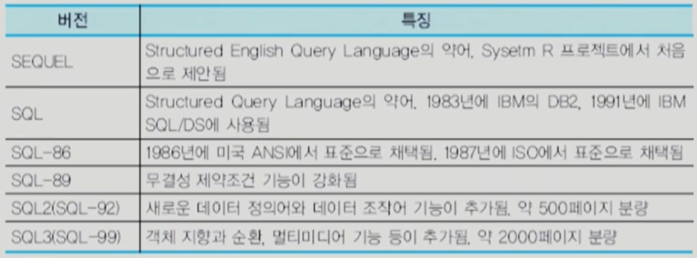

### SQL의 구성요소

- 데이터 정의어
- 데이터 조작어
- 데이터 제어어

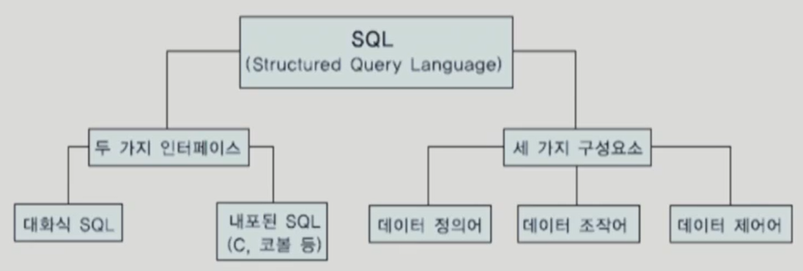

- 데이터 조작어의 기능

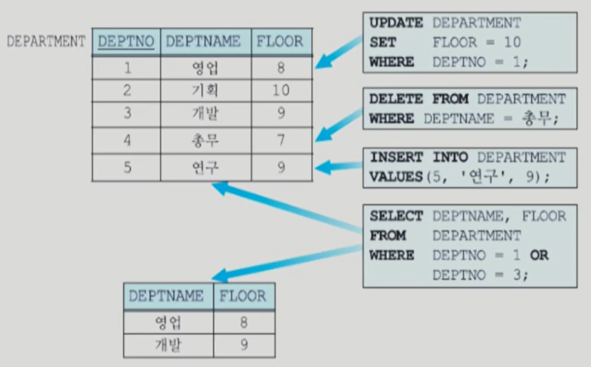

## 4.3 데이터 정의어와 무결성 제약조건

### 데이터 정의어의 종류

- 스키마 만들기

- CREATE 생성, ALTER 변경, DROP 제거 

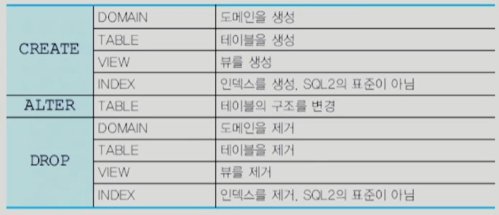

- 스키마의 생성과 제거
  - SQL2에서는 동일한 데이터베이스 응용에 속하는 릴레이션, 도메인, 제약조건, 뷰, 권한 등을 그룹화하기 위해서 스키마 개념을 지원
  - CREATE SCHEMA MY_DB AUTHORIZATION kim;
  - DROP SCHEMA MY_DB RESTRICT;
  - DROP SCHEMA MY_db CASCADE;

- 릴레이션 정의

  - CREATE TABLE MY_DB;

  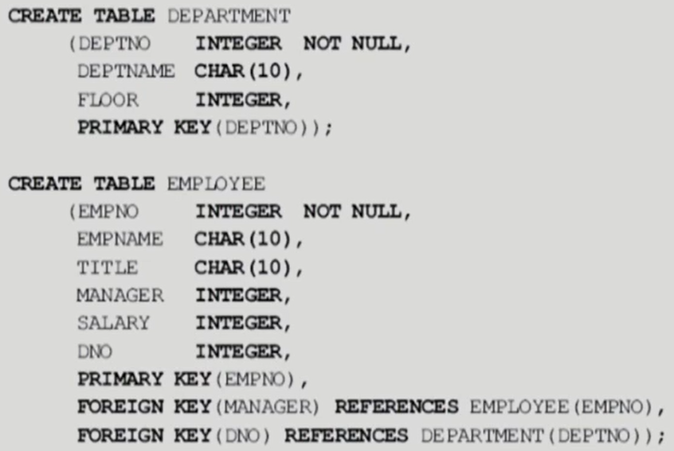

- 데이터 타입

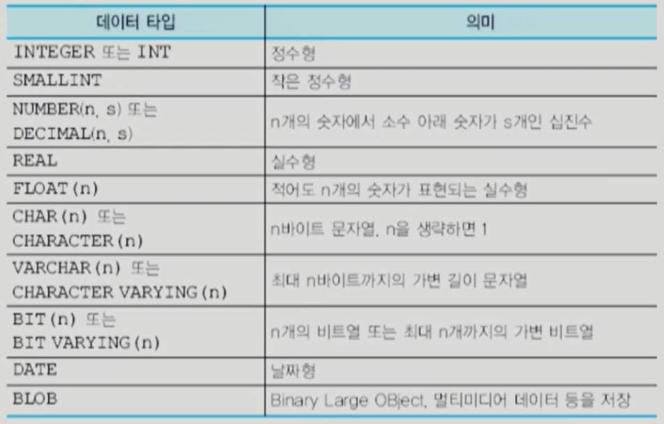

- **릴레이션 제거**

  DROP TABLE DEPARTMENT;

- **ALTER TABLE**

  ALTER TABLE EMPLOYEE ADD PHONE CHAR(13);

- **인덱스 생성**

  CREATE INDEX EMPDNO_IDX ON EMPLOYEE(DNO);

- **도메인 생성**

  CREATE DOMAIN DEPTNAME CHAR(10) DEFAULT '개발';

- 제약 조건
  - NOT NULL, DEFAULT
  - 이하, 이상 등
  - IN 어디 안에
  - 상수값, 조건을 만족하는가
  - CHECK 

- 참조 무결성 제약조건 유지
  - NO ACTION 아무것도 하지마라

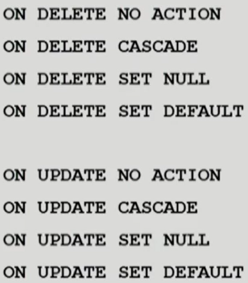

- 무결성 제약조건의 추가 및 삭제

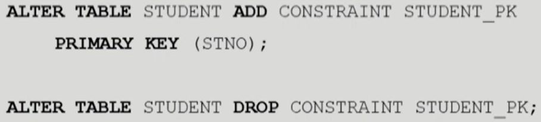

## 4.4 SELECT 문

- 관계 데이터베이스에서 정보를 검색하는 SQL문
- 관계 대수의 셀렉션과 의미가 완전히 다름
- 관계 대수의 셀렉션, 프로젝션, 조인, 카티션 곱 등을 결합한 것
- 관계 데이터베이스에서 가장 자주 사용됨
- 여러 가지 질의들의 결과를 보이기 위해서 다음과 같은 관계 데이터베이스 상태를 사용함

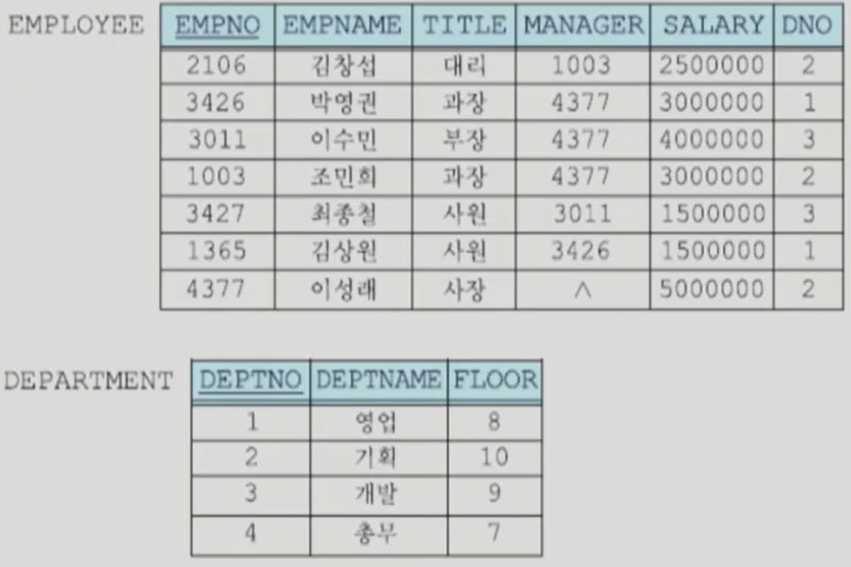

- 기본적인 SQL 질의

  - SELECT절과 FROM절만 필수적인 절이고, 나머지는 선택 사항

    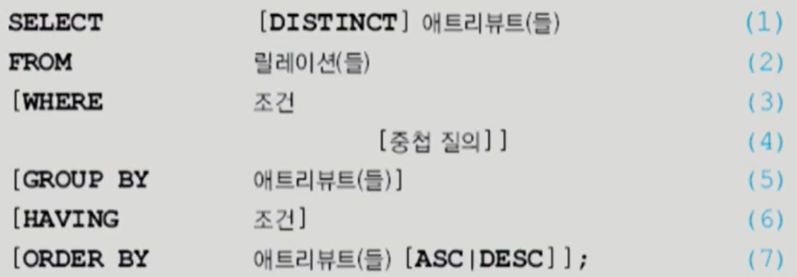

### 별칭 alias

- 서로 다른 릴레이션에 동일한 이름을 가진 애트리뷰트가 속해 있을 때 애트리뷰트의 이름을 구분하는 방법

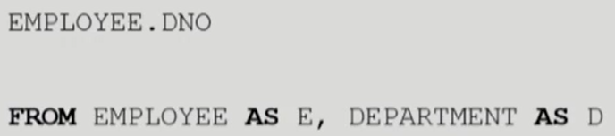

EMPLOYEE를  E, DEPARTMENT를 D라고 하자

### 검색

- 릴레이션의 모든 애트리뷰트나 일부 애트리뷰트들을 검색
  - SELECT * FROM DEPARTMENT; (전부)
  - SELECT DEPTONO, DEPTNAME FROM DEPARTMENT;(일부)

- 상이한 값들을 검색
  - SELECT TITLE FROM EMPLOYEE; 중복 허용
  - SELECT DISTINCT TITLE FROM DEMPLOYEE; 중복 제외
- 특정한 튜플들의 검색
  - SELECT * FROM EMPLOYEE WHERE DNO=2;
- 문자열 비교
  - SELECT EMPNAME, TITLE, DNO FROM EMPLOYEE WHERE EMPNAME LIKE '이%';  이로 시작
- 다수의 검색
  - SELECT FLOOR FROM DEPARTMENT WHERE DEPARTMENT='영업' AND DEPARTMENT='개발'; => 잘못된 조건(DEPTNAME 같이 AND로 못 묶음
- 부정 검색 조건
  - SELECT EMPNAME, SALARY FROM EMPLOYEE WHERE TITLE='과장' AND DNO <> 1;
- 범위를 사용한 검색
  - WHERE SALARY BETWEEN 3000000 AND 4500000; => 이해하기 더 쉬움
  - WHERE SALARY >= 3000000 AND SALARY <= 4500000;

- 리스트를 사용한 검색
  - SELECT * FROM EMPLOYEE WHERE DNO IN(1, 3);
  - 1 또는 3인 DNO
- SELECT절에서 산술 연산자(+, -, *, /) 사용
  - SELECT EMPNAME, SALARY, SALARY * 1.1 AS NEWSALARY FROM EMPLOYEE WHERE TITLE='과장';
  - NEWSALARY 새로 정의

#### 널값

- 널값을 포함한 다른 값과 널값을 +, - 등을 사용하여 연산하면 결과는 널
- COUNT(*)를 제외한 집단 함수들은 널값을 무시
- 어떤 애트리뷰트에 들어 있는 값이 널인가 비교하기 위해서 'DNO=NULL'처럼 나타내면 안됨

- unknown에 대한 연산

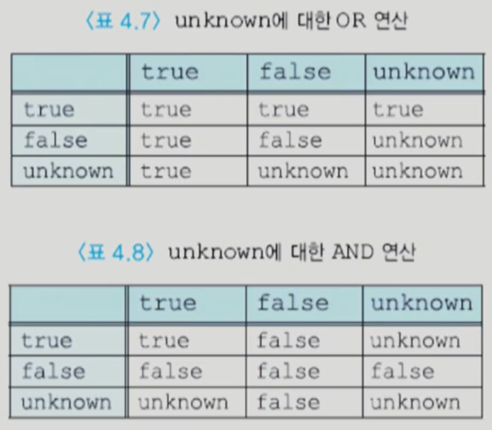

#### ORDER BY 절

- 사용자가 SELECT문에서 질의 결과의 순서를 명시하지 ㅇ낳으면 릴레이션에 튜플들이 삽입된 순서대로 사용자에게  제시됨
- ORDER BY절에서 하나 이상의 애트리뷰트를 사용하여 검색 결과를 정렬할 수 있음
- SELECT문에서 가장 마지막에 사용되는 절
- 디폴트 정렬 순서는 오름차순(ASC)
- DESC를 지정하여 정렬 순서를 내림차순으로 지정할 수 있음
- 널값은 오름차순에서는 가장 마지막에 나타나고, 내림차순에서는 가장 앞에 나타남
- SELECT절에 명시한 애트리뷰트들을 사용해서 정렬해야 함

#### 집단 함수

- 데이터베이스에서 검색된 여러 튜플들의 집단에 적용되는 함수
- 한 릴레이션의 한 개의 애트리뷰트에 적용되어 단일 값을 반환
- SELECT절과 HAVING절에만 나타날 수 있음
- COUNT(*)를 제외하고는 널값을 제거한 후 남아 있는 값들에 대해서 집단 함수의 값을 구함
- COUNT(*)는 결과 릴레이션의 모든 행들의 총 개수를 구하는 반면에 COUNT(애트리뷰트)는 해당 애트리뷰트에서 널값이 아닌 값들의 개수를 구함
- 키워드 DISTINCT가 집단 함수 앞에 사용되면 집단 함수가 적용되기 전에 먼저 중복을 제거함
- COUNT, SUM, AVG, MAX, MIN

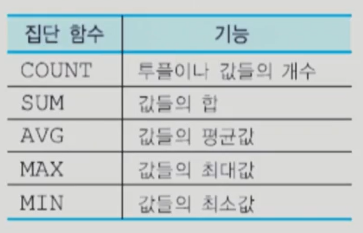

#### 그룹화

- GROUP BY절 사용된 애트리뷰트에 동일한 값을 갖는 튜플들이 각각 하나의 그룹으로 묶임
- 이 애트리뷰트를 그룹화 애트리뷰트라고 함
- 각 그룹에 대하여 결과 릴레이션에 하나의 튜플이 생성됨
- SELECT절에는 각 그룹마다 하나의 값을 갖는 애트리뷰트, 집단 함수, 그룹화에 사용된 애트리뷰트들만 나타날 수 있음
- 다음 질의는 그룹화를 하지 않은 채 EMPLOYEE 릴레이션의 모든 튜플에 대해서 사원번호와 모든 사원들의 평균 급여를 검색하므로 잘못됨
  - SELECT EMPNO, AVG(SALARY) FROM EMPLOYEE;

#### HAVING절

- 어떤 조건을 만족하는 그룹들에 대해서만 집단 함수를 적용할 수 있음
- 각 그룹마다 하나의 값을 갖는 애트리뷰트를 사용하여 각 그룹이 만족해야하는 조건을 명시함
- 그룹화 애트리뷰트에 같은 값을 갖는 튜플들의 그룹에 대한 조건을 나타내고, 이 조건을 만족하는 그룹들만 질의 결과에 나타남
- HAVING절에 나타나는 애트리뷰트는 반드시 GROUP BY절에 나타나거나 집단 함수에 포함되어야 함

### 집합 연산

- 집합 연산을 적용하려면 두 릴레이션이 합집합 호환성을 가져야 함
- UNION(합집합), EXCEPT(차집합), INTERSECT(교집합), UNION ALL(합집합), EXCEPT ALL(차집합), INTERSECT ALL(교집합)
- ALL은 중복된걸 하나로 해서 모두 뺌

#### 조인

- 조인은 두 개 이상의 릴레이션으로부터 연관된 튜플들을 결합
- 조인의 일반적인 형식은 아래의 SELECT문과 같이 FROM 절에 두 개 이상의 릴레이션들이 열거되고, 두 릴레이션에 속하는 애트리뷰트들을 비교하는 조인조건이 WHERE절에 포함됨
- 조인 조건은 두 릴레이션 사이에 속하는 애트리뷰트 값들을 비교 연산자로 연결한 것
- 가장 흔히 사용된느 비교 연산자는 =

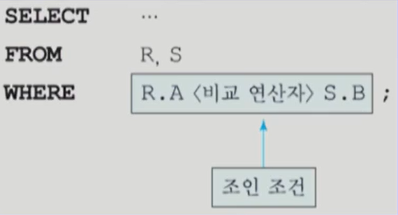

#### 중첩 질의(NESTED QUERY)

- 외부 질의의 WHERE절에 다시 SELECT ... FROM ... WHERE 형태로 포함된 SELECT문
- **부질의**(SUBQUERY)라고 함
- INSERT, DELETE, UPDATE문에도 사용될 수 있음
- 중첩 질의의 결과로 한 개의 스칼라값(단일 값), 한 개의 애트리뷰트로 이루어진 릴레이션, 여러 애트리뷰트로 이루어진 릴레이션이 반환될 수 있음

- 한 개의 스칼라값이 반환되는 경우
  - 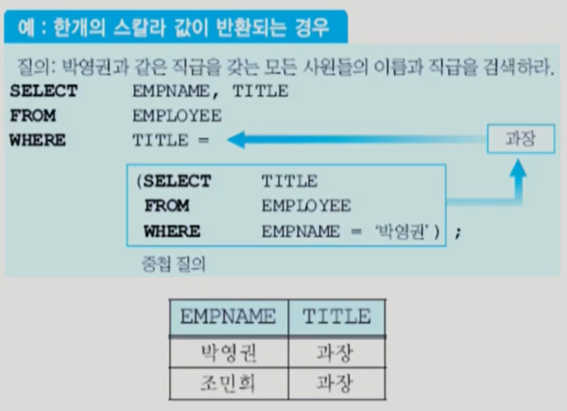
  - 박영권이 과장일지 모를때

- 한 개의 애트리뷰트로 이루어진 릴레이션이 반환되는 경우
  - 중첩 질의의 결과로 한 개의 애트리뷰트로 이루어진 다수의 튜플이 반환될 수 있음
  - 외부 질의의 WHERE절에서 IN, ANY(SOME), ALL, EXISTS와 같은 연산자를 사용해야 함
  - 키워드 IN은 한 애트리뷰트가 값들의 집합에 속하는가를 테스트할 때 사용됨
  - 한 애트리뷰트가 값들의 집합에 속하는 하나 이상의 값들과 어떤 관계를 갖는가를 테스트하는 경우에는 ANY를 사용
  - 한 애트리뷰트가 값들의 집합에 속하는 모든 값들과 어떤 관계를 갖는가를 테스트하는 경우에는 ALL을 사용

- 여러 애트리뷰트들로 이루어진 릴레이션이 반환되는 경우
  - 중첩 질의의 결과로 여러 애트리뷰트들로 이루어진 릴레이션이 반환되는 경우에는 EXISTS 연산자를 사용하여 중첩 질의의 결과가 빈 릴레이션인지 여부를 검사함
  - 중첩 질의의 결과가 빈 릴레이션이 아니면 참이 되고, 그렇지 않으면 거짓

#### 상관 중첩 질의(correlated nested query)

- 중첩 질의의 WHERE절에 있는 프레디키트에서 외부 질의에 선언된 릴레이션의 일부 애트리뷰트를 참조하는 질의
- 중첩 질의의 수행 결과가 단일 값이든, 하나 이상의 애트리뷰트로 이루어진 릴레이션이든 외부 질의로 한 번만 결과를 반환하면 상관 중첩 질의가 아님
- 상관 중첩 질의에서는 외부 질의를 만족하는 각 튜플이 구해진 후에 중첩 질의가 수행되므로 상관 중첩 질의는 외부 질의를 만족하는 튜플 수만큼 여러 번 수행될 수 있음

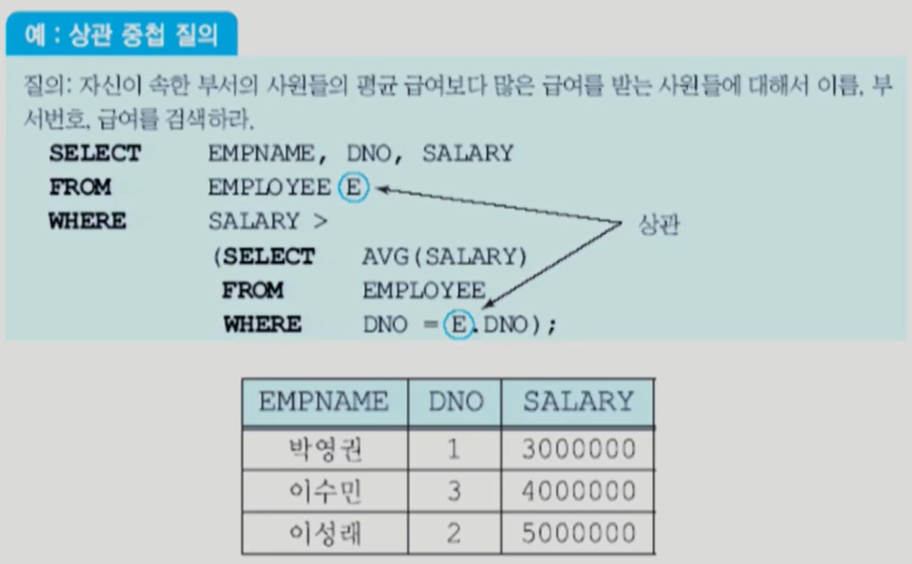

## 4.5 INSERT, DELETE, UPDATE문

### INSERT문

- 기존의 릴레이션에 튜플을 삽입
- 참조되는 릴레이션에 튜플이 삽입되는 경우에는 참조 무결성 제약조건의 위배가 발생하지 않으나 참조하는 릴레이션에 튜플이 삽입되는 경우에는 참조 무결성 제약조건을 위배할 수 있음
- 릴레이션에 한 번에 한 튜플씩 삽입하는 것과 한 번에 여러 개의 튜플들을 삽입할 수 있는 것으로 구분
- 릴레이션에 한 번에 한 튜플씩 삽입하는 INSERT문
  - INSERT INTO 릴레이션(애트리뷰트1, ..., 애트리뷰트N) VALUES (값1, ..., 값N);

- 릴레이션에 한 번에 여러 개의 튜플들을 삽입하는 INSERT문
  - INSERT INTO 릴레이션(애트리뷰트1, ..., 애트리뷰트N) SELECT ... FROM ... WHERE ...;

### DELETE문

- 삭제 연산은 한 릴레이션으로부터 한 개 이상의 튜플들을 삭제
- 참조되는 릴레이션의 삭제 연산의 결과로 참조 무결성 제약조건이 위배될 수 있으나, 참조하는 릴레이션에서 튜플을 삭제하면 참조 무결성 제약조건을 위배하지 않음
- DELETE문의 구문
  - DELETE FROM 릴레이션 WHERE 조건;

### UPDATE문

- 한 릴레이션에 들어 있는 튜플들의 애트리뷰트 값들을 수정
- 기본 키나 외래 키에 속하는 애트리뷰트의 값이 수정되면 참조 무결성 제약조건을 위배할 수 있음
- UPDATE의 구문
  - UPDATE 릴레이션 SET 애트리뷰트 = 값 도는 식[, ...] WHERE 조건;

## 4.6 트리거(trigger)와 주장(assertion)

### 트리거

방아쇠를 당긴다, 큰 사건을 촉발시킴

어떤 연산을 함으로써 다른 연산들을 수행하게 함

조건을 만족하면 바로 실행

너무 많이 만들면 안됨

- 명시된 이벤트(데이터베이스의 갱신)가 발생할 때마다 DBMS가 자동적으로 수행하는, 사용자가 정의하는 문(프로시저)
- 데이터베이스의 무결성을 유지하기 위한 일반적이고 강력한 도구
- 테이블 정의시 표현할 수 없는 기업의 비즈니스 규칙들을 시행하는 역할
- 트리거를 명시하려면 트리거를 활성시키는 사건인 이벤트, 트리거가 활성화되었을 때 수행되는 테스트인 조건, 트리거가 활성화되고 조건이 참일 때 수행되는 문(프로시저)인 동작을 표현해야 함
- 트리거를 **이벤트-조건-동작(ECA)** 규칙이라고도 부름
  - E는 EVENT, C는 CONDITION, A는 ACTION을 의미
- SQL3 표준에 포함되었으며 대부분의 상용 관계 DBMS에서 제공됨

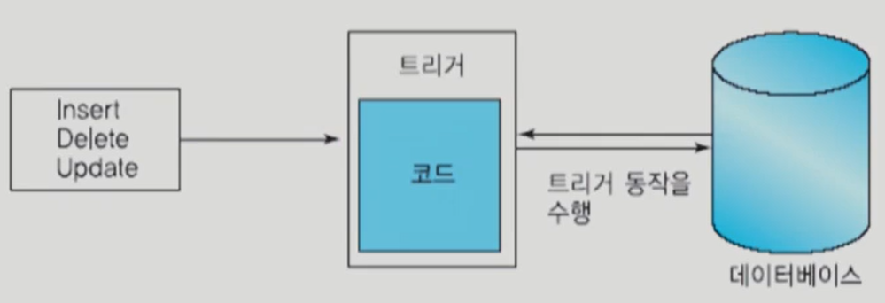

- SQL3에서 트리거의 형식

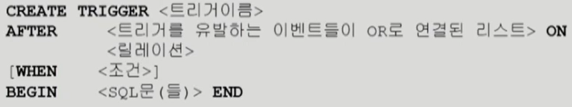

- 이벤트의 가능한 예로는 테이블에 튜플 삽입, 테이블로부터 튜플 삭제, 테이블의 튜플 수정 등이 있음
- 조건은 임의의 형태의 프레디키트
- 동작은 데이터베이스에 대한 임의의 갱신
- 어떤 이벤트가 발생했을 때 조건이 참이 되면 트리거와 연관된 동작이 수행되고, 그렇지 않으면 아무 동작도 수행되지 않음
- 삽입, 삭제, 수정 등이 일어나기 전(before)에 동작하는 트리거와 일어난 후(after)에 동작하는 트리거로 구분

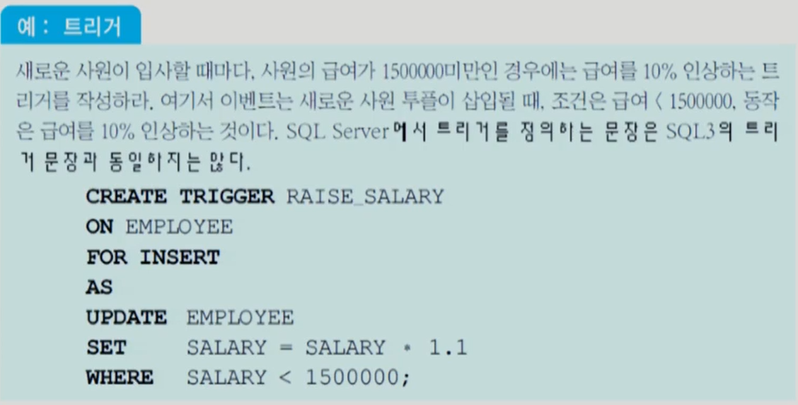

참조무결성이 트리거 시스템으로 구현

#### 연쇄적으로 활성화되는 트리거

- 하나의 트리거가 활성화되어 이 트리거 내의 한 SQL문이 수행되고, 그 결과로 다른 트리거가 활성화하여 그 트리거 내의 SQL문이 수행될 수 있음

### 주장 assertion

- 주장은 SQL3에 포함되어 있으나 대부분의 상용 관계 DBMS가 아직 지원하고 있지 않음
- 트리거는 제약조건을 위반했을 때 수행할 동작을 명시하는 것이고, 주장은 제약조건을 위반하는 연산이 수행되지 않도록 함
- 주장의 구문
  - CREATE ASSERTION 이름 CHECK 조건;
- 트리거보다 좀더 일반적인 무결성 제약조건
- DBMS는 주장의 프레디키트를 검사하여 만일 참이면 주장을 위배하지 않는 경우이므로 데이터베이스 수정이 허용됨
- 일반적으로 두 개 이상의 테이블에 영향을 미치는 제약조건을 명시하기 위해 사용됨

## 4.7 내포된 SQL

- embedded SQL
- SQL이 호스트 언어의 완전한 표현력을 갖고 있지 않기 때문에 모든 질의를 SQL로 표현할 수는 없음
- SQL은 호스트 언어가 갖고 있는 조건문(IF문), 반복문(WHILE문), 입출력 등과 같은 동작, 사용자와의 상호 작용, 질의 결과를 GUI로 보내는 등의 기능을 갖고 있지 않음
- C, C++, 코볼, 자바 등의 언어로 작성하는 프로그램에 SQL문을 삽입하여, 데이터베이스를 접근하는 부분을 SQL이 맡고 SQL에 없는 기능은 호스트 언어로 작성하는 것이 필요
- 호스트 언어에 포함되는 SQL문을 내포된 SQL이라 부름
- 데이터 구조가 불일치하는 문제(IMPEDANCE MISMATCH 문제)

- MY SQL SERVER 2005에서 C언어에 SQL문을 내포시키는 환경을 ESQL/C라 부름
- 호스트 언어로 작성 중인 프로그램에 SQL문을 내포시킬 때 해당 호스트 언어의 컴파일러가 어떻게 호스트 언어의 문과 SQL문을 구별할 것인가?
- 호스트 언어로 작성 중인 프로그램에 포함된 SELECT, INSERT, DELETE, UPDATE 등 모든 SQL문에는 반드시 문장의 앞부분에 EXEC SQL을 붙임
- EXEC SQL은 EXEC SQL부터 세미콜론 사이에 들어 있는 문장이 내포된 SQL문임을 전컴파일러에게 알림
- ESQL/C 전컴파일러(precompiler)는 내포된 SQL문을 C 컴파일러에서 허용되는 함수 호출로 변환함

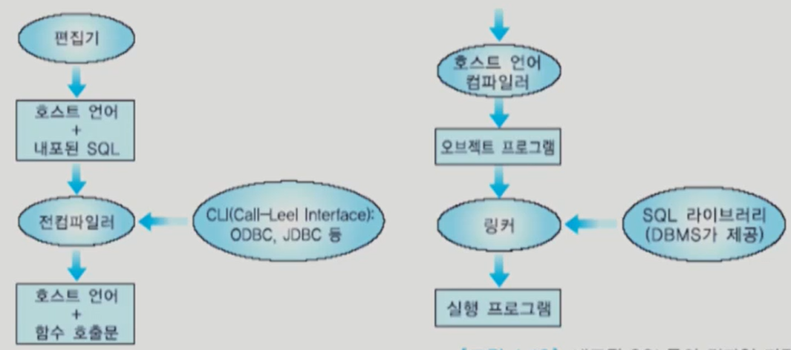

### ESQL/C

- ESQL/C는 정적인 SQL문과 동적인 SQL문 모두를 지원
- 정적인 SQL문은 C 프로그램에 내포된 완전한 Transact-SQL문
- 동적인 SQL문은 불완전한 Transact-SQL 문으로서 일부 또는 전부를 질의가 수행될 때 입력 가능
- 정적인 SQL문은 입력값과 출력 데이터를 위해서 C 프로그램의 변수들을 포함할 수 있음
- SQL문에 포함된 C 프로그램의 변수를 호스트 변수라고 부름

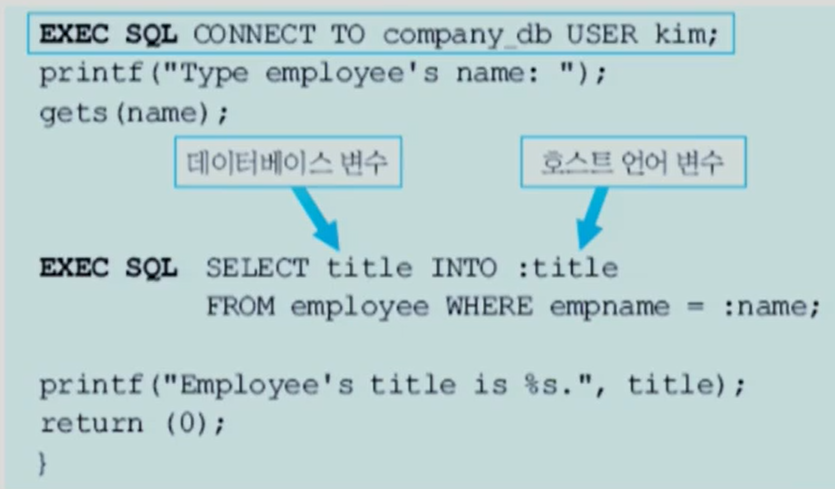