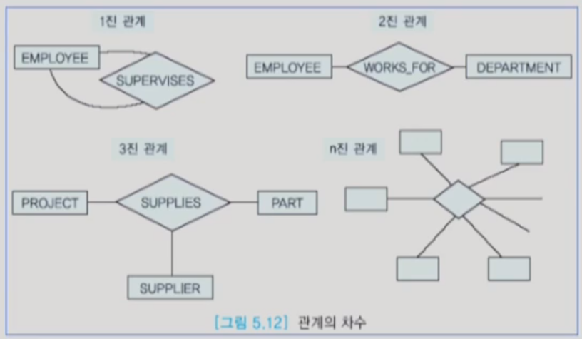
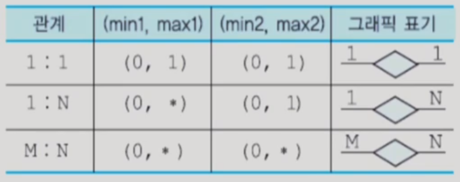
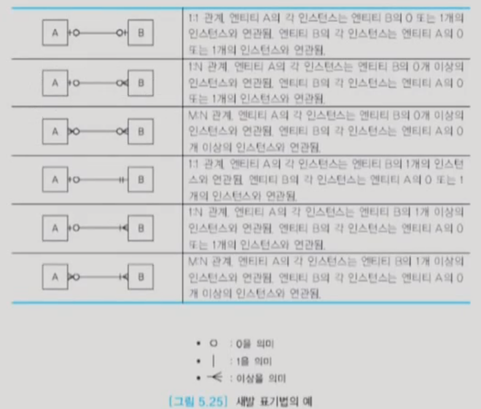

 

#### SQL 통신 영역

- SQL 통신 영역(SQLCA : SQL Communications Area)
  - C 프로그램에 내포된 SQL문에 발생하는 에러들을 사용자에게 알려줌
  - 사용자는 SQLCA 데이터 구조의 에러 필드와 상태 표시자를 검사하여 내포된 SQL문이 성공적으로 수행되었는가 또는 비정상적으로 수행되었는가를 파악할 수 있음
  - SQLCA 데이터 구조 중에서 가장 중요하고 널리 사용되는 필드는 SQLCODE 변수
  - SQLCODE의 값이 0이면 마지막에 내포된 SQL문이 성공적으로 끝났음을 의미

 

## 데이터베이스 설계와 ER 모델

#### 데이터 베이스 설계

* 데이터베이스 설계
  * 개념적 데이터베이스 설계와 물리적 데이터베이스 설계로 구분
  * 개념적 데이터베이스 설계는 실제로 데이터베이스를 어떻게 구현할 것인가와는 독립적으로 정보 사용의 모델을 개발하는 과정
  * 물리적 데이터베이스 설계에서는 물리적인 저장 장치와 접근 방식을 다룸
  * 개념적 데이터베이스 설계 과정에서 조직체(실세계)의 엔티티, 관계, 프로세스, 무결성 제약조건 등을 나타내는 추상화 모델을 구축
  * 엔티티는 서로 구분이 되면서 조직체에서 데이터베이스에 나타내려는 객체(사람, 장소, 사물 등)를 의미
  * **관계는 두 개 이상의 엔티티들 간의 연관**을 나타냄
  * 프로세스는 관련된 활동을 나타냄
  * 무결성 제약조건은 데이터의 정확성과 비즈니스 규칙을 의미

 

* 개념적 수준의 모델
  * 특정 데이터 모델과 독립적으로 응용 세계를 모델링할 수 있도록 함
  * 데이터베이스 구조나 스키마를 하향식으로 개발할 수 있기 위한 틀(framework)을 제공함
  * 인기있는 개념적 수준의 모델은 엔티티 관계(ER:Entity-Relationship) 모델
  * ER 모델과 같은 개념적인 데이터 모델이 사상될 수 있는 다수의 구현 데이터 모델(implementation data model)이 존대함
  * 구현 단계에서 사용되는 세 가지 데이터 모델: 관계 데이터 모델, 계층 데이터 모델, 네트워크 데이터 모델

 

* 데이터베이스 설계의 개요
  * 한 조직체의 운영과 목적을 지원하기 위해 데이터베이스를 생성하는 과정
  * 목적은 모든 주요 응용과 사용자들이 요구하는 데이터, 데이터 간의 관계를 표현하는 것
  * 데이터베이스 개발은 일반적인 프로젝트 라이프 사이클 과정을 따름
  * 훌륭한 데이터베이스 설계는 **시간의 흐름에 따른 데이터의 모든 측면**을 나타내고, 데이터 항목의 **중복을 최소화**하고, 데이터베이스에 대한 **효율적인 접근**을 제공하고, 데이터베이스 **무결성**을 제공하고, 이해하기 쉬워야 함

 

* 데이터베이스 설계의 주요 단계
  * **요구사항 분석, 개념적 설계, DBMS의 선정, 논리적 설계, 스키마 정제, 물리적 설계와 튜닝** 등 여러 작업들로 이루어짐
  * 일반적으로, 데이터베이스 설계의 완성도를 높이기 위해서 이런 작업들을 앞뒤로 왔다갔다할 필요가 있음

 

* 요구사항 수집과 분석
  * 흔히 기존의 문서를 조사하고, 인터뷰나 설문 조사 등이 시행됨
  * 인터뷰는 요구사항 수집을 위해 가장 흔히 사용됨
  * 설문 조사는 자유롭게 의견을 적어내도록 하는 방식과 주어진 질문에 대해서만 답을 하는 방식으로 구분
  * **요구사항에 관한 지식을 기반으로 관련 있는 엔티티들과 이들의 attribute들이 무엇인가, 엔티티들 간의 관계가 무엇인가 등을 파악**
  * 또한 데이터 처리에 관한 요구사항에 대하여 전형적인 연산들은 무엇인가, 연산들의 의미, 접근하는 데이터의 양 등을 분석

 

* DBMS 선정
  * 여러 가지 요인들을 검토한 후 DBMS 선정
  * 기술적 요인은 DBMS가 제공하는 데이터 모델, 저장 구조, 인터페이스, 질의어, 도구, 제공되는 서비스 등
  * 정치적인 요인은 고수준의 전략적인 결정 등
  * 경제적인 요인은 DBMS 구입 비용, 하드웨어 구입 비용, 유지 보수(서비스) 비용, 기존의 시스템을 새로운 DBMS에 맞게 변환하는데 소요되는 비용, 인건비, 교육비 등

 

* 논리적 설계
  * 데이터베이스 관리를 위해 선택한 DBMS의 데이터 모델을 사용하여 논리적 스키마를 생성
  * 개념적 스키마에 알고리즘을 적용하여 논리적 스키마를 생성
  * 논리적 스키마를 나타내기 위해 관계 데이터 모델을 사용하는 경우에는, ER 모델로 표현된 개념적 스키마를 관계 데이터베이스 스키마로 사상
  * 관계 데이터베이스 스키마를 더 좋은 관계 데이터베이스 스키마로 변환하기 위해서 정규화 과정을 적용
  * 데이터베이스 설계자가 요구사항 수집과 분석 후에 바로 논리적 설계 단계로 가는 경우가 있는데, 이런 경우에는 흔히 좋은 관계 데이터베이스 스키마가 생성되지 않음

 

* 물리적 설계
  * 처리 요구사항들을 만족시키기 위해 저장 구조와 접근 경로 등을 결정
  * 성능상의 주요 기준은 몇 가지로 구분 가능
    * 응답시간
    * 트랜잭션 처리율
    * 전체 데이터베이스에 대한 보고서를 작성하는데 얼마나 오래 걸릴 것인가?

 

* 트랜잭션 설계
  * 요구사항 수집과 분석 후에 데이터베이스 설계 과정과 별도로 트랜잭션 설계를 진행할 수 있음
  * 트랜잭션은 완성될 데이터베이스에서 동작할 응용 프로그램
  * 데이터베이스 스키마는 트랜잭션에서 요구하는 모든 정보를 포함해야 함
  * 검색, 갱신, 혼합 등 세 가지 유형으로 구분하여 입력, 출력, 동작 등을 식별

 

#### ER 모델

* ER 모델
  * EER(Enhanced Entity Relationship) 모델이 데이터베이스 설계 과정에 널리 사용
  * 쉽게 관계 데이터 모델로 사상

 

* 엔티티
  * 하나의 엔티티는 사람, 장소, 사물, 사건 등과 같이 독립적으로 존재하면서 고유하게 식별이 가능한 실세계의 객체
  * 사원처럼 실체가 있는 것도 있지만 생각이나 개념과 같이 추상적인 것도 있음

 

* 엔티티 타입
  * 엔티티 타입은 동일한 attribute들을 가진 엔티티들의 틀
  * 엔티티 집합은 동일한 attribute를 가진 엔티티들의 모임
  * 하나의 엔티티는 한 개 이상의 엔티티 집합에 속할 수 있음
  * 엔티티 타입은 관계 모델의 relation의 내포에 해당하고, 엔티티 집합은 관계 모델의 relation의 외연에 해당
  * 엔티티 집합과 엔티티 타입을 엄격하게 구분할 필요는 없음
  * ER 다이어그램에서 엔티티 타입은 직사각형으로 나타냄

 

* 강한 엔티티 타입
  * 강한 엔티티 타입(정규 엔티티 타입)은 독자적으로 존재하며 엔티티 타입 내에서 자신의 키 attribute를 사용하여 고유하게 엔티티들을 식별할 수 있는 엔티티 타입

 

* 약한 엔티티 타입
  * 약한 엔티티 타입은 키를 형성하기에 충분한 attribute들을 갖지 못한 엔티티 타입
  * 이 엔티티 타입이 존재하려면 소유 엔티티 타입이 있어야 함
  * 소유 엔티티 타입의 키 attribute를 결합해야만 고유하게 약한 엔티티 타입의 엔티티들을 식별할 수 있음
    * 약한 엔티티 타입에게 키 attribute를 제공하는 엔티티 타입을 소유 엔티티 타입(owner entity type) 또는 식별 엔티티 타입(identifying entity type)라고 부름
    * ER 다이어그램에서 이중선 직사각형
    * 약한 엔티티 타입의 부분 키는 점선 밑줄을 그어 표시
    * 부분 키(partial key) : 부양가족의 이름처럼 한 사원에 속한 부양 가족 내에서는 서로 다르지만 회사 전체 사원들의 부양가족들 전체에서는 같은 경우가 생길 수 있는 attribute

 

* attribute
  * 하나의 엔티티는 연관된 attribute들의 집합으로 설명
  * 한 attribute의 도메인은 그 attribute가 가질 수 있는 모든 가능한 값들의 집합을 의미
  * 여러 attribute가 동일한 도메인을 공유할 수 있음
  * 키 attribute는 한 attribute 또는 attribute들의 모임으로서 한 엔티티 타입 내에서 각 인티티를 고유하게 식별
  * ER 다이어그램에서 기본 키에 속하는 attribute는 밑줄을 그어 표시
  * 요구사항 명세에서 명사나 형용사로 표현
  * 엔티티는 독립적인 의미를 갖는데 반해서 attribute는 독립적인 의미를 갖지 않음
  * ER 다이어그램에서 타원형
  * attribute와 엔티티 타입은 실선으로 연결

 

* 단순 attribute
  * 더 이상 다른 attribute로 나눌 수 없는 attribute
  * ER 다이어그램에서 실선 타원으로 표현
  * ER 다이어그램에서 대부분의 attribute는 단순 attribute

 

* 복합 attribute
  * 두 개 이상의 attribute로 이루어진 attribute
  * 동일한 엔티티 타입이나 관계 타입에 속하는 attribute들 중에서 밀접하게 연관된 것들을 모아놓은 것

 

* 단일 값 attribute
  * 각 엔티티마다 정확하게 하나의 값을 갖는 attribute
  * ER 다이어그램에서 단순 attribute와 동일하게 표현
  * ER 다이어그램에서 대부분의 attribute는 단일 값 attribute

 

* 다치 attribute(multi-valued attribute)
  * 각 엔티티마다 여러 개의 값을 가질 수 있는 attribute
  * ER 다이어그램에서 이중선 타원으로 표현

 

* 저장된 attribute(stored attribute)
  * 다른 attribute와 독립적으로 존재하는 attribute
  * ER 다이어그램에서 단순 attribute와 동일하게 표현
  * ER 다이어그램에서 대부분은 저장된 attribute

 

* 유도된 attribute(derived attribute)
  * 다른 attribute의 값으로부터 얻어진 attribute
  * 관계 데이터베이스에서 relation의 attribute로 포함시키지 않는 것이 좋음
  * ER 다이어그램에서 점선 타원으로 표현

 

* 관계와 관계 타입
  * 관계는 엔티티들 사이에 존재하는 연관이나 연결로서 두 개 이상의 엔티티 타입들 사이의 사상으로 생각할 수 있음
  * 관계 집합은 동질의 관계들의 집합
  * 관계 타입은 동질의 관계들의 틀
  * 관계 집합과 관계 타입을 엄격하게 구분할 필요는 없음
  * 요구사항 명세에서 흔히 동사는 ER 다이어그램에서 관계로 표현
  * ER 다이어그램에서 다이아몬드로 표기
  * 관계 타입이 서로 연관시키는 엔티티 타입들을 관계 타입에 실선으로 연결
  * 관계 타입은 관계의 특징을 기술하는 attribute들을 가질 수 있다
  * 관계 타입은 키 attribute를 갖지 않는다.

 

* 차수(degree)

  * 관계로 연결된 엔티티 타입들의 개수를 의미
  * 실세계에서 가장 흔한 관계는 두 개의 엔티티 타입을 연결하는 2진 관계

  

 

* Cardinality
  * Cardinality 비율은 한 엔티티가 참여할 수 있는 관계의 수
  * 관계 타입에 참여하는 엔티티들의 가능한 조합을 제한
  * 관계를 흔히 **1:1, 1:N, M:N**으로 구분
  * Cardinality에 관한 정보는 간선 위에 표시

 

* Cardinality 비율의 최소값과 최대값

  * ER 다이어그램에서 관계 타입과 엔티티 타입을 연결하는 실선 위에 (min, max) 형태로 표기
  * 어떤 관계 타입에 참여하는 각 엔티티 타입에 대하여 min은 이 엔티티 타입 내의 각 엔티티는 적어도 min번 관계에 참여함을 의미
  * max는 이 엔티티 타입 내의 각 엔티티는 최대한 max 번 관계에 참여함을 의미
  * min=0은 어떤 엔티티가 반드시 관계에 참여해야 할 필요는 없음을 의미
  * max=*는 어떤 엔티티가 관계에 임의의 수만큼 참여할 수 있음을 의미

  

 

* 역할(role)
  * 관계 타입의 의미를 명확하게 하기 위해 사용
  * 특히 하나의 관계 타입에 하나의 엔티티 타입이 여러 번 나타나는 경우에는 반드시 역할 표기
  * 관계 타입의 간선 위에 표시

 

* 전체 참여와 부분 참여
  * 전체 참여는 어떤 관계에 엔티티 타입 E1의 모든 엔티티들이 관계 타임 R에 의해서 어떤 엔티티 타입 E2의 어떤 엔티티와 연관되는 것을 의미
  * 부분 참여는 어떤 관계에 엔티티 타입 E1의 일부 엔티티만 참여하는 것을 의미

 

* 다중 참여
  * 두 엔티티 타입 사이에 두 개 이상의 관계 타입이 존재할 수 있음

 

* **데이터베이스 설계 과정**
  * 응용의 요구사항을 수집하여 기술
  * 응용과 연관이 있는 엔티티 타입들을 식별
  * 응용과 연관이 있는 관계 타입들을 식별
  * 관계가 1:1, 1:N, M:N 중에 어느 것에 해당하는지 결정
  * 엔티티 타입과 관계 타입들에 필요한 attribute들을 식별하고, 각 attribute가 가질 수 있는 값들의 집합을 식별
  * 엔티티 타입들을 위한 기본 키를 식별
  * 응용을 위한 ER 스키마 다이어그램을 그림
  * ER 스키마 다이어그램이 응용에 대한 요구사항과 부합되는지 검사
  * ER 스키마 다이어그램을 DBMS에서 사용되는 데이터베이스 모델로 변환

 

* ER 모델의 또 다른 표기법

  

  

