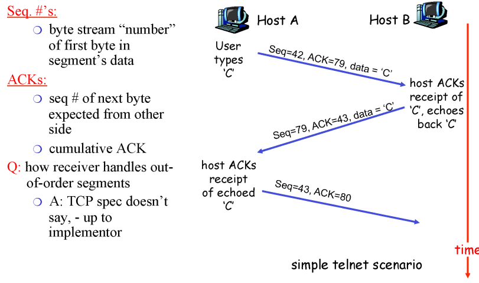

## A closer look at network structure

* network edge :
  * applications and hosts
  * end systems(hosts):
    * run application programs
    * Web, email
  * client / server model
    * client host requests, receives service from always-on server
    * Web browser/server, email client/server
  * peer-peer model
    * minimal use of dedicated servers
    * Skype, BitTorrent, KaZaA
  * connection-oriented service
    * data transfer between end systems
    * **TCP**(Transmission Control Protocol) : reliable, flow control, congestion control
    *  **UDP**(User Datagram Protocol) : connectionless, unreliable, no flow control, no congestion control
* network core:
  * mesh of interconnected routers
  * network of networks
  * **circuit switching**
  * **packet switching**
* access networks, physical media
  * communication links
* protocol
  * All communication in Internet coordinated by protocols
* Four sources of packet delay
  * nodal processing : check bit errors, determine output link
  * queueing : time waiting at output link for transmission, depends on congestion level of router
  * **transmission** : 첫 번째 비트가 나가는 순간부터 마지막 비트가 나가는 순간까지 L/R
  * **propagation** : 마지막 비트가 다음 라우터에 도착할 때까지 걸리는 시간 d/s

## client-server architecture

* server 
  * always-on host
  * permanent IP address
  * data centers for scaling
* clients
  * communicate with server 
  * may be intermittently connected
  * may have dynamic IP addresses
  * do not communicate directly with each other
* socket

## HTTP(Hyper Text Transfer Protocol)

* Web's application layer protocol
* client : browser that requests, receives and display web objects
* server : web server sends objects in response to requests
* stateless : 상대방에 대해서 기억하지 않음
* connections
  * **non-persistent HTTP**
    * at most one object sent over TCP connection
    * downloading multiple objects required multiple connections
  * **persistent HTTP**
    * multiple objects can send be sent over single TCP connection between client, server
* **RTT** : time for a small packet to travel from client to server and back

## Socket

* SOCK_STREAM
  * TCP
* SOCK_DGRAM
  * UDP

* server

* client

* multiplexing
* demultiplexing

* UDP : multiplexing , error checking

## Reliable Date Transfer

* RDT1.0 : Transfer over a perfect channel  

* RDT2.0 : channel with packet errors  

* Handling Duplicate Packets
  * sender adds sequence number

* RDT3.0 : channel with loss & packet errors
  * timer for packet loss 

* pipelined protocols

  * pipelining : sender allows multiple, "in-flight", yet-to-be-acknowledged pkts

  * Go-Back-N

    * window of up to *N*
    * ACK(n) : ACKs all pkts up to, including seq # n - "cumulative ACK"
    * timeout(n) : retransmit pkt n and all higher seq # pkts in window

    

* Selective Repeat

  * receiver individually acknowledges all correctly received pkts
  * sender only resends pkts for which ACK not received
    * sender timer for each unACKed pkt
  * sequence # 가 중요

* TCP

  * point-to-point : one sender, one receiver
  * reliable, in-order byte stream : no "message boundaries"
  * pipelined : TCP congestion and flow control set window size
  * send & receive buffers
  * full duplex data 
    * bi-directional data flow in same connection
    * MSS : maximum segment size
  * connection-oriented
    * handshaking(exchange of control msgs) init's sender, receiver state before data exchange
  * flow controlled
    * sender will not overwhelm receiver

  

  

  

  

