## TCP

* Flow Control
  * sender won't overflow receiver's buffer by transmitting too much, too fast

 

* Three way handshake
  1. client host sends TCP SYN segment to server
     * specifies initial seq #
     * no data
  2. server host receives SYN, replies with SYNACK segment
     * server allocates buffers
     * specifies sever initial seq #
  3. client receives SYNACK, replies with ACK segment, which may contain data

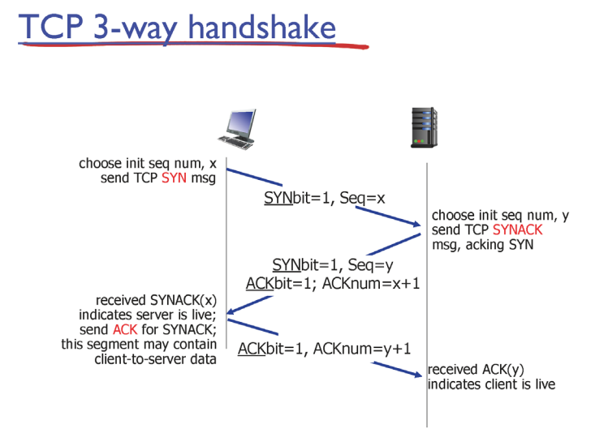

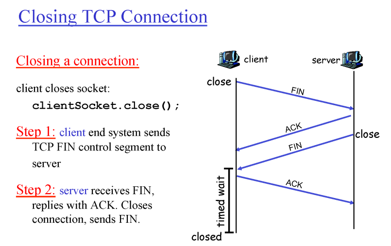

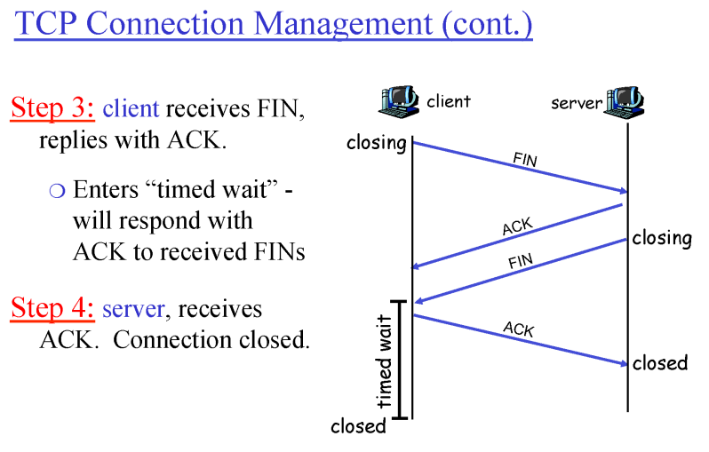

 

* Congestion control
  * End-end congestion control
    * no explicit feedback from network
    * congestion inferred from end-system observed loss, delay
    * approach taken by TCP
  * Network-assisted congestion control
    * routers provide feedback to end system
    * single bit indicating congestion(SNA, DECbit, TCP/IP ECN, ATM)
    * explicit rate sender should send at

 

* TCP congestion control
  * Slow Start
    * Do not know bottleneck bandwidth
    * So start from zero and quickly ramp up
  * Additive increase
    * getting close to capacity
    * be conservative and increase slow
  * Multiplicative decrease
    * Packet drop

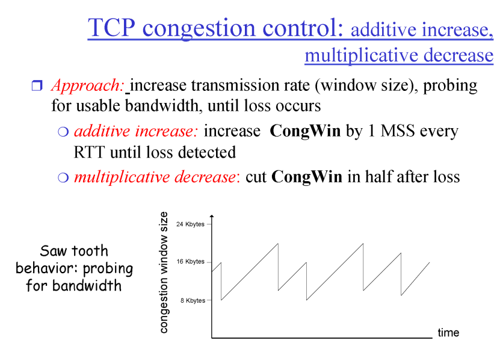

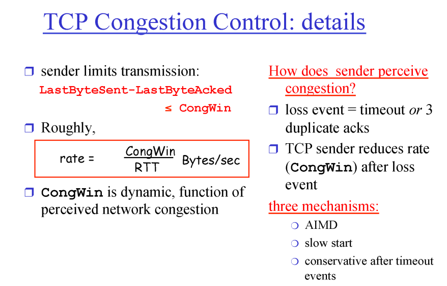

 

* TCP slow start
  * When connection begins, increase rate exponentially fast until first loss event
    * double CongWin every RTT
    * done by incrementing CongWin for every ACK received
  * **initial rate is slow but ramps up exponentially fast**

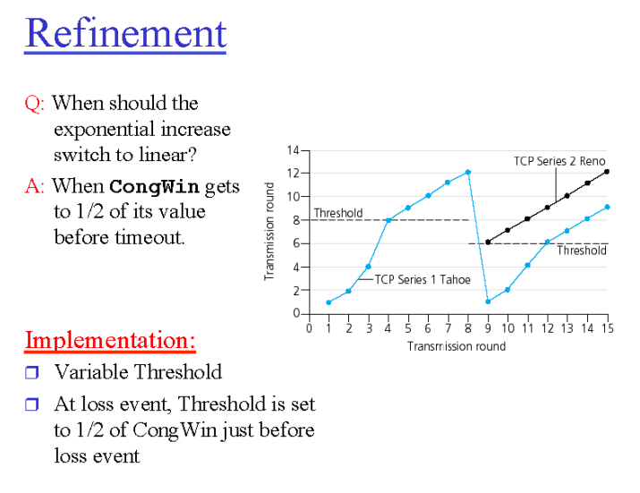

 

* TCP Fairness

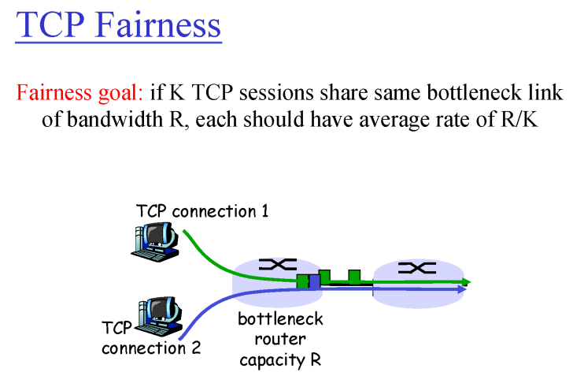

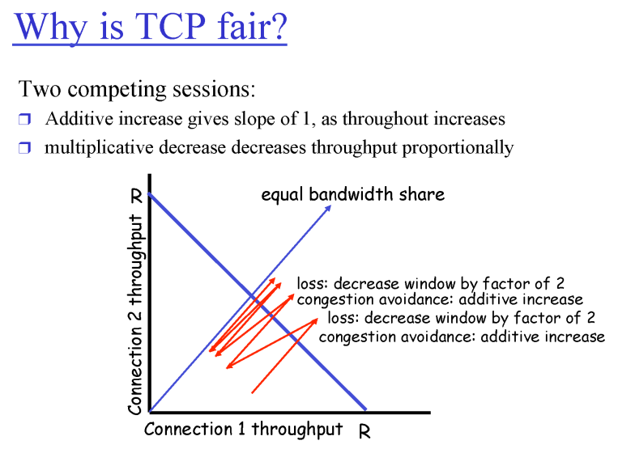

 

## HTTP

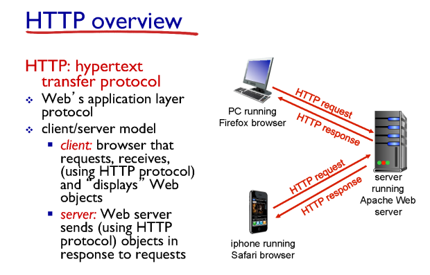

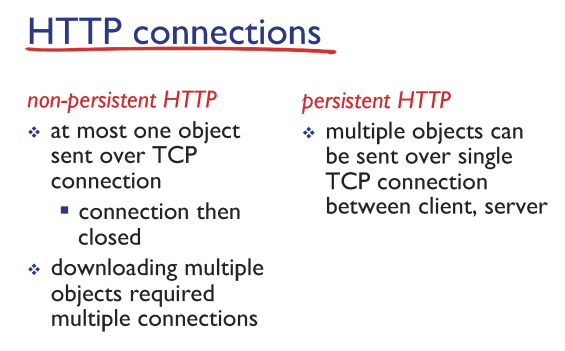

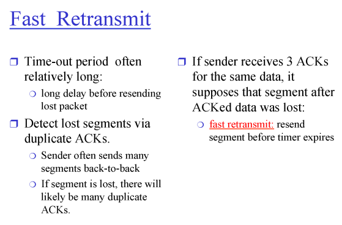

 

## Network layer

* Network layer

  * transport segment from sending to receiving host
  * on sending side encapsulates segments into datagrams
  * on receiving side, delivers segments to transport layer
  * network layer protocols in every host, router
  * router examines header fields in all IP datagrams passing through it
  * forwarding : move packets from router's input to appropriate router output, process of getting through single interchange
  * routing : determine route taken by packets from source to dest, process of planning trip from source to dest

  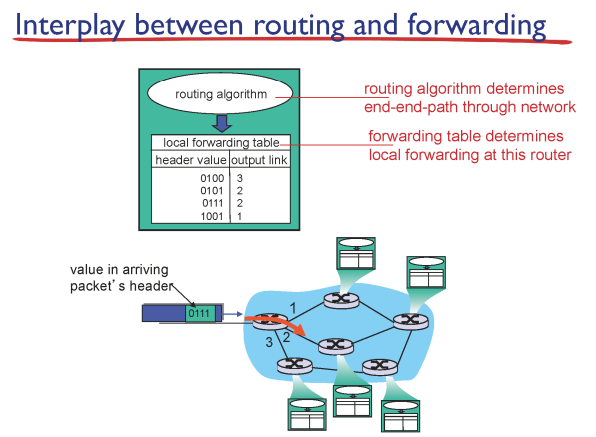

  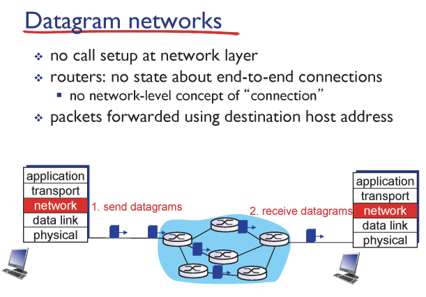

  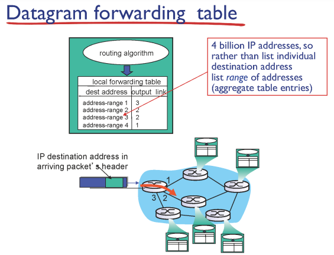

  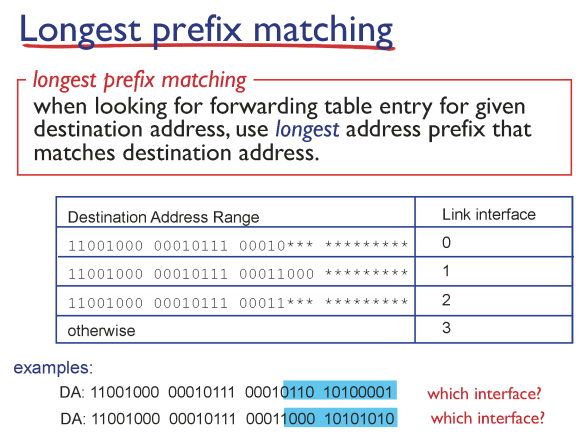

 

## Internet Protocol

* IP datagram format

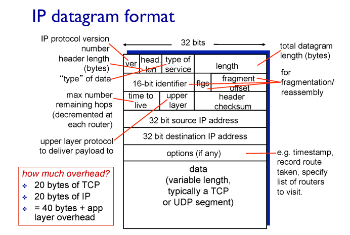

* IP Address (IPv4)
  * A unique 32-bit number
  * Identifies an interface (on a host, on a **router**, ...)
  * Represented in dotted-quad notation

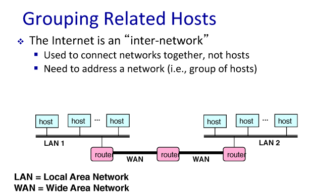

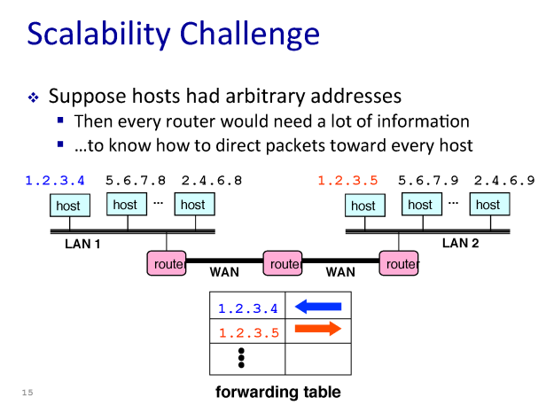

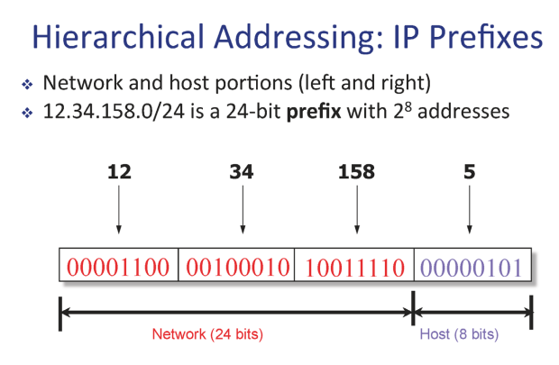

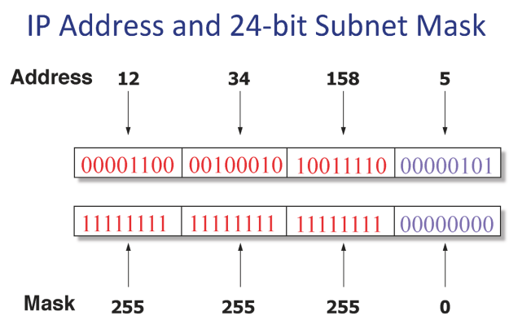

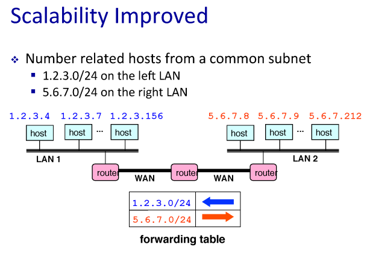

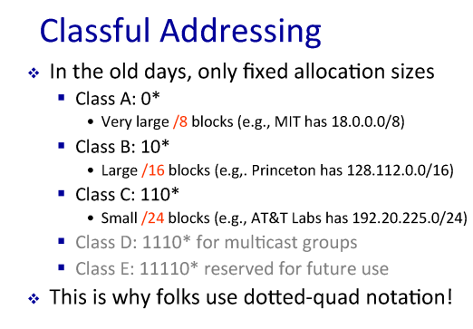

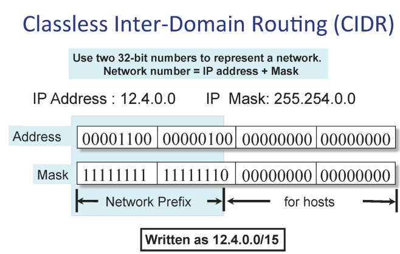

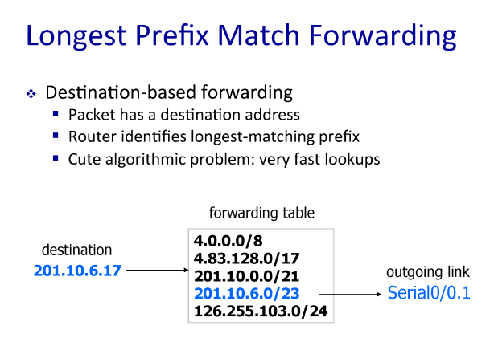

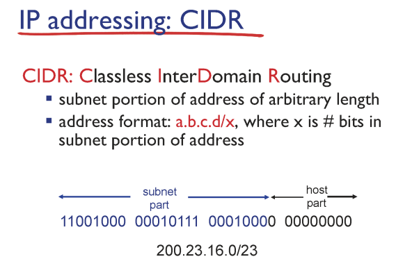

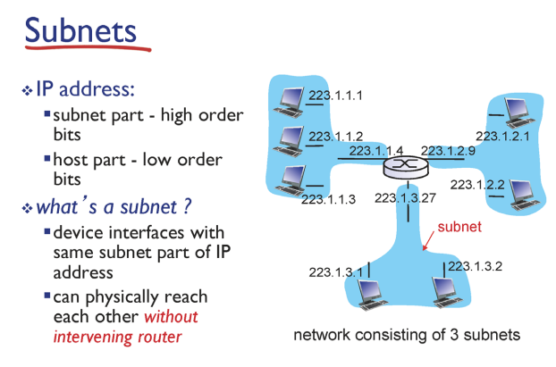

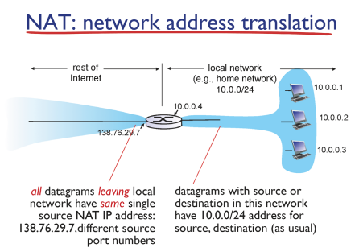

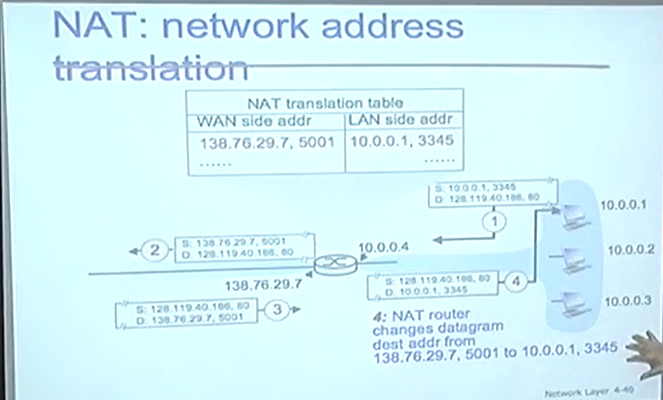

 

## Dynamic Host Configuration Protocol

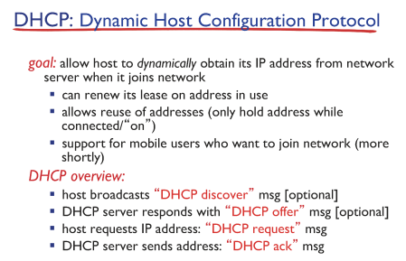  

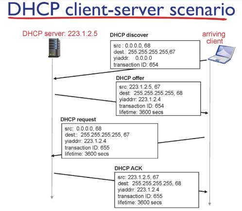  

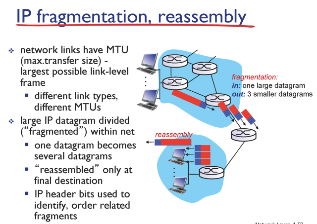  

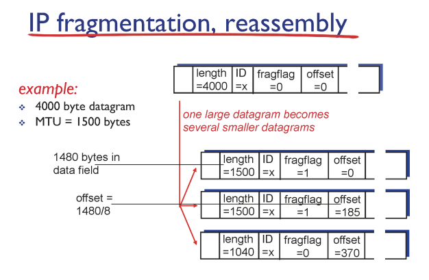  

## ICMP : Internet Control Message Protocol

* ICMP
  * used by hosts & routers to communicate network-level information
    * error reporting : unreachable host, network, port, protocol
    * echo request/reply(used by ping)
  * network-layer "above" IP
    * ICMP msgs carried in IP datagrams
  * ICMP message : type, code plus first 8 bytes of IP datagram causing error

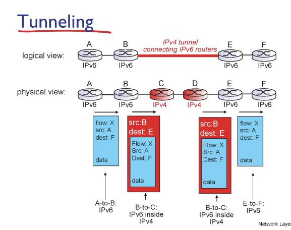

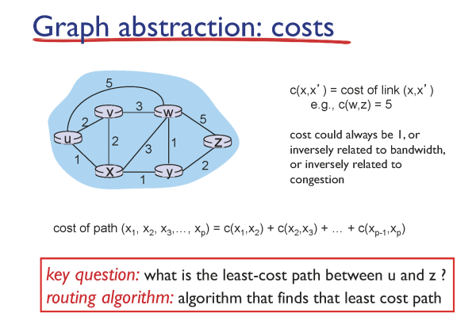

* 전체 네트워크의 비용 정보가 있는 경우

* 이웃 네트워크의 비용 정보만 있는 경우

  
