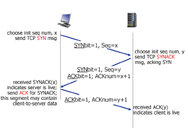
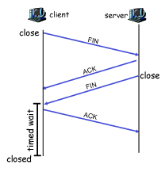
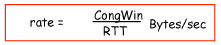
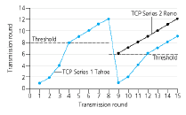
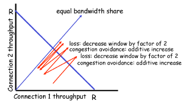
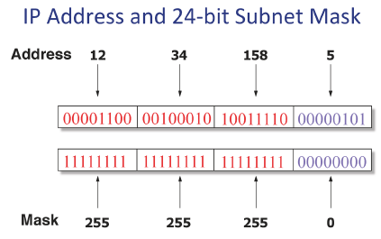
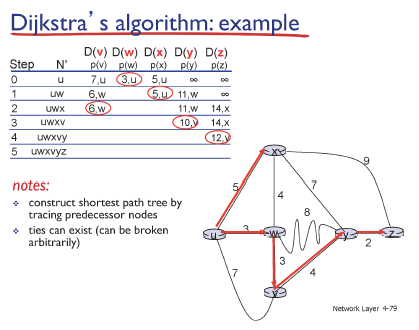
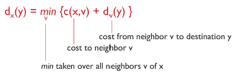

# TCP

## TCP 특징

1. point-to-point: 1대1 연결( 1센더 소켓 - 1 리시버 소켓)
2. reliable, in-order byte stream: 전송간 데이터 에러, 유실이 없음
3. pipelined: 한꺼번에 다수의 패킷 전송
4. full duplex data: 데어터가 양방향으로 통신함, 양방향 통신
5. send & receive buffers: 센더, 리시버 둘다 패킷을 임시 보관할 버퍼를 가지고 있음
6. connection-oriented: 커넥션을 유지하기 위한 3-way handshaking, 4-way handshaking
7. flow controlled: 리시버가 받을 수 있을 만큼만 데이터를 보냄, 흐름제어
8. congestion controll: 네트워크가 받을 수 있을 만큼만 데이터를 보냄

## TCP의 가장 중요한 기능

- reliable data transfer
- flow control
- congestion control

## TCP Flow Control

흐름 제어

- TCP는 파이프라인 방식으로 한꺼번에 많은 데이터 전송 가능
- 센더가 리시버가 받을 수 있는 속도만큼 보내주는 것

- A, B의 양쪽 끝에 버퍼 2개씩(send buf, recv buf)

- 나의 seq#가 알아야 함

- 센더가 보내는 양, 시간은 자신이 결정하지만 Network, receive buffer에 영향을 받음

  - 최소 능력치에 따라감
  - Network의 능력 확실하게 알 수 없음 - Congestion control로 알아내야 함
  - recv buffer의 능력은 확실함

  

- TCP는 네트워크가 막히면 재전송

- 실제 보내는 데이터 보다 더 많이 보내므로 더 막힘

- 막힐 것 같으면 데이터 보내는 속도와 양 줄임

  

## TCP Connection Management

### Three way handshake

- 클라이언트(computer)가 의사표현(SYN), 나의 seq # 알려줌
- 서버가 피드백(SYNACK), ACKnum(seq#)에 +1해서 알려줌
- 클라이언트가 ACK(확인), 이 이후부터 SYNbit=0, 애플리케이션 데이터 포함 가능,
- 3번하는 이유: 2번하면 서버가 클라이언트가 응답한지 모름, 확답 못받음

### Closing TCP Connection

데이터 다 보내면 close

- FIN -> ACK , FIN -> ACK
- ACK가 확실하게 갈때까지 timed wait(유실될 가능성 방지, timeout 방지)
- 서버에서도 데이터 다 보내면 그때  close

### TCP의 가장 중요한 기능

- segment structure
- reliable data transfer
- flow control
- connection management

## TCP Congestion Control

#### 네트워크 상황을 아는 방법

센더라 데이터를 보낼때 네트워크, 리서버가 받아드릴 수 있는 양 중 작은 양에 맞춰야하기 때문에 네트워크의 능력을 알아내기 위해 Congestion Control로 알아냄

#### End-end congestion control

- 양 끝의 엣지(서버, 클라이언트)가 알아서 네트워크 상황을 유추해서 보내는 속도를 조절
- 실제 구현되는 방식
- 유추할 수 있는 것: segment(SYN, SYNACK, ACK)
- TCP의 TCK가 어떻게 동작하는지 아주 정확하진 X

#### Network-assisted congestion control

- 네트워크가 직접 네트워크 상황을 알려준다

### 3 main phases

1. Slow start
   - 처음에 네트워크 상황 모르기 때문에 맨 처음에는 조금씩 보내지만 증가폭은 2배씩 커짐
2. Additive increase
   - 일정부분(treshold)지나면 네트워크 과부화날 수도 있으므로 미미하게 증가
3. Multiplicative decrease
   - packe loss(데이터 유실)되면 전송량 절반으로 줄임
   - 다시 1번부터 시작

- 이때 전송하는 세그먼트 크기를 MSS(Maximum segment Size) = 500 Byte

### 전송 속도

RTT = 갔다오는 시간

CongWin에 의해 속도 결정 => network size

변동 심함

### Refinement

- TCP Tahoe - 1980년대 (하늘색)
  - 처음에 1개만 보냄 slow start
  - 데이터 유실되면 다시 1번부터 시작

- TCP Reno - 현재
  - 데이터 유실일때 1번부터 시작이 아니라 threshold에서 시작
  - timeout, 3개 중복 ACK
    - timeout은 문제의 패킷 이후 패킷들도 모두 문제: Tahoe
    - 3개 중복 ACK은 해당 패킷만 문제: Reno

## TCP Fairness

2개의 네트워크가 연결됐을때, 같은 양의 네으퉈크 자원을 사용하는가? 전송속도가 같은가?

=> fair하게 됨

두선이 만나는 지점이 가장 공평한 지점

늘리고 줄이고를 반복하다가 공평한 지점에서 만남

# Transport layer

### UDP protocol

- 전송계층이 제공하는 가장 기본적인 기능만 수행
- DNS, SNMP 프로토콜이  UDP를 사용

### reliable data transfer의 기본 원리

- 전송 계층 이하에서 발생하는 packet error, packet loss 방지
- 패킷 에러를 위한 메커니즘
  1. Error detection: 에러체크
  2. Feedback: ACK로 받은 패킷에 대한 피드백해줌
  3. retransmission: 패킷 에러가 발생했을때 재전송
  4. sequence number: 전송한 패킷과 재전송된 패킷을 구분하기 위한 seq #
- 패킷 유실을 위한 메커니즘
  - 타이머: 타임 아웃 될때까지 피드백이 안 올 경우 유실로 판단

### Pipelined protocol

- 데이터 전송 속도를 한꺼번에 여러개의 패킷 전송
- Go-Back-N
  - 장점: 단순함, 리시버 버퍼 필요 X, 하나의 타이머만 필요
  - 단점: 에러, 유실 발생시 윈도우 전체를 재전송해야하기 때문에 네트워크에 과부화줄 수 있음
- Selective repeat
  - 장점: 에러, 유실 발생시 그 패킷만 재전송하기 때문에 네트워크 과부화 X
  - 단점: 리시버 버퍼가 필요,  패킷마다 타이머가 필요, 저장공간 많이 필요

# 4. Network layer

패킷을 어떤 경로로 잘 보낼 것인가

## 라우터가 하는 일

- forwarding 포워딩
  - 들어온 패킷의 목적지 주소와 포워딩 테이블의 엔트리를 매칭시켜서 그 엔트리에 해당하는 링크로 전달
- routing 라우팅
  - 포워딩 테이블을 만들어주는 역할을 담당

라우터 알고리즘이 포워딩 테이블을 생성

라우터는 오직 들어온 패킷을 라우팅 알고리즘에 따라 다음 라우터로 전달하는 역할만을 담당

라우터에 모든 도착지 정보를 모두 담을 순 없음, 대략적인 큰 범위만 구분하여 전달

Longest prefix matching 방식 사용, prefix가 가장 길게 동일한 범위로 전달

## IP datagram fomat

- ver: IP 프로토콜 버전, 현재 4버전
- length
- source IP address, destination IP address
- time to live: 처음에 값을 주고 하나의 라우터를 거쳐갈 때마다 하나씩 줄임, 값이 0이 되면 해당 패킷은 사라짐
- upper layer
- data 부분에 TCP, UDP 세그먼트가 들어감

각각의 IP헤더, TCP 헤더는 20바이트, TCP/IP프로토콜은 기본적으로 40바이트의 오버헤드가 발생

ACK는 40바이트

## IP Address(IPv4)

- NIC(네트워크 인터페이스)를 지칭하는 주소
- IP주소, 4버전
- 32비트 주소체제
- 이론상으로 2^32의  IP주소 사용 가능
- 8비트씩 끊어서 10진수로 표현
- 라우터는 여러개의 네트워크 인터페이스를 가지고 있음
- IP 주소를 규칙없이 배치할 경우 편리
  - 포워딩 테이블이 복잡
- IP 주소 계층화 

- 네트워크 아이디, 호스트 아이디
- Subnetmask: 네트워크(프리픽스), 호스트 아이디 구분
- 빨간색이 네트워크 아이디, 파란색이 호스트 아이디
- 12.34.158.0/24
  - 24는 프리픽스 bit 수
- 같은 네트워크 쓰면 같은 네트워크 ID(프리픽스)

## CIDR(Classless Inter-Domain Routing)

- 8비트씩 끊어서 프리픽스를 지정하면 편차가 너무 커짐
- 자유롭게 프리픽스 끊어서 사용하게 함(15, 22 등 가능)
- 여러개를 받는게 아니라 해당 프리픽스 하나만 받으면 됨
- 계층화된 네트워크를 기반으로 라우터는 Longest prefix matching 사용
  - 프리픽스 크기 중 가장 큰 거랑 매칭
- 포워딩 테이블은 라우팅 알고리즘에 의해 생성

## Subnets

- 같은 subnet ID(prefix)를 가진 디바이스의 집합
- 라우터들을 거치지 않고 접근이 가능한 호스트들의 집합
- 라우터는 여러개의 IP 주소를 가짐
- 라우터는 여러 서브넷에 걸쳐있는 존재

## NAT(Network Address Translation)

- IPv4는 32비트, 40억개의 IP 주소 - 1970년대부터 현재까지 사용
- IPv6는 128비트, 훨씬 더많은 IP 주소
- 현재 IPv6로 못 넘어가는 중

### NAT

- 같은 NET, 유일한 IP 주소
- 하나의 서브넷마다 사설 IP로 이용
- 해당 서브넷에서 빠져나갈때 라우터가 자기 IP와 포트번호를 바꿈
- 다시 들어올때 해당 서브넷은 항상 같은 IP로 들어옴
- 해당 포트번호로 정확한 주소 찾아감

- 원래 포트번호는 프로세스를 찾아가는 역할을 담당하는데 현재 서브넷 내의 IP 주소를 찾아가는 역할로 되는 문제 발생

- 2가지 단점: layer 자체가 무너짐

## DHCP

IP: 192.168.1.47

subnetmask: 255.255.255.0

route: 192.168.1.1

DNS: 192.168.1.1

- ID, route, DNS 네트워크 ID가 같음
- 위 4가지 주소는 필수적, 이걸 배정하는 프로토콜이 DHCP프로토콜
- 고정 ID일때는 DHCP 필요 없음

### DHCP discover

- 클라이언트가 네트워크에 접속하면 처음에는 0.0.0.0을 가짐
- 클라이언트는 랜덤한 숫자인 transaction ID를 지정

## DHCP offer

- 4가지 주소

## DHCP request

- IP 주소를 사용한다는 요청을 보내야함

## DHCP ACK

- ACk를 받으면 그때부터 클라이언트에 IP 주소 배정

무선공유기가 게이트웨어 라우터

## IP Fragmentation, reassembly

- 데이터가 전송될때 많은 링크들을 거쳐가는데, 각 링크마다 보낼수 있는 최대 패킷 크기(MTU)가 다 다름
- 보내진 패킷보다 MTU가 작을때 즉시 분할 - fragment
- 쪼개진 패킷들은 도착지에 도착하면 다시 합쳐짐 - reassemble
- IP 헤더 중에 16-bit identifier, flags, offset 이 필요
- ID는 우너래 하나의 패킷인걸 확인하기 위해 모든 쪼개진 패킷이 동일
- fragflag는 뒤에 연결된 패킷이 존재하면 0, 처음, 마지막, 안쪼개졌으면 0
- offset일 경우 쪼개진 바이트의 첫번째 위치 /8 (나누기)
- 유실됐을 경우 전체를 재전송해야함

## ICMP Internet Control Message Protocol

데이터 전송시 네트워크상의 환경을 알려주는 프로토콜

TTL이 0이 돼서 드랍될 경우 해당 라우터에서 IP 패킷을 생성해서 전송자에게 TTL이 0이 되어서 드랍됐다고 알려줌

### Tunneling

2가지 프로토콜을 동시에 이해해서 변환

IPv4, IPv6를 동시에 연결

## Routing algorithm

- 포워딩 테이블을 채우는 알고리즘

1. link state algorithm: 모든 라우터의 정보를 아는 경우
2. distance vector algorithm: 이웃 라우터의 정보만 아는 경우

### Link state algorithm

- 각 링크가 브로드캐스트로 자기 정보를 보내서 모든 정보를 알고 있게 함

- 데이크스트라 알고리즘

- 최단 경로 구하기

  

### Distance vector algorithm

- Bellman-Ford equation

  

dx(y): x에서부터 y까지 최소경로 cost 구하기

v: 이웃된 경로

최단거리일때 x의 이웃인  v를 무조건 지난다에 기반

