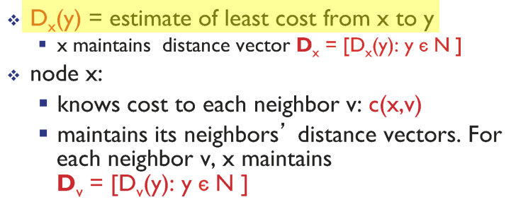
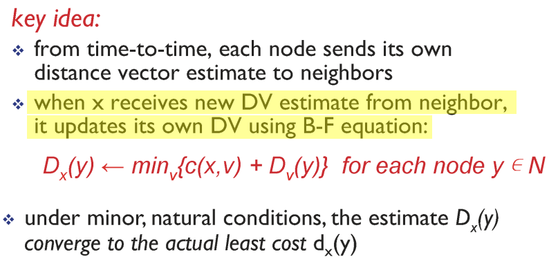

## Distance vector algorithm

* 예측한 정보를 토대로 거리 계산  
* 벨만 포드 알고리즘을 이용하여 최단 거리 도출  
* count-to-infinity : 라우팅 루프가 도는 현상  
  * poison reverse  

  

  

  

 

## routing in the Internet

* AS : Autonomous Systems
  * An autonomous system is an autonomous routing domain that has been assigned an Autonomous System Number
  * Intra-AS routing
    * 같은 AS 내부 호스트와 라우터들 간의 라우팅
    * 정책 결정이 필요없음
    * cost 기준

  
  
  
  
  
    * Inter-AS routing
  
  
      * 서로 다른 AS 시스템 간의 라우팅
      * cost < policy
  
  
      * BGP : Border Gateway Protocol
  
        * Policy-Based routing protocol
  

* AS-Path : 해당 AS까지 경로 주소들을 기록
  * 새로운 AS는 왼쪽에 추가
  * 서로 다른 neighbor로부터 동일한 BGP 수신 시 AS-Path 주소에 짧은 AS 선택

 

  ## Link layer

* MAC(Multiple Access links) protocols

  * point to point
  * broadcast(shared wire or medium)
  * three broad classes
    * channel partitioning
    * random access
    * taking turns

* Channel partitioning MAC protocols

  * TDMA(time division multiple access)
  * FDMA(frequency division multiple access)
  * 자원이 낭비되는 문제

* Random access protocols

  * ALOHA
  * CSMA(carrier sense multiple access)
    * listen before transmit
    * collision can still occur : propagation delay 때문

  

  * 충돌이 감지되면 전송을 멈춘다.

  

* "Taking turns" MAC protocols

 

## LAN(Local Area Network)

* Ethernet

 

* ARP(address resolution protocol)

 

 

* switching
  * switching forward table : each switch has a switch table
  * switch learns which hosts can be reached through which interfaces
  * destination의 위치를 모르는 경우 : flood
  * destination의 위치를 아는 경우 : selectively send on just one link

 

## data center network

 

## wireless network

* infrastructure : 기지국을 통한 통신
* ad hoc : 기지국 없이 단말끼리 네트워크 구성

* AP(access point) 
* BSS(basic service set) : cell,  AP가 만든 네트워크

 

* 802.11 : passive / active scanning

* RTS(Ready to send)
* CTS(Clear to send)

 

 

* 본인 addr는 제거한 frame을 전송

