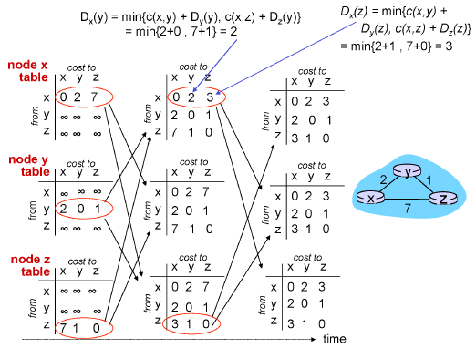
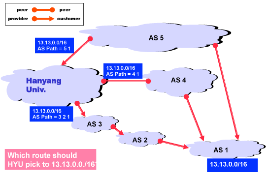
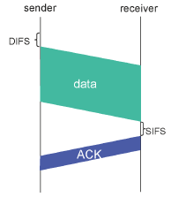
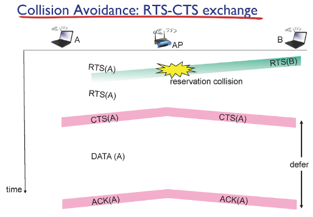

# 네트워크 계층

## Routing Algorithms

### Distance Vector algorithm

#### Bellamn-Ford example

Dx(Y) = min[c(x, v) + Dv(Y)]

- 출발지 u에서 목적지 z까지의 거리를 재귀적으로 구하는 알고리즘
- 이웃된 라우터정보만 알고 있음
- 1턴씩 동작(시간1)
- 1턴마다 이웃 라우터와의 거리 계산
- update 한다면 이웃 라우터에 새로 전송
- 더이상 update가 되지 않을때까지 반복 => 포워딩 테이블
- 가장 짧은 길이의 라우터로 보냄
- 이웃 라우터에게 정보를 받을 때, 자기 자신을 거쳐가는 경로가 있으면 나중에 거리가 바뀔때 count-to-infinity가 발생할 수 있음
- 자기 자신을 거쳐가는 경로는 ∞로 주는 poisoned reverse 방법 사용해야 함

### herarchical routing

- 라우터를 영역으로 통합, autonomous systems(AS)
- AS가 같으면 같은 라우팅 프로토콜을 사용

## Routing in the Internet

### AS: Astonomous Systems

- 자치권, 각각의 네트워크에서는 각자가 어떤 라우팅 알고리즘을 사용할 것인지 정함
- link state algorithm, distance vector algorithm은 Intra-AS
- Intra-AS는 고유의 숫자 가짐(ASN)
- 둘다 특정 범위 내에 네트워크에서만 적용 가능
- 전체 네트워크에 적용하기에는 무리
- link state algorithm으로 구현한 프로토콜: OSPF 프로토콜
- distance vector alogorithm으로 구현한 프로토콜: RIP 프로토콜
- 더 큰 범위의 네트워크 끼리의 라우팅 알고리즘은 Inter-AS

#### Inter-AS

- hierarchical routing으로 구현한 프로토콜인 BGP 프로토콜을 사용

### Relationships Between Networks

- 인력, 물리적 연결 및 광역폭, 하드웨어와 데이터 센터 공간과 힘도 다 필요하지만 결국 돈만 있으면 가능
- 네트워크를 제공해주는 AS - provider
- 네트워크를 제공받는 AS - customer

#### The "Peering" Relationship

- 같은 급 = Peering
- peering 관계끼리는 자유롭게 트래픽을 제공받고 provider/customer 관계에서는 계약으로 프래픽 제공받음
- 가운데 껴있는 peer은 이득 X

### Implementing Inter-Network Relationships with BGP

#### BGP-4

- Border Gateway Protocol
- Policy-Based (최적화(최고 효율)가 목적인 Inter-AS routing과 달리 정책에 따름)

#### ASPATH Attribute

- AS5나 AS4를 거쳐가는 것이 최단거리이지만 customer를 많이 거칠수록 이익이 더 크기때문에 AS3, AS2를 지남
- intra AS는 최고 효율을 내는 프로토콜을 사용하지만 inter AS는 그저 더 많은 이익을 얻는 경로를 찾아가는 프로토콜(BGP)를 사용

#### 경로 기본 설정 선호도

- Customer > Peer > Provider

# 링크 계층

- 충돌 방지가 목표
- 애플리케이션 계층에서는 소켓 대 소켓의 메세지 전송만을 봄
- 전송계층에서는 어떻게 신뢰성 있는 데이터를 전송할건지를 결정
- 네트워크 계층에서는 어떤 경로를 통해 패킷을 전송할건지 결정
- 링크 계층에서는 내가 보낸 패킷이 어떻게 다음 게이트 웨이까지 갈 것인지를 결정

- 하나의 게이트웨이에 여러 사용자가 패킷을 보냄
- 패킷이 물리 계층을 지나면서 파장으로 변함
- 파장은 여러 곳에 다 전달되기 때문에 충돌(collision) 발생
- 링크 계층에서 이 충돌을 방지

- 앱, 전송, 네트워크 계층은 OS 내부에 코드로 구현(소프트웨어)
- 링크 계층은 Network Interface Card, 하드웨어에 구현

### MAC

- Multiple access links
- 충돌에 대한 해결책
- broadcast medium
  - 패킷을 뿌리면 광범위한(broadcate) 매체(medium)에 모두 전송
  - 정확히 원한느 곳에만 받을 수 있게 하는게 MAC 프로토콜

#### 이상적인 MAC  프로토콜

- Given: 이용가능한 통로 R이 있을때

  - Desire
    1. 하나의 노드가 데이터 전송을 원할 경우 R에게 데이터 보냄
    2. M개의 노드가 같이 사용을 원할 경우, R/M씩 나눠서 보냄
    3. 분산처리해서 동작할 수 있게 함
    4. 단순화

  - 3가지 분류
    1. channel partitioning
    2. random access
    3. taking turns

#### Channer partitioning

- TDMA: time division multiple access
  - 하나의 통로를 공유해서 사용할때 연결된 노드만큼 시간대를 나눠서 하나의 노드는 해당 시간대에만 전송 가능하도록하여 충돌 방지
  - 연결만 되어있고 전송하지 않는 노드가 있을 경우 자원 낭비
- FDMA: frequency division multiple access
  - 각 노드마다 주파수를 나눠서 해당 주파수로만 데이터를 보내도록 함
  - TDMA와 마찬가지로 전송하지 않는 노드가 있을 경우 자원 낭비

- 시간, 주파수 등을 통해 Access 권한 나눠가짐
- 자원이 낭비될 수 있음

#### Random access

access 권한을 나누지 말고 보내고 싶을때만 보냄

- CSMA: carrier sense multiple access
  - listen before transmit, 전송하기 전에 듣는다
  - 전송하는 노드가 있을 경우 전송 X
  - 전송하는 노드가 없으면 전송
  - 여러개의 노드가 동시에 듣고 동시에 전송하는 경우가 있을 수 있음(Propagation delay)
- CSMA/CD(collision detection)
  - 기존 CSMA에서 발생하는 충돌을 해결하기 위함
  - 데이터 전송을 하고 충돌이 발생하면 그 즉시 전송을 멈춤
  - 재전송할 때 binary(exponential) backoff 사용
  - m번의 충돌이 있을때 0~m-1까지의 숫자 중 랜덤으로 하나의 숫자를 뽑은 후 그 시간만큼 기다림
  - 자기가 원할때 전송할 수 있다는 장점이 있지만 사용자가 몰릴 경우 전송 속도가 느려짐(충돌 갯수가 늘어날수록 숫자 고르는 시간 증가)

Propagation delay가 0이면 충돌이 없는데 0일 수가 없으니 충돌을 피함

#### Taking turns

- channel partitioning 프로토콜은 사용자가 많으면 효율성이 좋지만 사용자가 적을 경우 낭비되는 자원 발생
- random acces 프로토콜은 사용자가 적으면 효율성이 좋지만 사용자가 많을 경우 delay 시간이 길어짐
- 그래서 총괄하는 master를 하나 둬서 관리감독 하게 하는게 taking turns 프로토콜
- master가 고장날 경우 전체 시스템이 다운될 수 있기 때문에 사용 잘 X

### LANs

Local Area Network

#### Ethernet

- LAN이란 게이트웨이를 거치지 않고도 접근이 가능한 네트워크 단위
- 하나의 게이트웨이를 공유하는 매체가 하나의 LAN
- 동일한 프리픽스를 가지고 라우터를 거치지 않고도 통신이 가능한 서브넷도 LAN으로 구성

##### Ethernet  물리적 배치

- bus
  - 90년대부터 사용
  - 모든 노드를 같은 충돌 도메인에 배치
- star
  - 최근 사용
  - switch가 중간에 있음

##### Ethernet frame structure

- HDR: type까지
- dest address, source address, type이 중요, 이 중에서 type은 네트워크의 프로토콜이 들어있음(IP 프로토콜)
- CRC는 에러 채킹하는 곳

##### Ethernet CSMA/CD 알고리즘

- CSMA/CD 프로토콜 사용
- TCP 재전송(ACK가 오지 않을때 재전송)
- Link 재전송(프레임이 오지 않을때 재전송)
- Link 재전송을 하는게 나음

##### collision이 발생했을때 감지 못하는 경우

A   B    C     D    E

- A에서 E쪽으로 전송
- A가 전송한 프레임이 E에 도착하기 직전에 충돌이 발생했을때 E는 바로 전송 중단하고 재전송 준비
- A는 충돌난지 모름
- 이런 경우를 방지하기 위해 A가 길게 전송해야함
- 따라서 최소 64byte씩 데이터를 전송해야 함

##### MAC address

- 프레임에 들어있는 헤더 중 address는 IP address와는 다른 MAC address
- 48bit로 구성
- 앞 24bit는 제조회사, 뒤 24bit는 인터페이스 고유 넘버로 사용
- 랜카드가 공장에서 나올 때 찍힘
- 변경 불가능

##### LAN address

- 프레임의 헤더 중 source address에는 자기 자신의 MAC 주소가, destination address에는 다음에 갈 게이트웨이 MAC 주소가 적혀있음
- 프레임의 데이터 부분에는 DHCP가 알려준 나의 IP와 DNS가 알려준 목적지 IP주소가 있는 IP 패킷이 담겨져 있음
- 현재 자신의 IP, MAC 주소, 목적지 IP 주소는 알지만 전송해야할 게이트웨이 라우터의 MAC 주소는 알지 못함
- DHCP를 통해 해당 게이트웨이 라우터의 IP 주소는 알고 있음
- 그 IP 주소를 가지고 MAC 주소를 알아내는 과정이 필요

##### ARP(address resolution protocol)

- 각 인터페이스에는 ARP table 소유
- 테이블에는 IP 주소와 대응하는 MAC 주소가 적혀있음
- 그 테이블에 원하는 정보가 없을 경우 ARP request라는 프레임을 LAN 전체에 브로드캐스트로 보냄
- desc 주소는 브로드캐스트, source 주소는 자기자신, data 부분엔 원하는 IP 주소를 담아서 보냄
- IP 주소가 상응하는 인터페이스만 응답해줌
- 똑같이 브로드캐스트로 보내서 source가 맞는 인터페이스만 응답
- ARP 테이블에는 TTL이라는 칼럼이 있어 해당 정보의 유효기간을 명시

### switches

- bus 배치

  - 매체에 새로운 컴퓨터가 추가됐을 경우 직접 선을 구축,
  - bus 형은 하나의 collision domain으로 구성

- star 형

  - star배치에서는 switch에 선만 꽂으면 됨

  - star 형은 collision domain을 분리시켜 각각의 컴퓨터로 구분시켜서 충돌이 방지

  - switch는 연결만 도와주는 기기 

- 스위치 안에도 스위치 테이블이 존재해서 연결된 인터페이스들의 mac 주소를 담고 있음
- 스위치 테이블의 컬럼은 연결된 포트, mac 주소, TTL
- 스위치 테이블은 self-learing 방식으로 생성
- A로부터 요청이 오면 그때 A의 포트의 mac 주소를 적어놓음
- 요청이 올때 목적이 mac 주소의 포트를 알고 있으면 해당 포트로 보내고 모르면 브로드캐스트로 보냄
- 목적지에 맞는 인터페이스만 받고 다른 인터페이스는 버림
- 스위치 테이블에 없는 정보면 저장
- 스위치는 여러개 연결 가능, 사람이 많아질 경우 많은 스위치 필요

#### switches vs. routers

스위치와 라우터(공유기)의 차이

- 스위치는 단순히 교통정리 역할, 네트워크 계층에서는 고려되지 않음
- 라우터는 어플리케이션 계층까지 있는 하나의 컴퓨터
- 들어오는 공인 ip를 여러 사설 ip로 바꿔주는 NAT이 동작
- ip 주소를 알려주는 DHCP가 동작
- 도메인과 ip 주소를 상호변환해주는 NAME 서버가 동작
- 공유기는 하나의 서브넷을 관리

# Wireless 무선이동네트워크

- 유선과 무선의 MAC 프로토콜은 다름
- 유선은 링크라는 매체를 공유해서 사용
- 무선은 공기라는 매체를 공유해서 사용
- 무선일 경우 내 컴퓨터에서 서버로 통신이 갈 때 전체가 아닌 무선이 아닌 한 홉만 무선
- 유선은 안정적인 케이블로 연결되어 있어 외부의 노이즈로부터 보호, 연결 거리에 큰 영향 받지 X
- 무선은 거리에 영향 O

## Wireless links, characteristics

- Hidden terminal problem
  - A, B, C가 각각 80m 거리에 있고 각 데이터 전송 반경이 100m일 때, A와 B, B와 C는 서로 데이터 전송이 가능하지만 A와 C는 데이터 전송이 불가능
  - A와 B가 데이터 통신중일때 C가 CSMA방식을 사용해서 carrier sence를 하려고 해도 A가 보내는 데이터를 알아차릴 수 없음 
  - 자신이 전송을 시작하면 너무 커서 남이 하는 전송을 감지 못함
  - 무선환경에서는 CSMA/CD 방식 사용X

## Wi-Fi (IEEE 802.11)

- Wi-Fi는 Wireless Fidelity의 약자로 무선이지만 유선과 같은 성능을 낸다는 뜻
- 공유기 하나당 하나의 AP를 가지고 있고 유선으로 스위치 혹은 라우터에 연결되어 있음
- 모든 AP들은 주기적으로 자기 자신의 AP를 브로드캐스트함
- 호스트들은 그 정보를 가지고 와이파이 목록을 띄울 수 있음

### CSMA/CA

와이파이는 어떤 MAC 프로콜을 사용하는가

- 유선일 경우 모든 매체를 공유하기 때문에 충돌 감지가 되지만 무선일 경우 A가 보내는 데이터를 C는 들을 수 없기 때문에 충돌 감지 X
- 따라서 무선일때 AP가 ACK를 보내서 충돌 감지

- DIFS 만큼의 시간을 기다린 후 다른 데이터 전송이 없으면 전송 시작
- AP는 데이터를 받고 SIFS만큼의 시간을 기다린 후 ACK를 보냄
- 센더는 데이터를 보낸 후 ACK를 받았을 때만 데이터 전송이 완벽하게 이루어졌다고 판단하고 다음 데이터 준비
- ACK가 오지 않을 경우 충돌이 발생했다고 판단해서 랜덤한 시간 이후에 재전송

- 유선일 경우 충돌이 일어나면 바로 멈추기 가능
- 무선은 ACK로만 판단하기 때문에 한번 데이터를 전송하면 바로 멈추지 못함
- 그래서 데이터 전송하기 전 RTS라는 작은 데이터를 전송해 전송중인 다른 데이터가 있는지 확인
- AP가 RTS를 받으면 데이터를 전송해도 좋다는 CTS를 보냄
- CTS를 받지 못하면 충돌이 발생했다는걸 ㅇ니지하고  random backoff해서 재전송함
- RTS, CTS에는 얼마만큼의 데이터를 얼마의 시간동안 보내겠다는 정보가 담겨있음
- 각 RTS, CTS를 받을 수 있는 반경의 인터페이스들은 그 정보를 받고 그 기간동안엔 데이터 전송 X

- ACK를 못 받으면 무조건 재전송
- ACK 받을때까지 재전송하면 과부하가 걸릴 수 있기 때문에 최대 7번까지만 데이터를 전송하도록 규정
- 7번 전송해도 안되면 프레임을 포기하고 다음 프레임 전송