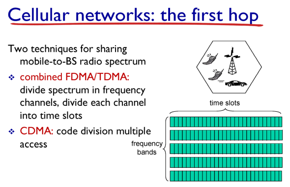
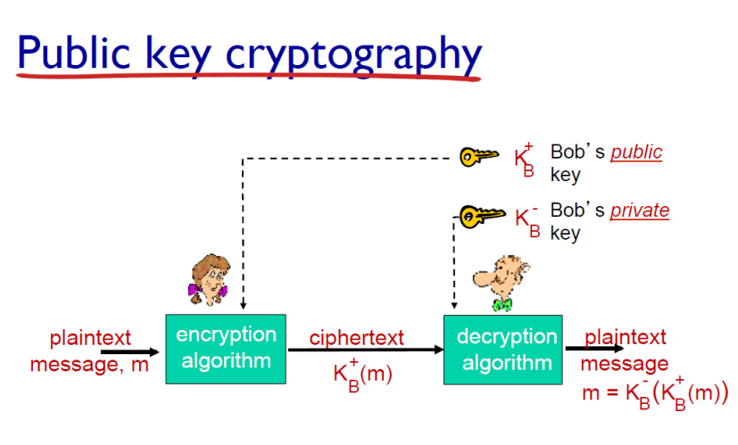

## DHCP  

*  **DHCP**(Dynamic Host Configuration Protocol) : 호스트의 IP주소와 각종 TCP/IP 프로토콜의 기본 설정을 클라이언트에게 자동적으로 제공해주는 프로토콜  
  * IP address  
  * subnet mask   
  * GWR IP    
  * local name server IP  

   

## Frame  

  

   

## connection  
* TCP 연결  
  * 소스의 IP 주소와 port, 목적지의 IP 주소와 port가 바뀌지 않으면 연결 유지  
  * 같은 서브넷의 경우에는 IP가 바뀌지 않음  
  * switch만 self-learning을 통해 switch port 수정  

  

  

   

## SNR  

* SNR(Signal to Noise Ratio)  
* BER(Bit / Error Ratio)  

  

## Celluar network  

  

* 2G : FDMA / TDMA  
* 3G : CDMA  

  

* cellular network의 발전은 속도 기준으로 구분  

  

   

  

## mobility

* 우선 home network와 home network에서 사용되는 permanent address를 갖게 된다.  

  

* registration
  * 이동이 발생한 경우에는 permanent address와 care-of-address를 갖게 된다.
  * foreign agent는 home agent에게 visited network에 있다는 것을 알린다.
* Mobility via indirect routing
  * 외부 노드가 home agent로 요청을 보내면 home agent가 다시 visited network에 있는 host에게 전송
  * 장점 : 외부 노드의 입장에서는 permanent address로만 보내면 된다.
* Mobility via direct routing
  * 외부 노드가 home agent로 요청을 보내면 home agent가 다시 외부 노드에게 host 정보 알려줌
  * 그 이후로는 host와 직접 통신

  

 

## Multimedia Network

* https://com24everyday.tistory.com/143
* 압축에 대해서 설명이 매우 잘 되어있어서 첨가

  

  

  

* 동영상을 실시간으로 재생한다고 할 때, 네트워크의 사정으로 전송 과정이 균일하지 않다.  

  * 버퍼를 사용하여 일정량이 모일 때 송출  
  * streaming에 UDP를 사용하는 경우  
    * UDP는 네트워크 상황을 고려하지 않기 때문에 적합하지 않음   
  * streaming에 TCP를 사용하는 경우  
    * 네트워크가 안 좋은 상황에 전송이 원활하지 않음  
  * TCP 기반의 DASH 사용  
    * 서버는 여러 개의 chunks를 만들어 놓고 다른 rate로 인코딩한다. 이 정보는 manifest file에 테이블 형태로 담겨있다.  
    * 낮은 bps(낮은 화질)로 데이터를 전송 시작  
    * 점차 bps를 높이고 네트워크의 상황에 맞는 bps로 전송  
  
  
  
  

* CDN (Content Delivery Network)
  * 지리적으로 분산된 여러 개의 서버

## network security

  

* 메시지를 주고 받을 때 key가 있어야 메시지를 열어볼 수 있다.

* Symmetric key는 암호키와 이를 푸는 키로 서로 같은 키를 공유한다.

  

* public 키를 이용하여 암호화를 진행하고 private 키를 이용하여 해석
  * 앨리스의 public 키를 이용하여 암호화를 하면 앨리스의 private 키로만 열어볼 수 있음

* 앨리스의 private 키로 암호화를 하고 앨리스의 public 키로 열어보면 앨리스인지 검증이 가능  
  * digital signatures는 해당 방법 사용

* 긴 메시지를 public key로 암호화하는 것에는 큰 비용이 들기 때문에 Hash 함수를 사용한다. 키를 이용해서 Hash 함수를 풀어 내용을 확인할 수 있다.

 

## SSL(Secure Sockets Layer)

* HTTP는 TCP 위에서 동작하므로 TCP가 제공하지 않는 것은 사용할 수 없다.
  * TCP는 security를 제공해주지 않는다. 이에 대한 응급처방이 SSL
  * SSL에서 message를 암호화()
  * SSL에서 TLS라는 용어도 많이 사용
* HTTPS
  * HTTP + SSL

* secrete key를 만들고 google의 key로 암호화해서 전송 ⇒ 서로만 공유하는 암호화 키를 만들 수 있음

* MAC(Message Authentication Code) : 송신자를 보장하고 메시지의 내용이 변조되지 않았는지 확인하기 위한 코드, Hash를 사용하여 만듦
  * 암호화한 data와 MAC을 같이 보내는데 data 안에는 Message와 MAC이 들어있음.
  * data안에 있는 MAC과 밖의 MAC이 같은지 확인

* 공격자가 데이터의 순서를 바꿀 수도 있기 때문에 MAC에 sequence를 같이 넣어서 전송(sequence number field는 아님)

* 데이터를 다 전송하지 않았는데 fin을 보내어 연결을 끊어버리는 것을 방지
  * MAC에 데이터의 type을 담아서 전송한다. type이 0인 경우는 data, 1인 경우는 close를 의미한다.

 

## Firewalls

* 방화벽으로 Gateway Router에 구현된다.

  

