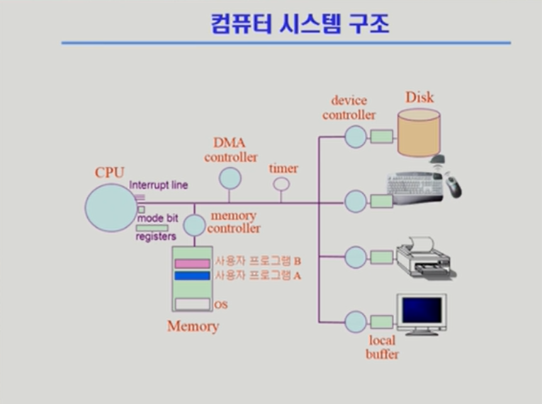
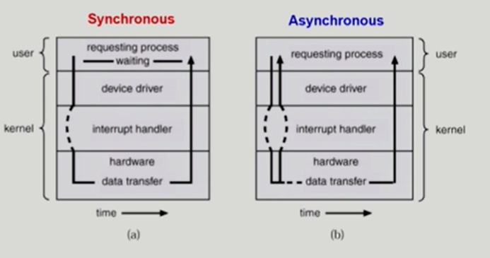
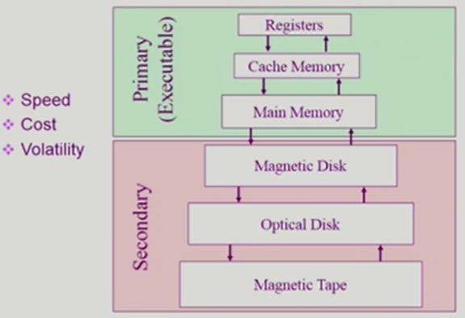
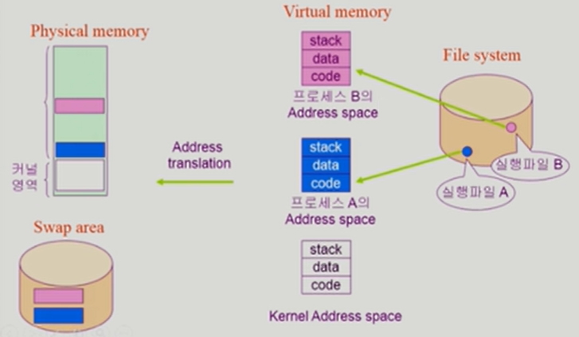
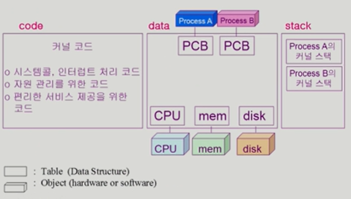
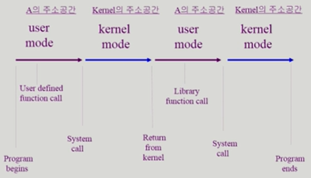
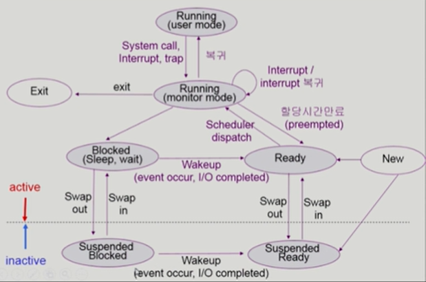
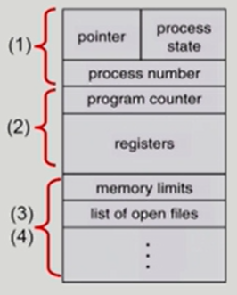

## 운영체제(Operating System, OS)란?

* 컴퓨터 하드웨어 바로 위에 설치되어 사용자 및 다른 모든 소프트웨어와 하드웨어를 연결하는 소프트웨어 계층
* 협의의 운영체제(커널)
  * 좁은 의미의 운영 체제, 일반적으로 운영체제라고 하면 커널을 지칭
  * 운영체제의 핵심 부분으로 메모리에 상주하는 부분
* 광의의 운영체제
  * 넓은 의미의 운영 체제
  * 커널 뿐 아니라 각종 주변 시스템 유틸리티를 포함하는 개념
* 컴퓨터 시스템을 편리하게 사용할 수 있는 환경을 제공
  * 운영체제는 동시 사용자 / 프로그램들이 각각 독자적 컴퓨터에서 수행되는 것 같은 환상을 제공
  * 하드웨어를 직접 다루는 복잡한 부분을 운영체제가 대행
* 컴퓨터 시스템의 자원(프로세서, 기억장치, 입출력 장치 등)을 효율적으로 관리하는 것이 목표
  * 사용자간의 형평성 있는 자원 분배
    * 실행중인 프로그램들에게 짧은 시간씩 CPU를 번갈아 할당
    * 실행중인 프로그램들에 메모리 공간을 적절히 분배
  * 주어진 자원으로 최대한의 성능을 내도록
  * 사용자 및 운영체제 자신의 보호
  * 프로세스, 파일, 메시지 등을 관리

## 운영 체제의 분류

* 동시 작업 가능 여부

  * 단일 작업(single tasking)
    * 한 번에 하나의 작업만 처리 (MS-DOS 프롬프트)
  * 다중 작업(multi tasking)
    * 동시에 두 개 이상의 작업 처리 (UNIX, MS Window)

* 사용자의 수

  * 단일 사용자(single user)
    * MS-DOS, MS Windows
  * 다중 사용자 (multi user)
    * UNIX, NT server

* 처리 방식

  * 일괄 처리(batch processing)
    * 작업 요청의 일정량 모아서 한꺼번에 처리
    * 작업이 완전 종료될 때까지 기다려야 함
    * 현대에는 쓰이기 어려운
  * 시분할 (time sharing)
    * 여러 작업을 수행할 때 컴퓨터 처리 능력을 일정한 시간 단위로 분할하여 사용
    * 일괄 처리 시스템에 비해 짧은 응답 시간
    * interactive한 방식 (사용자가 컴퓨터로부터 서비스를 제공되는 시간을 숫자로 표시)
  * 실시간(Realtime OS)
    * 정해진 시간 안에 어떠한 일이 반드시 종료됨이 보장되어야하는 실시간 시스템을 위한 OS
    * 원자로/공장 제어, 미사일 제어, 반도체 장비, 로보트 제어
    * 경성 실시간 시스템(Hard realtime system) : 시간이 어긋나면 안 됨
    * 연성 실시간 시스템(Soft realtime system) : 시간이 어긋나면 안 되지만 어긋나도 큰 문제는 없음 (동영상 재생)

* 용어

  * Multitasking / Multiprogramming / Time Sharing / Multiprocess
  * 위 용어들은 컴퓨터에서 여러 작업을 동시에 수행하는 것 의미, 하나의 CPU로 가능
  * Multiprogramming은 여러 프로그램이 메모리에 올라가 있음을 강조
  * Time Sharining은 CPU의 시간을 분할하여 나누어 쓴다는 의미 강조
  * :star:Multiprocessor : 하나의 컴퓨터에 CPU(processor)가 여러 개 붙어있음을 의미
## 운영 체제의 예

  * 유닉스(UNIX)
    *  코드의 대부분을 C언어로 작성
    * 높은 이식성
    * 최소한의 커널 구조
    * 복잡한 시스템에 맞게 확장이 용이
    * 소스 코드 공개
    * 프로그램 개발에 용이
    * 다양한 버전 (System V, FreeBSD, SunOS, Solaris, Linux)
  * MS windows
    * DOS(Disk Operating System)
      * MS사에서 1981년 IBM-PC를 위해 개발
      * 단일 사용자용 운영체제, 메모리 관리 능력의 한계 (주 기억 장치 : 640 KB)
    * MS Windows
      * MS사의 다중 작업용 GUI 기반 운영 체제
      * Plug and Play, 네트워크 환경 강화
      * DOS용 응용 프로그램과 호환성 제공
      * 불안정성
      * 풍부한 지원 소프트웨어
      * Handheld device를 위한 OS (PalmOS, Pocket PC(WinCE), Tiny OS)

## 운영 체제의 구조

* CPU 스케줄링 ( 누구에게 CPU를 줄 것인가 )
* 메모리 관리 ( 한정된 메모리를 어떻게 쪼개어 사용할 것인가 )
* 파일 관리 ( 디스크에 파일을 어떻게 보관할 것인가 )
* 입출력 관리 ( 각기 다른 입출력장치와 컴퓨터 간에 어떻게 정보를 주고 받게 할 것인가 )
* 프로세스 관리 ( 프로세스의 생성과 삭제, 자원 할당 및 반환, 프로세스 간 협력 )

## 컴퓨터 시스템 구조

* Mode bit 

  * 사용자 프로그램의 잘못된 수행으로 다른 프로그램 및 운영체제에 피해가 가지 않도록 하기 위한 보호 장치 필요
  * Mode bit을 통해 하드웨어적으로 두 가지 operation 지원
    * 1 사용자 모드 : 사용자 프로그램 수행
    * 0 모니터 모드 : OS 코드 수행
    * 보안을 해칠 수 있는 중요한 명령어는 모니터 모드에서만 수행 가능한 '특권 명령'으로 규정
    * Interrupt나 Exception 발생 시 하드웨어가 mode bit을 0으로 바꿈
    * 사용자 프로그램에게 CPU를 넘기기 전에 mode bit을 1로 셋팅
    * 모니터 모드 = 커널 모드 = 시스템 모드

* Timer

  * 정해진 시간이 흐른 뒤 운영체제에게 제어권이 넘어가도록 Interrupt 발생
  * 타이머는 매 클럭 틱 때마다 1씩 감소
  * 타이머 값이 0이 되면 timer interrupt 발생
  * CPU를 특정 프로그램이 독점하는 것으로부터 보호
  * time sharing을 구현하기 위해 널리 이용
  * 현재 시간을 계산하기 위해서도 사용
  
* Device Controller
  
  * I/O device controller
    * I/O 장치 유형을 관리하는 일종의 작은 CPU
    * 제어 정보를 위해 control register, status register를 가짐
    * local buffer를 가짐 (일종의 data register)
  * I/O은 실제 device와 local buffer 사이에서 일어남
  * Device controller는 I/O가 끝났을 경우 interrupt로 CPU에 그 사실을 알림
  * device driver(장치 구동기) : OS 코드 중 장치별 처리루틴 (software)
  * device controller(장치 제어기) : 각 장치를 통제하는 일종의 작은 CPU (hardware)

* 입출력(I/O)의 수행

  * 모든 입출력 명령은 특권 명령
  * 사용자 프로그램은 어떻게 I/O를 하는가?
    * 시스템 콜(system call) : 사용자 프로그램은 운영체제에게 I/O 요청, 사용자 프로그램이 운영 체제의 서비스를 받기 위해 커널 함수를 호출하는 것
    * trap을 사용하여 인터럽트 벡터의 특정 위치로 이동
    * 제어권이 인터럽트 벡터가 가리키는 인터럽트 서비스 루틴으로 이동
    * 올바른 I/O 요청인지 확인 후 I/O 수행
    * I/O 완료 시 제어권을 시스템콜 다음 명령으로 옮김
  
* 인터럽트 (Interrupt)
  
  * 인터럽트 당한 시점의 레지스터와 program counter를 save한 후 CPU의 제어를 인터럽트 처리 루틴에 넘긴다.
  * Interrupt(하드웨어 인터럽트)
    * 하드웨어가 발생시킨 인터럽트(타이머, 컨트롤러)
  * Trap(소프트웨어 인터럽트)
    * Exception : 프로그램이 오류를 범한 경우
    * System call : 프로그램이 커널 함수를 호출하는 경우
  * 인터럽트 벡터 : 해당 인터럽트의 처리 루틴 주소를 가지고 있음
  * 인터럽트 처리 루틴(Interrupt Service Routine, 인터럽트 핸들러) : 해당 인터럽트를 처리하는 커널 함수
  * CPU 독점을 막기 위해 timer 인터럽트
  * 요청한 작업이 끝난 것을 알려주기 위해서, 새로운 입력이 들어왔다는 것을 알려주기 위해서 control 인터럽트
  * 현대 운영체제는 인터럽트를 통해 구현
  
* 동기식 입출력과 비동기식 입출력

  

  * 동기식 입출력 (synchronous I/O) 
    * I/O 요청 후 입출력 **작업이 완료된 후**에야 제어가 사용자 프로그램에 넘어감
    * 구현 방법 1 : I/O가 끝날 때까지 CPU 낭비, 매시험 하나의 I/O만 일어날 수 있음
    * 구현 방법 2 : I/O가 끝날 때까지 해당 프로그램에게서 CPU를 빼앗음, I/O 처리를 기다리는 줄에 그 프로그램을 줄 세움, 다른 프로그램에게 CPU를 줌
  * 비동기식 입출력 (asynchronous I/O)
    * I/O가 시작된 후 **입출력 작업이 끝나기를 기다리지 않고** 제어가 사용자 프로그램에 즉시 넘어감
  * 두 경우 모두 I/O의 완료는 인터럽트로 알려줌

* DMA(Direct Memory Access)

  * 빠른 입출력 장치를 메모리에 가까운 속도로 처리하기 위해 사용
  * CPU의 중재 없이 device controller가 device의 buffer storage의 내용을 메모리에 block 단위로 직접 전송
  * 바이트 단위가 아니라 block 단위로 인터럽트를 발생시킴
  
  
  
* 저장장치 계층 구조
  
  
  
  * 위로 갈수록 속도가 빠르고 가격이 비싸기 때문에 용량이 작음. 
  * Primary : 휘발성 매체, CPU가 직접 접근 가능
  *  Secondary : 비휘발성,  CPU가 직접 접근 불가능
  
* 프로그램의 실행 (메모리 load)
  
  
  
* 커널 주소 공간의 내용
  
  
  
  
  
* 사용자 프로그램이 사용하는 함수
  
  * 사용자 정의 함수
    * 자신의 프로그램에서 정의한 함수
  * 라이브러리 함수
    * 자신의 프로그램에서 정의하지 않고 갖다 쓴 함수
    * 자신의 프로그램의 실행 파일에 포함되어 있다
  * 커널 함수
    * 운영체제 프로그램의 함수
    * 커널 함수의 호출 = 시스템 콜
  
* 프로그램의 실행
  
  
  
  ## 프로세스
  
  
  
* 프로세스의 문맥(context)

  * CPU 수행 상태를 나타내는 하드웨어 문맥
  * Program Counter가 어디를 가리키고 있는지
  * 각종 register에 어떤 값을 넣어놓고 어떤 instruction까지 실행했는지

* 프로세스의 주소 공간 (메모리 쪽)

  * code, data, stack

* 프로세스 관련 커널 자료 구조

  * PCB(Process Control Block)
  * Kernel stack

* 프로세스의 상태(Process State)

  * Running : CPU를 잡고 instruction을 수행중인 상태
  * Ready : CPU를 기다리는 상태(메모리 등 다른 조건을 모두 만족하고)
  * Blocked(wait, sleep) : CPU를 주어도 당장 instruction을 수행할 수 없는 상태, Process 자신이 요청한 event(예:I/O)가 즉시 만족되지 않아 이를 기다리는 상태 (디스크에서 file을 읽어와야 하는 경우 같이)
  * Suspended(stopped) : 외부적인 이유로 프로세스의 수행이 정지된 상태, 프로세스는 통째로 디스크에 swap out 된다. (사용자가 프로그램을 일지 정지시킨 경우, break key / 시스템이 여러 이유로 프로세스를 잠시 중단시킴, 메모리에 너무 많은 프로세스가 올라와 있을 때)
  * New : 프로세스가 생성중인 상태
  * Terminated : 수행(execution)이 끝난 상태

* PCB(Process Control Block)

  

  * 운영체제가 각 프로세스를 관리하기 위해 프로세스당 유지하는 정보
  * (1)  OS가 관리상 사용하는 정보 (Process state, Process ID, scheduling information, priority)
  * (2) CPU 수행 관련 하드웨어 값 (Program counter, registers)
  * (3) 메모리 관련 (Code, data, stack 위치 정보)
  * (4) 파일 관련 (Open file descriptors...)

* 문맥 교환(Context Switch)

  * CPU를 한 프로세스에서 다른 프로세스로 넘겨주는 과정
  * CPU가 다른 프로세스에게 넘어갈 때 운영체제는 다음을 수행
    * CPU를 내어주는 프로세스의 상태를 그 프로세스의 PCB에 저장
    * CPU를 새롭게 얻는 프로세스의 상태를 PCB에서 읽어옴
  * system call이나 interrupt 발생시 반드시 context switch가 일어나는 것은 아님
    * timer interrupt 또는 I/O 요청 system call(시간이 오래 걸리는)에 문맥 교환이 일어남

* 스케줄러(Scheduler)
  * Long-term scheduler(장기 스케줄러 or job scheduler)
    * 시작 프로세스 중 어떤 것들을 ready queue로 보낼지 결정
    * 프로세스에 메모리를 주는 문제
    * degree of Multiprogramming 제어
    * time sharing system에는 보통 장기 스케줄러가 없음(무조건 ready)
  * Short-term scheduler(단기 스케줄러 or CPU scheduler)
    * 어떤 프로세스를 다음번에 running 시킬지 결정
    * 프로세스에 CPU를 주는 문제
    * 충분히 빨라야 함
  * Medium-term schedular(중기 스케줄러 or Swapper)
    * 여유 공간 마련을 위해 프로세스를 통째로 메모리에서 디스크로 쫓아냄
    * 프로세스에게서 memory를 뺏는 문제
    * degree of Multiprogramming을 제어
* Thread
  * A thread (or lightweight process) is a basic unit of CPU utilization
  * Thread의 구성 : program counter, register set, stack space
  * Thread가 동료 thread와 공유하는 부분(task) : code section, data section, OS resources
  * 전통적인 개념의 heavyweight process는 하나의 thread를 가지고 있는 task로 볼 수 있다.
  * 다중 스레드로 구성된 태스크 구조에서는 하나의 서버 thread가 blocked(waiting) 상태인 동안에도 동일한 태스크 내의 다른 thread가 실행(running)되어 빠른 처리를 할 수 있다.
  * 동일한 일을 수행하는 다중 thread가 협력하여 높은 처리율(throughput)과 성능 향상을 얻을 수 있다.
  * thread를 사용하면 병렬성을 높일 수 있다.
  * 장점
    * Responsiveness(응답성) : if one thread is blocked(eg network) another thread continues(eg display)
    * Resource Sharing(자원 공유) : n threads can share binary code, data, resource of the process
    * Economy : creating & CPU switching thread (rather than a process)
    * Utilization of MP Architectures : each thread may be running in parallel on a different processor (CPU가 여러 개 있는 경우)
  * Kernel threads(kernel을 통해 지원) , User threads (library를 통해 지원)

* 프로세스 생성(Process Creation)
  * 부모 프로세스 (Parent process)가 자식 프로세스(children process) 생성
  * 프로세스의 트리(계층 구조) 형성
  * 프로세스는 자원을 필요로 함(운영체제로부터 or 부모와 공유)
  * 자원의 공유 : 부모와 자식이 모든 자원을 공유하는 모델, 일부를 공유하는 모델, 전혀 공유하지 않는 모델
  * 수행(execution) : 부모와 자식은 공존하며 수행되는 모델, 자식이 종료(terminate)될 때까지 부모가 기다리는(wait) 모델
  * 주소 공간(Address space)
    * 자식은 부모의 공간을 복사함(binary and OS data)
    * 자식은 그 공간에 새로운 프로그램을 올림
  * 유닉스의 예
    * fork() : 시스템 콜이 새로운 프로세스를 생성, 부모를 그대로 복사, 주소 공간 할당
    * fork 다음에 이어지는 exec() 시스템 콜을 통해 새로운 프로그램을 메모리에 올림
* 프로세스 종료(Process Termination)
  * 프로세스가 마지막 명령을 수행한 후 운영체제에게 이를 알려줌(exit)
    * 자식이 부모에게 output data를 보냄(via wait)
    * 프로세스의 각종 자원들이 운영체제에게 반납됨
  * 부모 프로세스가 자식의 수행을 종료시킴(abort)
    * 자식이 할당 자원의 한계치를 넘어섬
    * 자식에게 할당된 태스크가 더 이상 필요하지 않음
    * 부모가 종료(exit)하는 경우
      * 운영체제는 부모 프로세스가 종료하는 경우 자식이 더 이상 수행되도록 두지 않는다
      * 단계적인 종료

