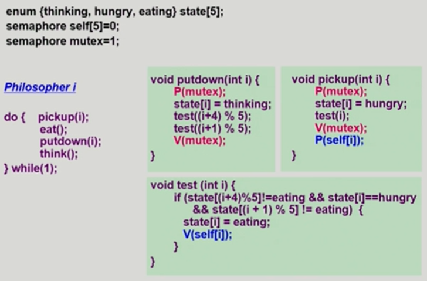

## 프로세스 생성(Process Creation)

* 자원의 공유

  * 부모와 자식이 모든 자원을 공유하는 모델 : 자식 프로세스는 부모 프로세스를 카피하기 때문에 주소 공유할 수 있는 부분은 일단 공유해서 메모리 절약, 하지만 각자의 작업을 통해 내용이 변경되는 경우에는 카피 (Copy-on-write, COW). 

    

* 유닉스의 예

  * fork() 시스템 콜이 새로운 프로세스를 생성

  * 부모를 그대로 복사, 새로운 내용을 덮어 씌우는

      

* fork() 시스템 콜

  * 자식의 경우에는 main 함수의 시작부분부터 시작하는 것이 아니라 fork가 끝나는 부분부터 실행되기 때문에 자식을 무한히 생성하진 않음. (만약 fork 앞에 어떤 행동이 있는 경우에는 해당 행동이 발생되지 않음)
  * fork를 할 때는 원본과 복제본 구분 가능(부모의 경우에는 pid가 양수가 되고 자식의 경우에는 pid가 음수)

  ```
  int main()
  { int pid;
    pid = fork();
    if (pid==0) /*this is child*/
      printf("\n Hello, I am child!\n")
    else if (pid > 0) /*this is parent*/
      printf("\n Hello, I am parent!\n")
  }
  ```

    

* exec() 시스템 콜

  * exelp : exec() 시스템 콜의 역할, 해당 부분을 만나면 파일을 아예 새롭게 덮어 씌워서 새로운 함수의 시작부분부터 수행할 수 있도록 함.
  * 한 번 exec() 을 하면 다시 돌아올 수 없음.
  
  ```
  int main()
  { int pid;
    pid = fork();
    if (pid==0) /*this is child*/
    {
      printf("\n Hello, I am child! Now I'll run date\n")
      execlp("/bin/date", "/bin/date", (char *) 0);
    }
    else if (pid > 0) /*this is parent*/
      printf("\n Hello, I am parent!\n")
  }
  ```
  
  * 아래 코드에서 execlp을 만나면 파일아 date 파일로 아예 새롭게 덮어 씌워지기 때문에 아래에 있는 parent 부분은 실행되지 않고 이전 파일로 되돌아 올 수도 없다.
  * exelp에는 프로그램 이름을 두 개 넣고 프로그램에 전달하고 싶은 내용을 뒤에 쭉 이어서 작성하고 마지막에 char 로 종료하는 것이 기본 문법
  
  ```
  int main()
  { int pid;
    printf("\n Hello, I am child! Now I'll run date\n")
    execlp("/bin/date", "/bin/date", (char *) 0);
    printf("\n Hello, I am parent!\n")
  }
  ```
  
    
  
* wait() 시스템 콜

  * 프로세스 A가 wait() 시스템 콜을 호출하면

    * 커널은 child가 종료될 때까지 프로세스 A를 sleep 시킨다. (block 상태)

    * Child process가 종료되면 커널은 프로세스 A를 깨운다. (ready 상태)

        

* exit() 시스템 콜

  * 프로세스의 종료

  * 자발적 종료

    * 마지막 statement 수행 후 exit() 시스템 콜을 통해
    * 프로그램에 명시적으로 적어주지 않아도 main 함수가 리턴되는 위치에 컴파일러가 넣어줌

  * 비자발적 종료

    * 부모 프로세스가 자식 프로세스를 강제 종료시킴

      > - 자식 프로세스가 한계치를 넘어서는 자원 요청
      >
      > - 자식에게 할당된 태스크가 더 이상 필요하지 않음

    * 키보드로 kill, break 등을 친 경우

    * 부모가 종료하는 경우

      > * 부모 프로세스가 종료하기 전에 자식들이 먼저 종료됨

  

## 프로세스 간 협력

* 독립적 프로세스 (Independent process)

  * 프로세스는 각자의 주소 공간을 가지고 수행되므로 원칙적으로 하나의 프로세스는 다른 프로세스의 수행에 영향을 미치지 못함

      

* 협력 프로세스 (Cooperating process)

  * 프로세스 협력 메커니즘을 통해 하나의 프로세스가 다른 프로세스의 수행에 영향을 미칠 수 있음

      

* 프로세스 간 협력 메커니즘(IPC: Interprocess Communication)

  * 메시지를 전달하는 방법

    * message passing : 커널을 통해 메시지 전달

  * 주소 공간을 공유하는 방법

    * shared memory : 서로 다른 프로세스 간에도 일부 주소 공간을 공유하게 하는 shared memory 메커니즘이 있음

    * thread : thread는 사실상 하나의 프로세스이므로 프로세스 간 협력으로 보기는 어렵지만 동일한 process를 구성하는 thread들 간에는 주소 공간을 공유하므로 협력이 가능

        

* Message Passing

  * Message system : 프로세스 사이에 공유 변수(shared variable)를 일체 사용하지 않고 통신하는 시스템

  * Direct Communication

    * 통신하려는 프로세스의 이름을 명시적으로 표시
    * 마찬가지로 커널을 통해 메시지 전달

  * Indirect Communication

    * mailbox(또는 port)를 통해 메시지를 간접 전달

    * 경우에 따라서 특정 프로세스가 아니라 아무 프로세스에게 전달될 수 있음

        

## CPU Scheduling

* CPU and I/O Bursts in Program Execution

  * CPU burst : CPU 명령을 실행하는 것

  * I/O burst : I/O를 요청한 다음 기다리는 시간

  * 프로세스는 명령어를 수행하다가 I/O를 기다렸다가, 다시 CPU에 남은 명령어를 돌리는 과정을 반복

      

* CPU-burst Time


  * CPU bound job의 경우에는 CPU를 길게 사용하는 것이고 I/O bound job의 경우에는 CPU를 많이 쓰기 보다는 짧은 시간동안 높은 빈도로 사용하는 것
  * 여러 종류의 job(=process)이 섞여 있기 떄문에 CPU 스케줄링이 필요
    * Interactive job에게 적절한 response 제공 요망
    * CPU와 I/O 장치 등 시스템 자원을 골고루 효율적으로 사용

  

* 프로세스의 특성 분류

  * I/O-bound process
    * CPU를 잡고 계산하는 시간보다 I/O에 많은 시간이 필요한 job
    * many short CPU bursts
  * CPU-bound process
    * 계산 위주의 job
    * few very long CPU bursts

  

* CPU Scheduler & Dispatcher

  * CPU Scheduler 
    * Ready 상태의 프로세스 중에서 이번에 CPU를 줄 프로세스를 고른다
  * Dispatcher
    * CPU의 제어권을 CPU scheduler에 의해 선택된 프로세스에게 넘긴다
    * 이 과정을 context switch라고 한다.
  * CPU 스케줄링이 필요한 경우는 프로세스에게 다음과 같은 상태 변화가 있는 경우이다.
    * Running -> Blocked(예: I/O 요청하는 시스템 콜) , nonpreemptive
    * Running -> Ready (예: 할당시간만료로 timer interrupt)
    * Blocked -> Ready(예: I/O 완료 후 인터럽트)
    * Terminate, nonpreemptive
    * **nonpreemptive**(강제로 빼앗지 않고 자진 반납)을 제외하고는 다른 스케줄은 **preemptive**(강제로 빼앗음)

  

* Scheduling Criteria(성능 척도)
  * CPU utilization(이용률) : 전체 시간 중 CPU의 수행 시간
  * Throughput(처리량) : 시간 당 수행하는 프로세스의 수
  * Turnarround time(소요 시간, 반환 시간) : 각 프로세스의 수행 시간
  * Waiting time(대기 시간) : ready queue에서 프로세스가 기다린 시간
    * 한 번의 프로세스에서도 CPU를 썼다가 다시 뺏기고 기다리고 이를 반복하게 됨. 여기에서 기다린 전체 대기 시간
  * Response time(응답 시간) : ready queue에 들어와서 최초로 CPU를 얻기까지의 시간

  

## CPU 스케줄링 알고리즘
* FCFS(First-Come-First-Served)

  * 비선점형 스케줄링

  * 자주 사용되지는 않음

  * 앞에 온 프로세스에 따라서 waiting time이 크게 달라짐

  * Convoy effect : waiting time이 길어진 상황

      

* SJF(Shortest-Job-First)

  * CPU burst time이 가장 짧은 프로세스를 제일 먼저 스케줄

  * Nonpreemptive : 일단 CPU를 잡으면 이번 CPU burst가 완료될 때까지 CPU를 preemptive 당하지 않음

  * Preemptive : 현재 수행중인 프로세스의 낮은 burst time보다 더 높은 CPU burst time을 가지는 새로운 프로세스가 도착하면 CPU를 빼앗김, 이 방법을 Shortest-Remaining-Time-First(SRTF)라고도 부른다.

  * SJF is optimal (주어진 프로세스들에 대해 가장 적은 average waiting time을 보장, preemptive일 때)

  * 극단적으로 짧은 프로세스를 위한 알고리즘이기 때문에 프로세스 사용시간이 긴 프로세스는 계속 수행될 수 없는 starvation이 발생할 수 있음

  * CPU burst time의 경우, 과거의 CPU burst time을 통해 들어온 프로세스의 CPU burst time을 예측한다.(exponential averaging)

      

* Priority Scheduling

  * 우선 순위가 높은 프로세스에게 CPU 할당

  * preemptive : 현재 수행 중인 프로세스보다 높은 우선 순위를 갖는 프로세스가 들어와도 완료할 때까지 CPU가 보장됨

  * Nonpreemptive : 우선 순위가 더 높은 프로세스가 들어오면 바로 CPU를 뺏김

  * 우선 순위에 대해 정수값으로 들어오고 작은 숫자일 수록 높은 우선 순위

  * SJF도 일종의 priority scheduling

  * Aging : starvation 문제를 해결하기 위한 방법, 아무리 우선순위가 낮은 프로세스여도 시간에 따라서 우선 순위를 점점 높여주는

      

* Round Robin(RR)

  * 현대 주로 사용되는 CPU 스케줄링
  * 각 프로세스는 동일한 크기의 할당시간(time quantum)을 가짐
  * 할당 시간이 지나면 프로세스는 preempted 당하고 ready queue의 제일 뒤에 가서 다시 줄을 선다.
  * 응답 시간이 가장 빠르다.
  * 대기 시간이 CPU 사용 시간에 비례하여 커진다
  * 할당 시간이 크면 FCFS와 같이 작동하고, 작으면 context switch 오버헤드가 커진다.
  * SJF보다 average turnarround time이 길지만 response time은 더 짧다.

    

* Multilevel Queue

  

  * Ready queue를 여러 개로 분할

    * foreground(interactive)
    * background(batch - no human interaction)

  * 각 큐는 독립적인 스케줄링 알고리즘을 가짐

    * foreground - RR
    * background - FCFS

  * 큐에 대한 스케줄링이 필요

    * Fixed priority scheduling

      * serve all from foreground then from background
      * Possibility of starvation

    * Time slice

      * 각 큐에 CPU tie을 적절한 비율로 할당

      * Eg. 80% to foreground in RR, 20% to background in FCFs

          

* Multilevel Feedback Queue

  * 프로세스가 다른 큐로 이동 가능

  * 에이징(aging)을 이와 같은 방식으로 구현할 수 있다.

      

* Multi-Processor Scheduling

  * CPU가 여러 개인 경우 스케줄링은 더욱 복잡해짐

  * Homogeneous processor인 경우

    * Queue에 한 줄로 세워서 각 프로세서가 알아서 꺼내가게 할 수 있다.
    * 반드시 특정 프로세서에서 수행되어하는 프로세스가 있는 경우에는 문제가 더 복잡해짐

  * Load sharing

    * 일부 프로세서에 job이 몰리지 않도록 부하를 적절히 공유하는 메커니즘 필요
    * 별개의 큐를 두는 방법 vs 공동 큐를 사용하는 방법

  * Sysmmetric Multiprocessing(SMP)

    * 각 프로세서가 각자 알아서 스케줄링 결정

  * Asymmetric multiprocessing

    * 하나의 프로세서가 시스템 데이터의 접근과 공유를 책임지고 나머지 프로세서는 거기에 따름

        

* Real-Time Scheduling

  * Hard real-time systems
    * Hard real-time task는 정해진 시간 안에 반드시 끝내도록 스케줄링 해야함
    
  * Soft real-time systems
    * Soft real-time task는 일반 프로세스에 비해 높은 priority를 갖도록 해야함
    
        

* Thread Scheduling

  * Local Scheduling
    * User level thread의 경우 사용자 수준의 thread library에 의해 어떤 thread를 스케줄할지 결정
    
  * Global Scheduling
    * Kernel level thread의 경우 일반 프로세스와 마찬가지로 커널의 단기 스케줄러가 어떤 thread를 스케줄할지 결정
    
        

* Algorithm Evaluation

  * Queueing models
    * 확률 분포로 주어지는 arrival rate와 service rate 등을 통해 각종 performance index 값을 계산

  * Implementation(구현) & Measurement(성능 측정)
    * 실제 시스템에 알고리즘을 구현하여 실제 작업(workload)에 대해서 성능을 측정 비교

  * Simulation(모의 실험)
    * 알고리즘을 모의 프로그램으로 작성 후 trace를 입력으로 하여 결과 비교


## Process Synchronization

* 데이터의 접근


  

* Race condition

  

  * kernel 수행 중 인터럽트 발생 시

    * 커널모드 running 중 interrupt가 발생하여 인터럽트 처리 루틴이 수행
    * 양쪽 다 커널 코드이므로 kernel address space 공유
    * 중요한 작업 중에 interrupt가 들어오는 경우에는 먼저 하던 일을 처리

    * Process가 system call을 하여 kernal mode로 수행 중인데 context switch가 일어나는 경우

      * 커널 모드에서 수행 중일 때는 CPU를 preempt하지 않음, 커널 모드에서 사용자 모드로 돌아갈 때 preempt

    * Multiprocessor에서 shared memory 내의 kernel data

      * 한 번에 하나의 CPU만이 커널에 들어갈 수 있게 하는 방법

      * 커널 내부에 있는 각 공유 데이터에 접근할 때마다 그 데이터에 대한 lock / unlock을 하는 방법

          

* Process Synchronization 문제

  * 공유 데이터(shared data)의 동시 접근(concurrent access)은 데이터의 불일치 문제(inconsistency)를 발생시킬 수 있다.

  * 일관성(consistency) 유지를 위해서는 협력 프로세스(cooperating process)간의 실행 순서(oderly execution)를 정해주는 메커니즘 필요

  * Race condition

    * 여러 프로세스들이 동시에 공유 데이터를 접근하는 상황

    * 데이터의 최종 연산 결과는 마지막에 그 데이터를 다룬 프로세스에 따라 달라짐

    * race condition을 막기 위해서는 concurrent process는 동기화(synchronize) 되어야 한다.

        

* The Critical-Section Problem

  * n개의 프로세스가 공유 데이터를 동시에 사용하기를 원하는 경우

  * 각 프로세스의 code segment에는 공유 데이터를 접근하는 코드인 critical section이 존재

  * problem

    * 하나의 프로세스가 다른 critical section에 있을 때 다른 모든 프로세스는 critical section에 들어갈 수 없어야 한다.
    
        

* Critical-Section Problem 해결법의 충족 조건
  
  * Mutual Exclusion
  
    * 프로세스 Pi가 critical section 부분을 수행 중이면 다른 모든 프로세스들은 그들의 critical section에 들어가면 안 된다
  
  * Progress
  
    * 아무도 critical section에 있지 않은 상태에서 critical section에 들어가고자 하는 프로세스가 있으면 critical section에 들어가게 해주어야 한다.
  
  * Bounded Waiting
  
    * 프로세스가 critical section에 들어가려고 요청한 후부터 그 요청이 허용될 때까지 다른 프로세스들이 critical section에 들어가는 횟수에 한계가 있어야 한다.
  
  * Algorithm 1
  
    int turn;
  
    initially turn = 0;
  
    ```
    do {
        while(turn != 0): /* My turn? */
        critical section
        turn = 1; /* Now it's your turn */
        remainder section
    } while(1);
    ```
  
    Mutual Exclusion은 보장된다.
  
    Progress는 보장되지 않는다.
  
    (무조건 교대로 들어가게 되는데 critical section에 들어가는 빈도에 영향을 받음)
  
  * Algorithm 2
  
    boolean flag[2];
  
    intially flag[모두] = false;
  
    P ready to enter its critical section if (flag[i] == true)
  
    ```
    do {
        flag[i] = true; /*Pretend I am in*/
        while(flag[j]); /*Is he also in? then wait*/
        critical section
        flag[i] = false; /*I am out now*/
        remainder section
    }
    ```
  
    둘다 2행 수행 후 끊임없이 양보하는 상황이 발생할 수 있어서 Mutual Exclusion은 보장하지만 Progress는 보장되지 않음
  
  * Algorithm 3 (Peterson's Algorithm)
  
    Combined synchronization variable of algorithms 1 and 2
  
    ```
    do {
        flag[i] = true; /*My intention is to enter ... */
        turn = j; /*Set to his turn*/ 
        while (flag[j] && turn == j); /*wait only if...*/
        critical section
        flag[i] = false;
        remainder section
    }while(1);
    ```
  
    Mutual Exclusion, Progress, Bounded Waiting 모두 충족
  
    Busy Waiting(=spin lock) (계속 CPU와 memory를 쓰면서 wait)
    
      
  
* Synchronization Hardware

  * 하드웨어적으로 Test & modify를 atomic하게 수행할 수 있도록 지원하는 경우 앞의 문제를 간단하게 해결

  * 값을 읽고 해당 값이 0이든 1이든 1로 채움

    ```
    Synchronization variable:
        boolean lock = false;
    Process Pi
        do{
            while(Test_and_Set(lock));
            critical section
            lock = false;
            remainder section
        }
    ```

    

* Semaphores

  * 앞의 방식을 추상화시킴

  * Semaphore S

    * integer variable

    * 아래 두 가지 atomic 연산에 의해서만 접근 가능

    * P 연산 : 자원이 없으면 대기 (Busy waiting 문제)

    * V 연산 : 자원 반납

      P(S) : while (S ≤ 0) do no-op; (wait)

      ​           S--;

      V(S) :

      ​           S++;


* Critical Section of n Processes

  ```
  Synchronization variable
  semaphore mutex; /* initially 1: 1개가 CS에 들어갈 수 있다 */
  
  Process Pi
  do {
      P(mutex); /* If positive, dec-&-enter, Otherwise, wait */
      critical section
      V(mutex); /* Increment semaphore */
      remainder section
  }while(1);
  ```

* Block / Wakeup Implementation

  * Semaphore를 다음과 같이 정의

    ```
    typedef struct
    {    int value; /* semaphore */
         struct process *L; /* process wait queue */
    } semaphore;
    ```

  * block과 wakeup을 다음과 같이 가정

    * block : 커널은 block을 호출한 프로세스를 suspend 시킴, 이 프로세스의 PCB를 semaphore에 대한 wait queue에 넣음
    * wakeup(P) : block된 프로세스 P를 wakeup 시킴, 이 프로세스의 PCB를 ready queue로 옮김

* Implementation

  P(S) : S.value--;

  ​          if (S.value < 0)

  ​          {		add this process to S.L;

  ​					block();

  ​		  }

  V(S) : S.value ++;

  ​		  if (S.value <= 0) {

  ​		  		remove a process P from S.L;

  ​				   wakeup(P);		

  ​		   }

  V(S) 에서 S.value가 음수라면 대기 중인 프로세스가 존재한다는 의미이기 때문에 잠든 프로세스를 깨움.

    

* Which is better?

  * Block / wakeup overhead vs Critical section

    * Critical section의 길이가 긴 경우 Block/wakeup이 적당

    * 너무 짧은 경우에는 경우에는 Block/wakeup 방식에 오버헤드가 생길지도

    * 주로 Block / wakeup

        

* Two Type of Semaphores

  * Counting semaphore
    * 도메인이 0 이상인 임의의 정수값
    * 주로 resource counting에 사용
  * Binary semaphore
    * 0 또는 1 값만 가질 수 있는 semaphore
    * 주로 mutual exclusion(lock / unlock에 사용)


* Deadlock and Starvation
  * Deadlock : 둘 이상의 프로세스가 서로 상대방에 의해 충족될 수 있는 event를 무한히 기다리는 현상 ( semaphore에 대한 순서를 부여하여 해결 ) , 일종의 starvation
  * Starvation : indefinite blocking, 프로세스가 suspend된 이유에 해당하는 semaphore queue에서 빠져나갈 수 없는 현상, Dining-Philosophers Problem


* Bounded-Buffer problem

  * Producer

    * Empty 버퍼가 있는가? (없으면 기다림)
    * 공유 데이터에 lock
    * Empty 버퍼에 데이터 입력 및 버퍼 조작
    * lock을 푼다
    * Full 버퍼 하나 증가

  * Consumer

    * Full 버퍼가 있는가? (없으면 기다림)
    * 공유 데이터에 lock
    * Full 버퍼에서 데이터 꺼내고 버퍼 조작
    * lock을 푼다
    * Empty 버퍼 하나 증가

  * Shared data :  버퍼 자체 및 버퍼 조작 변수(empty / full 버퍼의 시작 위치)
    
  * Synchronization variables 
    
    * mutual exclusion > Need binary semaphore (shared data의 mutual exclusion을 위해)
    
    * resource count > Need integer semaphore (남은 full/empty 버퍼의 수 표시)
    
        
    
  
  


* Readers-Writers Problem
  * 한 process가 DB에 write 중일 때 다른 process가 접근하면 안 됨
  * read는 동시에 여럿이 해도 됨
  * solution
    * writer가 DB에 접근 허가를 아직 얻지 못한 상태에서는 모든 대기중인 Reader들을 다 DB에 접근하게 해준다.
    * Writer는 대기 중인 Reader가 하나도 없을 때 DB 접근이 허용된다.
    * 일단 Writer가 DB에 접근중이면 Reader들은 접근이 금지된다.
    * Writer가 DB에서 빠져나가야만 Reader의 접근이 허용된다.
  * Shared data : DB 자체, readcount(현재 DB에 접근 중인 Reader의 수)
  * Synchronization variables : mutex(공유 변수 readcount를 접근하는 코드(critical section)의 mutual exclusion 보장을 위해 사용), db(reader와 writer가 공유 DB 자체를 올바르게 접근하게 하는 역할)


* Dining-Philosophers Problem

  * Deadlock 문제 발생

    * 4명의 철학자만이 테이블에 동시에 앉을 수 있도록 한다

    * 젓가락을 두 개 모두 집을 수 있을 때에만 젓가락을 집을 수 있게 한다

      

    * 비대칭 : 짝수(홀수) 철학자는 왼쪽(오른쪽) 젓가락부터 집도록
    
      

* Monitor
  * Semaphore의 문제점
    * 코딩하기 힘들다
    * 정확성(correctness)의 입증이 어렵다
    * 자발적 협력(voluntary cooperation)이 필요하다
    * 한 번의 실수가 모든 시스템에 치명적 영향
    
  * 동시 수행중인 프로세스 사이에서 abstract data type의 안전한 공유를 보장하기 위한 high-level synchronization construct
  
  * semaphore와 차이점 : lock을 걸 필요가 없다
  
  * 모니터 내에서는 한 번에 하나의 프로세스만이 활동 가능

  * 프로그래머가 동기화 제약 조건을 명시적으로 코딩할 필요가 없음
  
  * 프로세스가 모니터 안에서 기다릴 수 있도록 하기 위해 condition variable 사용
    
    * condition variable은 wait와 signal 연산에 의해서만 접근 가능
    
    * x.wait()을 invoke한 프로세스는 다른 프로세스가 x.signal()을 invoke하기 전까지 suspend 된다.
    
    * x.signal()은 정확하게 하나의 suspend된 프로세스를 resume한다. suspend된 프로세스가 없으면 아무 일도 일어나지 않는다.
    
      
