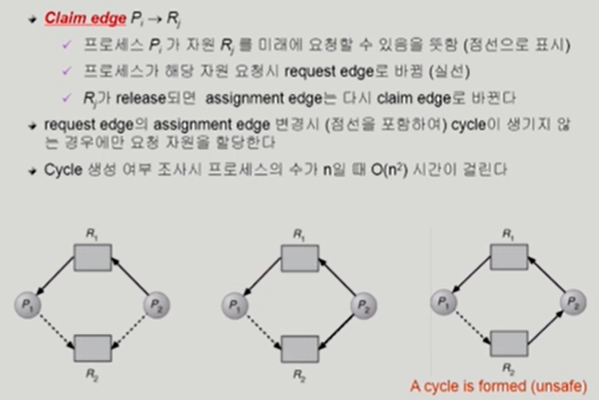
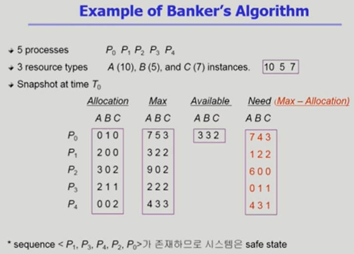
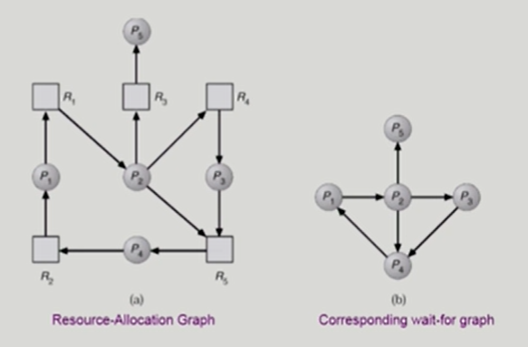
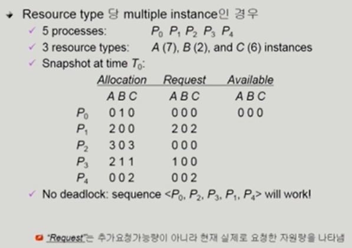
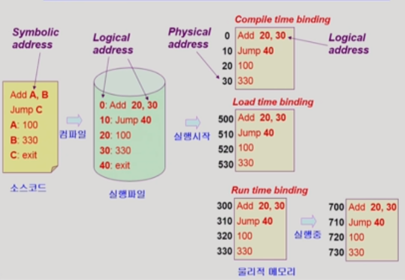
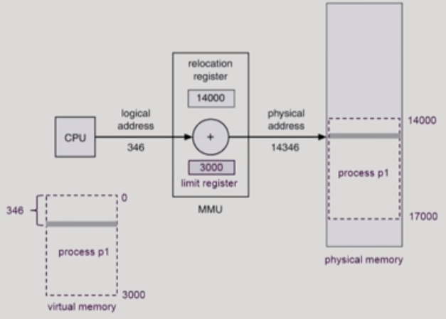

## Deadlock

* Deadlock

  * 교착 상태

  * 일련의 프로세스들이 서로가 가진 자원을 기다리며 block된 상태

     

* Resource
  * 하드웨어, 소프트웨어 등을 포함하는 개념
  * (예) I/O device, CPU cycle, memory space, semaphore 등
  * 프로세스가 자원을 사용하는 절차
    * Request, Allocate, Use, Release
     

* Deadlock 발생의 4가지 조건
  * Mutual exclusion(상호 배제)
    * 매 순간 하나의 프로세스만이 자원을 가질 수 있음
    
  * No preemption(비선점)
    * 프로세스는 자원을 스스로 내어놓을 뿐 강제로 빼앗기지 않음
    
  * Hold and wait(보유 대기)
    * 자원을 가진 프로세스가 다른 자원을 기다릴 때 보유 자원을 놓지 않고 계속 가지고 있음
    
  * Circular wait(순환 대기)
    * 자원을 기다리는 프로세스 간에 사이클이 형성되어야 함
    * cycle이 없으면 deadlock이 아니다.
    * cycle이 있고 instance가 하나인 경우에는 무조건 deadlock이지만 여러 개 있는 경우에는 deadlock일 수도, 아닐 수도 있다.
    
       

* Deadlock의 처리 방법

  * Deadlock Prevention
    * 자원 할당 시 Deadlock의 4가지 필요 조건 중 어느 하나가 만족되지 않도록 하는 것
* Deadlock Avoidance
    * 자원 요청에 대한 부가적인 정보를 이용해서 deadlock의 가능성이 없는 경우에만 자원을 할당
    * 시스템 state가 원래 state에 돌아올 수 있는 경우에만 자원 할당
  * Dead Detection and recovery
  * Deadlock 발생은 허용하되 그에 대한 detection 루틴을 두어 deadlock 발견시 recover
  * Deadlock Ignorance
    * Deadlock을 시스템이 책임지지 않음
  * UNIX를 포함한 대부분의 OS가 채택

 

* Deadlock Prevention
  * Mutual Exclusion
    * 공유해서는 안 되는 자원의 경우 반드시 성립해야 함

  * Hold and Wait
    * 프로세스가 자원을 요청할 때 다른 어떤 자원도 가지고 있지 않아야 한다.
    * 방법 1. 프로세스 시작 시 모든 필요한 자원을 할당받게 하는 방법
    * 방법 2. 자원이 필요할 경우 보유 자원을 모두 놓고 다시 요청

  * No Preemption
    * process가 어떤 자원을 기다려야 하는 경우 이미 보유한 자원이 선점됨
    * 모든 필요한 자원을 얻을 수 있을 때 그 프로세스는 다시 시작
    * State를 쉽게 save하고 restore할 수 있는 자원에서 주로 사용(CPU, memory)

  * Circular Wait
    * 모든 자원 유형에 할당 순서를 정하여 정해진 순서대로만 자원 할당
    * 예를 들어 순서가 3인 자원 Ri를 보유 중인 프로세스가 순서가 1인 자원 Ri을 할당받기 위해서는 우선 Ri를 release해야 한다.

  * Utilization 저하, throughput 감소, starvation 문제

 

* Deadlock Avoidance

  * 자원 요청에 대한 부가적인 정보를 이용해서 자원 할당이 deadlock으로부터 안전한지를 동적으로 조사해서 안전한 경우에만 할당

  * 가장 단순하고 일반적인 모델은 프로세스들이 필요로 하는 각 자원별 최대 사용량을 미리 선언하도록 하는 방법임

  * 자원이 하나인 경우

    

  * 자원이 여러 개인 경우

    * 항상 최악의 경우를 가정

    

 

* Deadlock detection and recovery
  * 자원이 하나인 경우
    
  
  * 자원이 여러 개인 경우
  
    
  
  * Recovery
  
    * Process termination
      * 모든 프로세스 종료
    * Resource Preemption
      * 비용을 최소화할 victim 의 선정
      * safe state로 rollback하여 process를 restart
      * starvation 문제 ( 동일한 프로세스가 계속해서 victim으로 선정되는 경우, cost factor에 rollback 횟수도 같이 고려)

 

* Deadlock Ignorance
  * Deadlock이 일어나지 않는다고 생각하고 아무런 조취도 취하지 않음
  * Deadlock이 매우 드물게 발생하므로 deadlock에 대한 조치 자체가 더 큰 overhead일 수 있음
  * 만약, 시스템에 deadlock이 발생한 경우 system이 비정상적으로 작동하는 것을 사람이 느낀 후 직접 process를 죽이는 등의 방법으로 대처
  * UNIX, Windows 등 대부분의 범용 OS가 채택

 

* Logical vs Physical Address
  * Logical address(=virtual address)
    * 프로세스마다 독립적으로 가지는 주소 공간
    * 각 프로세스마다 0번지부터 시작
    * CPU가 보는 주소는 logical address임
  * Physical address
    * 메모리에 실제 올라가는 위치
  * 주소 바인딩 : 주소를 결정하는 것
  * Symbolic Address > logical Address > Physical address

 

* 주소 바인딩(Address binding)
  * Compile time binding
    * 물리적 메모리 주소가 컴파일 시 알려짐
    * 시작 위치 변경 시 재 컴파일
    * 컴파일러는 절대 코드(absolute code) 생성
  * Load time binding
    * Loader의 책임하에 물리적 메모리 주소 부여
    * 컴파일러가 재배치가능코드(relocatable code)를 생성한 경우 가능
  * Execution time binding(=Run time binding)
    * 수행이 시작된 이후엗 프로세스의 메모리 상 위치를 옮길 수 있음
    * CPU가 주소를 참조할 때마다 binding을 점검(address mapping table)
    * 하드웨어적인 지원이 필요(MMU)

 

* MMU(Memory-Management Unit)

  * logical address를 physical address로 매핑해 주는 Hardware device
  * MMU scheme : 사용자 프로세스가 CPU에서 수행되며 생성해내는 모든 주소값에 대해 base register(=relocation register)의 값을 더한다.
  * user program : logical address만을 다룬다. 실제 physical address를 볼 수 없으며 알 필요가 없다.

  

  

  * Hardware Support for Address Translation : 운영체제 및 사용자 프로세스 간의 메모리 보호를 위해 사용하는 레지스터
  * Relocation register(=base register) : 접근할 수 있는 물리적 메모리 주소의 최소값
  * Limit register : 논리적 주소의 범위

 

* Dynamic Loading
  * 프로세스 전체를 메모리에 미리 다 올리는 것이 아니라 해당 루틴이 불려질 때 메모리에 load하는 것
  * memory utilization의 향상
  * 가끔씩 사용되는 많은 양의 코드의 경우 유용 (오류 처리 루틴)
  * 운영체제의 특별한 지원없이 프로그램 자체에서 구현 가능(OS는 라이브러리를 통해 지원 가능)
  * Loading : 메모리로 올리는 것

 

* Overlays
  * 메모리에 프로세스의 부분 중 실제 필요한 정보만을 올림
  * 프로세스의 크기가 메모리보다 클 때 유용
  * 운영체제의 지원없이 사용자에 의해 구현
  * 작은 공간의 메모리를 사용하던 초창기 시스템에서 수작업으로 프로그래머가 구현
  * Manual Overlay, 프로그래밍이 매우 복잡

:heavy_check_mark: Dynamic Loading의 경우에는 OS의 지원이 되어 상대적으로 간편하게 구현이 가능하지만 Overlays는 수작업으로 구현해야하기 때문에 복잡

 

* Swapping
  * 프로세스를 일시적으로 메모리에서 backing store로 쫓아내는 것
  * Backing store : 디스크, 많은 사용자의 프로세스 이미지를 담을 만큼 충분히 빠르고 큰 저장 공간
  * Swap in / Swap out
    * 일반적으로 중기 스케줄러(swapper)에 의해 swap out 시킬 프로세스 선정
    * priority - based CPU scheduling algorithm
      * priority가 낮은 프로세스를 swapped out
      * priority가 높은 프로세스를 메모리에
    * Compile time 혹은 load time binding에서는 원래 메모리 위치로 swap in
    * Execution time binding 에서는 추후 빈 메모리 영역 아무 곳에나 올릴 수 있음
    * swap time은 대부분 transfer time (swap 되는 양에 비례)

 

* Dynamic Linking
  * Linking을 실행 시간(execution time)까지 미루는 기법
  * Static Linking 
    * 라이브러리가 프로그램의 실행 파일 코드에 포함
    * 실행 파일의 크기가 커짐
    * 동일한 라이브러리를 각 프로세스가 메모리에 올리므로 메모리 낭비
  * Dynamic linking
    * 라이브러리가 실행시 연결(link)됨
    * 라이브러리 호출 부분에 라이브러리 루틴의 위치를 찾기 위한 stub라는 작은 코드
    * 라이브러리가 이미 메모리에 있으면 그 루틴의 주소로 가고 없으면 디스크에서 읽어옴
    * 운영체제의 도움이 필요
* Allocation of Physical Memory
  * 메모리는 일반적으로 두 영역으로 나뉘어 사용
    * OS 상주 영역
      * Interrupt vector와 함께 낮은 주소 영역 사용
    * 사용자 프로세스 영역
      * 높은 주소 영역 사용
  * 사용자 프로세스 영역의 할당 방법
    * Contiguous allocation
      * 각각의 프로세스가 메모리의 연속적인 공간에 적재되도록 하는 것
    * Noncontiguous allocation
      * 하나의 프로세스가 메모리의 여러 영역에 분산되어 올라갈 수 있음

 

## Contiguous allocation

* 고정분할(Fixed partition) 방식

  * 물리적 메모리를 몇 개의 영구적 분할(partition)로 나눔

  * 분할의 크기가 모두 동일한 방식과 서로 다른 방식이 존재

  * 분할당 하나의 프로그램 적재

  * 융통성이 없음

    * 동시에 메모리에 load되는 프로그램의 수가 고정됨
    * 최대 수행 가능 프로그램 크기 제한

  * Internal fragmentation 발생 (external fragmentation도 발생)

     

* 가변분할(Variable partition) 방식

  * 프로그램의 크기를 고려해서 할당

  * 분할의 크기, 개수가 동적으로 변함

  * 기술적 관리 기법 필요

  * External fragmentation 발생

  * Hole : 가용 메모리 공간, 다양한 크기의 hole들이 메모리 여러 곳에 흩어져 있음, 프로세스가 도착하면 수용가능한 hole을 할당, 운영체제는 다음 정보를 유지(할당 공간, 가용 공간)

     

* Dynamic Storage-Allocation Problem

  * 가변 분할 방식에서 size n인 요청을 만족하는 가장 적절한 hole을 찾는 문제
  * First-fit : size가 n 이상인 것 중 최초로 찾아지는 hole에 할당
  * Best-fit : size가 n 이상인 가장 작은 hole을 찾아서 할당, hole들의 리스트가 크기 순으로 정렬되지 않은 경우 모든 hole의 리스트를 탐색해야함, 많은 수의 아주 작은 hole들이 생김
  * Worst-fit : 가장 큰 hole에 할당, 역시 모든 리스트를 탐색해야 함, 상대적으로 아주 큰 hole들이 생성됨
  * First-fit과 best-fit이 worst-file보다 속도와 공간 이용률 측면에서 효과적

 

* compaction
  * external fragmentation 문제를 해결하는 한 가지 방법
  * 사용 중인 메모리 영역을 한군데로 몰고 hole들을 다른 한 곳으로 몰아 큰 block을 만드는 것
  * 매우 비용이 많이 드는 방법
  * 최소한의 메모리 이동으로 compaction하는 방법(매우 복잡한 문제)
  * Compaction은 프로세스의 주소가 실행 시간에 동적으로 재배치 가능한 경우에만 수행될 수 있다.

## Noncontiguous allocation

* Paging

  * Process의 virtual memory를 동일한 사이즈의 page 단위로 나눔
  * Virtual memory의 내용이 page 단위로 noncontiguous하게 저장됨
  * 일부는 backing storage에, 일부는 physical memory에 저장
  * Basic Method
  
    * physical memory를 동일한 크기의 frame으로 나눔
  
    * logical memory를 동일한 크기의 page로 나눔
  
    * 모든 가용 frame들을 관리
  
    * page table을 사용하여 logical address를 physical address로 변환
  
    * External fragmentation 발생 안 함
  
    * Internal fragmentation 발생 가능
  * Implementation of Page Table
    * Page table은 main memory에 상주
    * Page-table base register(PTBR)가 page table을 가리킴
    * Page-table length register(PTLR)
  * Associative Registers(TLB) : parallel search가 가능
    * TLB에는 page table 중 일부만 존재
  * Address translation
    * page table 중 일부가 associative register에 보관되어 있음
    * 만약 해당 page #가 associative register에 있는 경우 곧바로 frame #를 얻음
    * 그렇지 않은 경우 main memory에 있는 page table로부터 frame #을 얻음
    * TLB는 context switch 때 flush (remove old entries)
  * Two-Level page table
    * 현대의 컴퓨터에서는 address space가 매우 큰 프로그램 지원 > 공간 낭비가 심해서 two-level page table 사용
    * page table 중 사용되지 않는 page의 경우에는 내부 table이 만들어지지 않기 때문에 공간을 줄일 수 있음
    * 여러 단계의 page table을 만들 수 있지만 메모리 접근 시간이 더 길어지는 문제가 발생하지만 대부분 TLB를 사용하기 때문에 크게 오래 걸리지 않음
  * Memory Protection
    * Page table의 각 entry마다 아래의 bit를 둔다.
    * Protection bit : page에 대한 접근 권한(read / write / read-only)
    * Valid-invalid bit : valid는 해당 주소의 frame에 그 프로세스를 구성하는 유효한 내용이 있음을 뜻함, invalid는 해당 주소의 frame에 유효한 내용이 없음을 뜻함
  * Page table이 매우 큰 이유
    * 모든 process별로 그 logical address에 대응하는 모든 page에 대해 page table entry가 존재, 대응하는 page가 메모리에 있든 아니든 간에 page table에는 entry로 존재
  * Inverted Page Table
    * Page frame 하나당 page table에 하나의 entry를 둔 것
    * 각 page table entry는 각각의 물리적 메모리의 page frame이 담고 있는 내용 표시(process-id, process의 logical address)
    * 단점 : 테이블 전체를 탐색해야 함
    * 조치 : associative register 사용 (expensive)
  * Shared page
    * shared code : Re-entrant code, read-only로 하여 프로세스 간에 하나의 code만 메모리에 올림
    * shared code는 모든 프로세스의 logical address space에서 동일한 위치에 있어야 함
    * Private code and data : 각 프로세스들은 독자적으로 메모리에 올림, private data는 logical address space의 아무 곳에 와도 무방

 

* Segmentation

  * 프로그램은 의미 단위인 여러 개의 segment로 구성
    * 작게는 프로그램을 구성하는 함수 하나하나를 세그먼트로 정의
    * 크게는 프로그램 전체를 하나의 세그먼트로 정의 가능
    * 일반적으로는 code, data, stack 부분이 하나씩 세그먼트로 정의됨
  * Logical address는 < segment-number, offset > 두 가지로 구성
  * Segmanet-table base register(STBR) : 물리적 메모리에서의 segment table 위치
  * Segment-table length register(STLR) : 프로그램이 사용하는 segment의 수
  * Protection : 각 세그먼트 별로 protection bit가 있음
  * Sharing : shared segment, same segment number (공유와 보안에 있어서 paging에 비해 효과적이다.)
  * allocation : first fit / best fit, external fragmentation 발생, segment의 길이가 동일하지 않으므로 가변분할 방식에서와 동일한 문제점들이 발생

   

* Segmentation with paging

  * pure segmentation과의 차이점 : segment-table entry가 segment의 base address를 가지고 있는 것이 아니라 segment를 구성하는 page table의 base address를 가지고 있음
