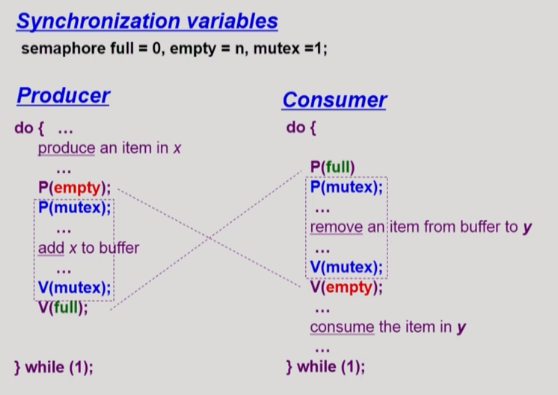
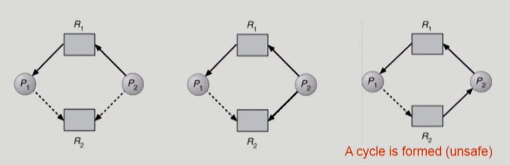
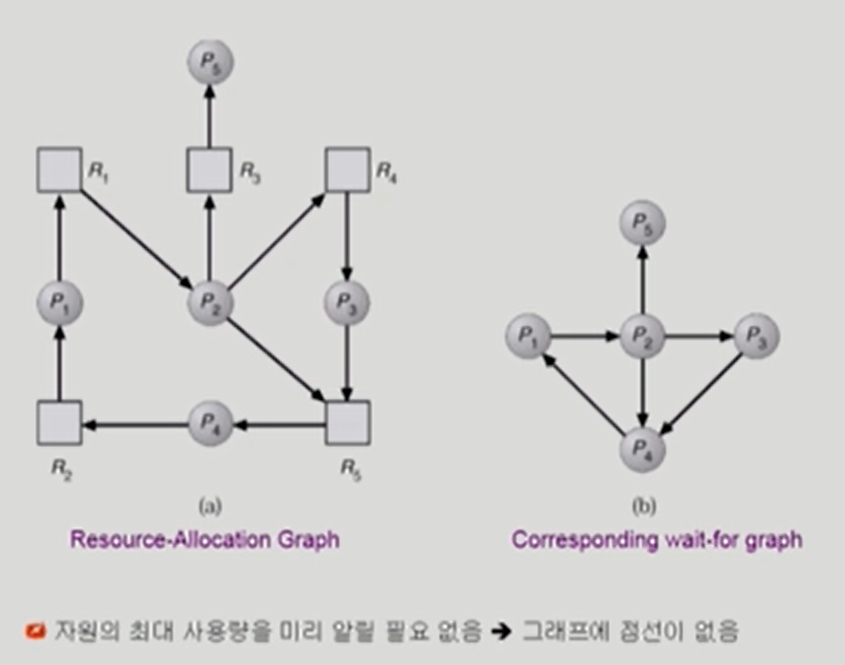

### Monitor

p연산과 v연산을 통해 프로세스 동기화를 하지만, 모니터는 동기화할 수 있는 방법을 프로그램에 알려주고 프로그램이 그것을 하는 것.

- Semaphore의 문제점

  - 코딩하기 힘들다
  - 정확성 (correctness)의 입증이 어렵다
  - 자발적 협력(voluntary cooperation)이 필요하다
  - 한 번의 실수가 모든 시스템에 치명적 영향 (동기화가 깨짐)

- 예

  

- 동시 수행중인 프로세스 사이에서 abstract data type의 안전한 공유를 보장하기 위한 high-level synchronization construct

  - 프로그램 안에서 동시접근하는 문제를 모니터가 자동으로 해결해줘서 프로그래머의 부담을 확연히 줄여줌

  

- 모니터 내에서는 **한번에 하나의 프로세스만**이 활동 가능

- 프로그래머가 동기화 제약 조건을 명시적으로 코딩할 필요가 없음

- 프로세스가 모니터 안에서 기다릴 수 있도록 하기 위해 **condition variable** 사용

  **condition x, y;**

- Condition variable 은 wait과 signal연산에 의해서만 접근 가능.

  **x.wait();**

  x.wait()을 invoke한 프로세스는 다른 프로세스가 x.signal()을 invoke 하기 전까지 suspend된다

  **x.signal();** (깨우기)

  x.signal()은 정확하게 하나의 suspend된 프로세스를 resume한다.

  Suspend된 프로세스가 없으면 아무 일도 일어나지 않는다

​	모니터가 알아서 제어해주기 때문에 굳이 들어가기 전에 lock을 걸고 나올 때 lock을 풀 이유가 없어짐. 

### Bounded-Buffer Problem

공유 버퍼에 대해서 락을 걸거나 푸는 코드가 필요 없음

full은 내용이 들어있는 버퍼 empty는 빈 버퍼를 기다리는 컨디션

내용이 들어있는 버퍼를 기다리면서(소비자 버퍼) 잠들어있는 버퍼가 있으면 깨어줘라.

세마포어보다 모니터버전이 훨씬 더 자연스러움

세마포어에서는 lock을 거는 코드가 있고, 모니터 버전에서는 없음

빈 버퍼가 없으면 잠들게 해라 라는 코드가 있으나 세마포어에서는 P연산을 해줌

모니터에서는 시그널 연산, 세마포어에서는 V연산

세마포어에서는 V연산을 해주면 내용이 들어있는 버퍼를 기다리는 소비자가 있으면 깨어주는 역할을 해야하고, 값을 가지면 V연산은 값의 변화가 항상 있으나 모니터에서는 잠들어있는 프로세스가 있으면 그냥 깨워라는 것이기때문에, 잠들어있는 프로세스가 없으면 값을 바꾸거나 아무 일도 발생하지 않음.

### Dining Pilosophers Example - Monitor ver

---

# Chapter 7. Deadlocks

### 교착상태 (deadlock)

### The Deadlock Problem

- Deadlock
  - 일련의 프로세스들이 서로가 가진 자원을 기다리며 block된 상태
- Resource (자원)
  - 하드웨어, 소프트웨어 등을 포함하는 개념
  - (예) I/O device, CPU cycle, memory space, semaphore 등
  - 프로세스가 자원을 사용하는 절차
    - Request, Allocate, Use, Release
- Deadlock Example 1
  - 시스템에 2개의 tape drive가 있다 
  - 프로세스 P1과 P2 각각이 하나의 tape drive를 보유한 채 다른 하나를 기다리고 있다 (보유한 채 상대방의 자원을 계속 요구하면 어느 누구도 진행이 되지 않음)
- Deadlock Example 2
  - Binary semaphores A and B

P0		P1

P(A);	P(B);

P(B);	P(A);

두 개의 프로세스가 하나씩 획득하고 나머지를 획득하고 싶어하는데, cpu가 누구에게 가더라도 해결이 안되기때문에 데드락 상태 발생

### Deadlock 발생의 4가지 조건

4가지 조건을 모두 만족해야 함, 하나라도 만족하지 않으면 데드락이 발생하지 않음

- Mutual exclusion (상호 배제)

  - 매 순간 하나의 프로세스만이 자원을 사용할 수 있음
  - **독점적**으로 써야만 함

- No preemption (비선점)

  - 프로세스는 자원을 스스로 내어놓을 뿐 강제로 **빼앗기지 않음**
  - 자원을 가지고 있는데 빼앗길 수 있다고 하면 데드락이 발생하지 않음

- Hold and wait (보유대기)

  - 자원을 가진 프로세스가 **다른 자원을 기다릴 때** **보유 자원을 놓지 않고** 계속 가지고 있음

- Circular wait (순환대기)

  - 자원을 기다리는 프로세스 간에 사이클이 형성되어야 함

  - 프로세스 P0, P1, ... Pn이 있을 때

    P0은 P1이 가진 자원을 기다림

    P1은 P2이 가진 자원을 기다림

    Pn-1은 Pn이 가진 자원을 기다림

    Pn은 P0이 가진 자원을 기다림

  - 필요로하는 자원이 꼬리를 물고, 서로가 가진 자원을 기다리면서 사이클을 형성하는 경우

### Resource-Allocation Graph (자원할당그래프)

데드락이 발생했는지 확인하는 그래프

자원 -> 프로세스 : 프로세스가 이 자원을 가지고 있다는 의미

프로세스 -> 자원: 프로세스가 이 자원을 요청하고 있다는 의미, 요청만 하고 아직 얻지는 못함

- Vertex

  - Process P = {p1, P2, ... Pn}
  - Resource R = {R1, R2, ..., Rm}

- Edge

  - request edge Pi -> Pj

  - assignment edge Rj -> Pi

    

    사이클이 있음

    1번 그림: p1은 자원 2를 가지면서 자원1을 요청, p2는 자원1,2를 가지고 있으면서 자원3을 요청, p3은 자원3을 가지고 있으면서 자원2를 요청 -> 데드락 상황

    2번 그림: p1이 자원2를 가지고 있고 자원1을 요청, p3이 자원1을 가지고 자원2를 요청하는데 여분이 하나씩 있고, 이 자원은 p2와 p4가 하나씩 가지고 사이클에 연루되어 있지 않기 때문에 쓰고 나서 반납하면 available 해져서 데드락이 아님

​				사이클이 없음

- 그래프에 cycle이 없으면 deadlock이 아니다
- 그래프에 cycle이 있으면 (데드락일수도 있고, 아닐수도 있다)
  - if only one instance per resource type, then deadlock (자원의 인스턴스가 하나씩밖에 없을 때)
  - if several instances per resource type, possibility of deadlock  (자원의 인스턴스가 여러개 있을 때 데드락일수도 있고 아닐수도 있음)

### Deadlock의 처리 방법

- Deadlock Prevention
  - 자원 할당 시 Deadlock의 4가지 필요 조건 중 어느 하나가 만족되지 않도록 하는 것
- Deadlock Avoidance
  - 자원 요청에 대한 부가적인 정보를 이용해서 deadlock의 가능성이 없는 경우에만 자원을 할당
  - 시스템 state가 원래 state로 돌아올 수 있는 경우에만 자원 할당

=> 데드락이 생기지 않도록 원천적으로 방지하는 방법 (위로 갈수록 데드락 처리방법이 강함)

- Deadlock Detection and recovery
  - Deadlock 발생은 허용하되 그에 대한 detection 루틴을 두어 deadlock 발견 시 recover
  - 느려지거나 문제가 발생하면 데드락이 있는지 확인하고 있으면 recover
- Deadlock Ignorance
  - Deadlock을 시스템이 책임지지 않음
  - UNIX를 포함한 대부분의 OS가 채택
  - 아무 일도 하지 않음

=> 데드락이 생기도록 놔둠. 관여하지 않음

데드락은 빈번히 발생하는 문제가 아니기 때문에 미연에 방지하기 위해서 무언가 하는 것이 비효율적일 수 있어서 주로 생겨도 아무 일도 하지 않는 것이 많이 쓰임

### Deadlock Prevention

- Mutual Exclusion (상호 배제)
  - 공유해서는 안되는 자원의 경우 반드시 성립해야 함
  - 막을 수 있는 조건이 아님. 
- Hold and wait (보유대기)
  - 프로세스가 자원을 요청할 때 다른 어떤 자원도 가지고 있지 않아야 한다
  - 방법 1. 프로세스 시작 시 모든 필요한 자원을 할당받게 하는 방법 (자원에 대한 비효율성이 생길 수 있음)
  - 방법 2. 자원이 필요할 경우 보유 자원을 모두 놓고 다시 요청 
  - 자진해서 반납함으로써 문제 해결
- No preemption (비선점)
  - process가 어떤 자원을 기다려야 하는 경우 이미 보유한 자원이 선점됨
  - 모든 필요한 자원을 얻을 수 있을 때 그 프로세스는 다시 시작된다
  - State를 쉽게 save하고 restore할 수 있는 자원에서 주로 사용 (CPU, memory)
    - CPU는 빼앗기면 다음 시점부터 실행 가능. 
  - 빼앗아 올 수 있도록 preemption이 가능할 수 있도록 하면 데드락이 생기지 안흠
- Circular wait (순환대기)

  - 모든 자원 유형에 할당 순서를 정하여 정해진 순서대로만 자원 할당
  - 예를 들어 순서가 3인 자원 Ri를 보유 중인 프로세스가 순서 1인 자원 Rj을 할당받기 위해서는 우선  Ri를 release해야 한다
  - 낮은 순서의 자원을 먼저 획득해야만 다음 자원을 얻을 수 있게 함

=> Utilization 저하, throughput 감소, starvation 문제 (자원에 대한 이용률이 낮아지고 성능이 나빠지고 starvation의 문제가 발생할 수 있다.)

### Deadlock Avoidance

- Deadlock Avoidance
  - 자원 요청에 대한 부가정보를 이용해서 자원 할당이 deadlock으로부터 **안전(safe)한지를 동적으로 조사해서 안전한 경우에만 할당**
  - 가장 단순하고 일반적인 모델은 프로세스들이 필요로 하는 각 **자원별 최대 사용량을 미리 선언하도록 하는 방법임** (프로세스 시작할 때 처음부터 미리 사용량을 정해줌)
- safe state
  - 시스템 내의 프로세스들에 대한 safe sequence가 존재하는 상태
- safe sequence
  - 프로세스의 sequence <P1, P2, ..., Pn>이 safe하려면 Pi(1<=i<=n)의 자원 요청이 "가용 자원 + 모든 Pj (j<i)의 보유 자원"에 의해 충족되어야 함
  - 조건을 만족하면 다음 방법으로 모든 프로세스의 수행을 보장
    - Pi의 자원 요청이 즉시 충족될 수 없으면 모든 Pj(j<i)가 종료될 때까지 기다린다
    - Pi-1이 종료되면 Pi의 자원 요청을 만족시켜 수행한다

- 시스템이 safe state에 있으면 => no deadlock
- 시스템이 unsafe state에 있으면 => possibility of deadlock
- Deadlock Avoidance
  - 시스템이 unsafe state에 들어가지 않는 것을 보장
  - 2가지 경우의 avoidance 알고리즘
    - Single instance per resource types 자원 당 인스턴스가 하나밖에 없는 경우
      - Resource Allocation Graph algorithm 사용
    - Multiple instance per resource types 자원 당 인스턴스가 여러개 있는 경우
      - Banker's Algorithm 사용

### Resource Allocation Graph algorithm

- Claim edge Pi -> Rj

  - 프로세스 Pi가 자원 Rj를 미래에 요청할 수 있음을 뜻함 (점선으로 표시)

    (평생에 한번은 자원을 요청할 수 있다는 것을 표시함)

  - 프로세스가 해당 자원 요청시 request edge로 바뀜 (실선)

  - Rj가 release되면 assignment edge는 다시 claim edge로 바뀐다

- request edge의 assignment edge 변경시 (점선을 포함하여) cycle이 생기지 않는 경우에만 요청 자원을 할당한다

- Cycle 생성 여부 조사시 프로세스의 수가 n일 때 O(n^2) 시간이 걸린다

  

​		데드락이 아님 => P1이 2번자원을 요청할 수 있지만 아직 요청한 것이 아니므로. 

요청을 해서 사이클이 생성되면 데드락이 될 수도 있음. 데드락이 발생할 수 있는 위험성 있는 상황은 방지를 해서 자원을 주지 않음 (Deadlock Avoidance)

### Banker's Algorithm

- 가정
  - 모든 프로세스는 자원의 최대 사용량을 미리 명시
  - 프로세스가 요청 자원을 모두 할당받은 경우 유한 시간 안에 이들 자원을 다시 반납한다
- 방법
  - 기본 개념: 자원 요청시 safe 상태를 유지할 경우에만 할당
  - 총 요청 자원의 수가 가용 자원의 수보다 적은 프로세스를 선택
    (그런 프로세스가 없으면 unsafe 상태)
  - 그런 프로세스가 있으면 그 프로세스에게 자원을 할당
  - 할당받은 프로세스가 종료되면 모든 자원을 반납
  - 모든 프로세스가 종료될 때까지 이러한 과정 반복

### Example of Banker's Algorithm

### P1 request (1, 0, 2)

### Deadlock Detection and Recovery

- Deadlock Detection
  - Resource type 당 single instance인 경우
    - 자원할당 그래프에서의 cycle이 곧 deadlock을 의미
  - Resource type 당 multiple instance인 경우
    - Banker's algorithm과 유사한 방법 활용
- Wait-for graph 알고리즘
  - Resource type 당 single instance인 경우
  - Wait-for graph
    - 자원할당 그래프의 변형
    - 프로세스만으로 node 구성
    - Pj가 가지고 있는 자원을 Pk가 기다리는 경우 Pk -> Pj
  - Algorithm
    - **Wait-for graph에 사이클이 존재하는지를 주기적으로 조사**
    - O(n^2)

=> 데드락이 없는 상황

P2의 Request 001 인 경우 -> 데드락이 있음

- Recovery
  - Process termination (프로세스 종료)
    - Abort all deadlocked processes (데드락이 연루된 모든 프로세스를 죽임)
    - Abort one process at a time until the deadlock cycle is eliminated (데드락이 연루된 프로세스를 하나씩 죽여봄 데드락이 없어질 때까지 하나씩 죽여감)
  - Resource Preemption (프로세스에게 자원을 뺏음)
    - 비용을 최소화할 victim의 선정 (자원을 뺏을 프로세스를 선정)
    - safe state로 rollback하여 process를 restart
    - Starvation 문제
      - 동일한 프로세스가 계속해서 victim으로 선정되는 경우 (패턴을 조금씩 바꿔야 함)
      - cost factor에 rollback 횟수도 같이 고려

### Deadlock Ignorance 

- Deadlock이 일어나지 않는다고 생각하고 아무런 조치도 취하지 않음
  - Deadlock이 매우 드물게 발생하므로 deadlock에 대한 조치 자체가 더 큰 overhead일 수 있음
  - 만약, 시스템에 deadlock이 발생한 경우 시스템이 비정상적으로 작동하는 것을 사람이 느낀 후 직접 process를 죽이는 등의 방법으로 대처
  - UNIX, Windows 등 대부분의 범용 OS가 채택

---

# Chapter 8. Memory Management

### 1. Logical Address vs Physical Address

- Logical Address (=Virtual Address) (논리주소=가상주소)

  - 프로세스마다 독립적으로 가지는 주소 공간

  - 각 프로세스마다 0번지부터 시작

  - **CPU가 보는 주소는 Logical Addrss**

- Physical Address (물리적 주소)
  - 메모리에 실제 올라가는 위치

\* 주소 바인딩 :  (어디로 올라갈 지) 주소를 결정하는 것 (주소 변환)

​	Symbolic Address -> Logical Address -> Physical Address

- Symbolic Address : 프로그래머는 숫자로 된 주소를 사용하지 않고 심볼로된 주소를 사용한다. => 컴파일 되면 숫자인 Logical Address => 실행되려면 물리적 메모리에 올라가야하므로 주소변환이 이루어져야한다. (주소결정 = Address Binding) => Physical Address

\* 각 프로그램마다 가지고 있는 논리적 주소가 물리적 주소로 언제 결정되는가? => 총 3가지 시점으로 나눌 수 있다.

### 2. 주소 바인딩 (Address Binding)

- Compile Time Binding (컴파일 시)

  - 물리적 메모리 주소(Physical Address)가 컴파일 시 알려짐

  - 시작 위치 변경시 재컴파일
  - 컴파일러는 절대 코드(Absolute Code) 생성 ( = 컴파일시 주소가 Fixed 된다.)

- Load Time Binding (실행이 시작될 시)

  - Loader의 책임하에 물리적 메모리 주소 부여

  - 컴파일러가 재배치가능코드(Relocatable Code)를 생성한 경우 가능 ( = 정해져 있는 것이 아니라 실행시 비어있는 곳 어디든 올라간다.)

- Execution Time Binding (=Run Time Binding) (실행도중)

  - 수행이 시작된 이후에도 프로세스의 메모리 상 위치를 옮길 수 있음.

  - CPU가 주소를 참조할 때마다 Binding을 점검 (Address Mapping Table)

  - **하드웨어적인 지원이 필요** (ex. base and limit registers, MMU) - 주소 변환을 도와줌
  - 주소가 계속 바뀔 수 있음

### 3. Memory Management Unit (MMU)

- MMU (Memory Management Unit)

  - Logical Address를 Physical Address로 매핑해주는 Hardware Device

- MMU Scheme

  사용자 프로세스가 CPU에서 수행되며 생성해내는 모든 주소 값에 대해 Base Register (=Relocation Register)의 값을 더한다.

- User Program

  - Logical Address만을 다룬다.

  - 실제 Physical Address를 볼 수 없으며 알 필요가 없다.

    ### Dynamic Relocation

    

    

    P1 프로세스 실행 중 상황 (논리주소: 0-3000번지, 물리 주소: ~14000번지) 346번지를 달라고 할 때, 

    시작 위치 14000번지와 논리주소를 더해주면 됨 (요청한 논리주소+시작 위치=물리주소)

    리미트 레지스터를 체크해줌. 프로그램의 크기를 담고 있음(3000). 프로그램이 악의적이어서 3000번지까지밖에 없는데 메모리4000번지를 달라고 하면 시작위치를 4000에 더해주면 18000번지. 다른 프로그램이 존재하는 메모리위치가 됨. 이걸 막아야 하므로 limit register를 넘는 주소를 요청하면 trap이 걸림

    ### hardware Support for Address Translation

    

    운영체제 및 사용자 프로세스 간의 메모리 보호를 위해 사용하는 레지스터

    - Relocation register : 접근할 수 있는 물리적 메모리 주소의 최소값 (=base register)
    - Limit register : 논리적 주소의 범위

    

### 4. Some Terminologies

- Dynamic Loading
- Dynamic Linking
- Overlays
- swapping

### 1) Dynamic Loading

프로그램을 메모리에 동적으로 올린다 =그때그때 필요할 때마다 루틴을 메모리에 올린다 

- 프로세스 전체를 메모리에 미리 다 올리는 것이 아니라 해당 루틴이 불려질 때 메모리에 load

- Memory Utilization의 향상
- 가끔씩 사용되는 많은 양의 코드의 경우 유용 
  - 예) 오류 처리 루틴

- 운영체제의 특별한 지원 없이 프로그램 자체에서 구현 가능 ( 운영체제가 라이브러리를 제공해주며 그걸 이용하여 구현)
- Loading : 메모리에 올리는 것을 의미

- 현재 컴퓨터 시스템도 필요한 부분만 메모리에 올라가고 필요 없는 부분은 다시 내림 => Dynamic Loading(프로그래머가 관리)이 아니라 운영체제가 직접 관리해주는 Paging System에 해당(지금은 이 용어를 섞어 쓰기도 함)

### 2) Overlays 

- 메모리에 프로세스의 부분 중 실제 필요한 정보만을 올림
- 프로세스의 크기가 메모리보다 클 때 유용
- 운영체제의 지원없이 사용자에 의해 구현
- 작은 공간의 메모리를 사용하던 초창기 시스템에서 수작업으로 프로그래머가 구현
  - Manual Overlay
  - 프로그래밍이 매우 복잡
- 프로그래머가 큰 프로그램을 쪼개서 올리고 내리는 것을 직접 코딩 해야 함. Dynamic Loading은 라이브러리 이용

### 3) Swapping

- Swapping
  - 프로세스를 일시적으로 메모리에서 backing store로 쫓아내는 것
- Backing store (=swap area)
  - 디스크
    - 많은 사용자의 프로세스 이미지를 담을 만큼 충분히 빠르고 큰 저장 공간

- Swap In / Swap Out

  - 일반적으로 중기 스케줄러(swapper)에 의해 Swap Out 시킬 프로세스 선정

  - Priority-Based CPU Scheduling Algorithm
    - Priority가 낮은 프로세스를 Swapped Out 시킴 (쫓아냄)
    - Priority가 높은 프로세스를 메모리에 올려 놓음

  - Compile Time 혹은 Load Time Binding에서는 원래 메모리 위치로 Swap In 해야 함
  - Execution time binding에서는 추후 빈 메모리 영역 아무 곳에나 올릴 수 있음

  - Swap Time은 대부분 Transfer Time (Swap 되는 양에 비례하는 시간)임

### Schematic View of Swapping

Swap Time? 보통 디스크를 접근하는 시간은 Seek Time(디스크 헤더가 이동하는 시간)이 대부분을 차지하고 Transfer Time(데이터 전송 시간)은 미미하다. 그런데, 용량이 방대한 *Swapping에서는 파일입출력과는 다르게 디스크 접근 시간 대부분이 Swap 되는 데이터 양에 비례하는 Transfer Time이 차지한다.

1. Swap Out : Main Memory-> Swap Area
2. Swap In : Swap Area -> Main Memory

### 4) Dynamic Linking

프로그램 작성 후 컴파일하고 링크에서 실행파일을 만듬. 링킹이란 여려 곳에 존재하는 컴파일된 파일들을 하나로 묶어서 실행파일로 만드는 과정

- Linking을 실행 시간(execution time)까지 미루는 기법

- Static Linking

  - 라이브러리가 프로그램의 실행 파일 코드에 포함됨

  - 실행 파일의 크기가 커짐

  - 동일한 라이브러리를 각각의 프로세스가 메모리에 올리므로 메모리 낭비 (eg. printf 함수의 라이브러리 코드)

- Dynamic Linking (=shared Library, 리눅스-Shared Object, 윈도우-DLL (Dynamic Linking Library))

  - 라이브러리가 실행시 연결(link)됨

  - 라이브러리 호출 부분에 라이브러리 루틴의 위치를 찾기 위한 stub이라는 작은 코드를 둠

  - 라이브러리가 이미 메모리에 있으면 그 루틴의 주소로 가고(가서 실행), 없으면 디스크에서 읽어옴

  - 운영체제의 도움이 필요
  - eg. printf의 라이브러리 위치를 찾는 코드만 프로그램 안에 집어 넣어두는 것

### 5. Allocation of Physical Memory (물리적 메모리의 할당)

- 메모리는 일반적으로 두 영역으로 나누어 사용
  - **OS 상주영역** 
    - Interrupt Vector와 함께 낮은 주소 영역 사용
  - **사용자 프로세스 영역**
    - 높은 주소 영역 사용

- 사용자 프로세스 영역의 할당 방법 (관리 방법)

  - **Contiguous Allocation(연속 할당)**
    - 각각의 프로세스가 메모리의 연속적인 공간에 적재도록 하는 것
      - Fixed Partition Allocatoin (고정 분할)
      - Variable Partition Allocation (가변 분할)

  - **NonContiguous Allocation(불연속 할당)**
    - 하나의 프로세스가 메모리의 여러 영역에 분산되어 올라가도록 하는 것
      - Paging
      - Segmentation
      - Paged Segmentation

#### 1) Contiguous Allocation(연속 할당)

- Contiguous Allocation

  - 고정 분할 방식 : 프로그램이 들어갈 사용자 영역을 미리 파티션으로 나누어 두는 것.

    - 물리적 메모리를 몇 개의 영구적인 분할로 나눔
    - 분할의 크기가 모두 동일한 방시과 서로 다른 방식이 존재
    - 분할당 하나의 프로그램 적재
    - 융통성이 없음
        - 동시에 메모리에 load되는 프로그램의 수가 고정됨.
        - 최대 수행 가능 프로그램 크기 제한
      - Internal fragmentation (내부 단편화) 발생 (external fragmentation(외부 단편화)도 발생)

    - 가변 분할 방식: 미리 나눠두지 않는 것.

      - 프로그램의 크기를 고려해서 할당
      - 분할의 크기, 개수가 동적으로 변함
      - 기술적 관리 기법 필요
      - external fragmentation(외부 단편화) 발생

​	

- 프로그램 A는 분할 1에 넣으면 됨. 

  프로그램 B는 분할 2에 들어갈 수 없음(분할 2가 크기가 더 작기 때문에) 분할 3에 들어감=> 낭비되는 조각이 발생(외부 조각-프로그램을 올리려고 하는데, 올리려는 프로그램보다 메모리 조각이 작은 경우/내부 조각-프로그램의 크기가 공간보다 작아서 할당 되었지만 사용되지 않아 남는 공간)

- 굳이 분할의 크기를 나눠놓을 필요가 있는가? -> 가변분할 방식: 프로그램이 실행될 때마다 차곡차곡 메모리에 올려놓는 방법 (가변 분할 방식으로 쓰더라도 프로그램 크기가 균일하지 않기 때문에 외부조각은 생길 수 있음 (내부조각은 생기지 않음))

- Hole

  - 가용 메모리 공간

  - 다양한 크기의 Hole들이 메모리 여러 곳에 흩어져 있음

- 프로세스가 도착하면 수용가능한 Hole을 할당

  - 운영체제는 다음의 정보를 유지

    - a) 할당 공간
    - b) 가용 공간 (hole)

    

    프로그램을 실행할 때 가용곤간 어디에 프로그램을 할당할 것인지? Dynamic Storage-Allocation Problem

- **Dynamic Storage-Allocation Problem**

  : 가변 분할 방식에서 size n인 요청을 만족하는 가장 적절한 hole을 찾는 문제

  - First-Fit
    - Size가 n 이상인 것 중 최초로 찾아지는 Hole에 할당 (제일 처음 발견되는 홀)

  - Best-Fit

    - Size가 n 이상인 가장 작은 Hole을 찾아서 할당 (가장 적합한 Hole에 할당)

    - Hole들의 리스트가 크기순으로 정렬되지 않은 경우 모든 Hole의 리스트를 탐색해야함 (전체 홀을 탐색해야하므로 시간 부담)

    - 많은 수의 아주 작은 Hole들이 생성됨

  - Worst-Fit

    - 가장 큰 Hole에 할당

    - 역시 모든 리스트를 탐색해야함

    - 상대적으로 아주 큰 Hole들이 생성됨
    - 지금 적합한 홀이 있을텐데 제일 큰 홀을 써서 작은 홀로 만들어버리기 때문에 좋은 방법은 아님

  - First-fit과 best-fit이 worst-fit보다 속도와 공간 이용률 측면에서 효과적인 것으로 알려짐(실험적인 결과)

- **Compaction**

  - external fragmentation (외부 단편화) 문제를 해결하는 한 가지 방법

  - 사용 중인 메모리 영역을 한군데로 몰고 Hole들을 다른 한 곳으로 몰아 큰 Block을 만드는 것

  - 매우 비용이 많이 드는 방법 (전체 프로그램의 binding에 관련된 문제여서)

  - 최소한의 메모리 이동으로 Compaction하는 방법 (매우 복잡한 문제)

  - Compaction은 프로세스의 주소가 실행 시간에 동적으로 재배치가 가능한 경우에만 수행될 수 있다
  - Runtime Binding이 지원되야지만 사용할 수 있다.

### Paging

- Paging
  - Process의 virtual memory를 동일한 사이즈의 page 단위로 나눔
  - Virtual memory의 내용이 page 단위로 .noncontiguous하게 저장됨
  - 일부는 backing storage에, 일부는 physical memory에 저장
- Basic Method
  - physical memory를 동일한 크기의 frame으로 나눔
  - logical memory를 동일 크기의 page로 나눔 (frame과 같은 크기)
  - 모든 가용 frame들을 관리
  - page table을 사용하여 logical address를 physical address로 변환
  - External fragmentation(외부 단편화) 발생 안함
  - Internal fragmentation(내부 단편화) 발생 가능

=> 프로그램을 구성하는 논리적 메모리를 동일한 크기의 Page로 잘라서 각각의 페이지별로 물리적 메모리 어디든 비어있는 위치에 올라갈 수 있게 해줌. 

각각의 논리적 메모리에 있는 Page들이 물리적 메모리 어디에 올라가 있는가를 알려줌

Page Table : Page 갯수만큼 엔트리가 존재함

인덱스를 통해 곧바로 접근 가능한 자료구조.

### Adress Translation Scheme

- CPU는 다음 두 가지로 구성된 virtual address를 사용
  - Page number (p)
    - page table의 index로 사용
    - 해당 index에는 그 페이지의 물리적 메모리 상의 base address가 저장됨

### Address Translation Architecture

내부에서 상대적 위치는 똑같기 때문에 페이지 내의 offset은 주소 변환에 영향이 없고, 페이지 번호만 바뀜

4kb, 프로그램 하나의 주소 공간이 백만개로 짤림- 많은 용량이 필요함 -> 레지스터에 넣을 수도 없고 하드디스크에 저장할 수도 없음. -> 메모리에 집어넣게 됨

메모리에 접근하기 위해 주소변환, 주소변환 후 데이터를 실제로 접근하기 위해

### Implementation of Page Table

- Page Table은 Main Memory에 상주
- Page-Table Base Register(PTBR)가 Page Table을 가리킴
- Page-Table Length Register(PTLR)가 테이블 크기를 보관
- 모든 메모리 접근 연산에는 2번의 Memory Access 필요
- Page Table 접근 1번, Data/Instruction 접근 1번
- 속도 향상을 위해 Associative Register 혹은 Translation Look-aside Buffer(TLB)(주소변환 계층) 라 불리는 고속의 Lookup Hardware Cache 사용 (별도의 하드웨어(일종의 캐쉬-주소 변환을 위한 캐쉬메모리)를 사용함)

### Paging Hardware with TLB

page table로 가기 전 먼저 TLB를 체크해서 주소변환이 가능한지 확인해서 접근 한 번을 줄임

프로세스마다 TLB의 정보도 다름. 

### Effective Access Time

- Associative register lookup time = ￡ (TLB를 접근하는 시간)
- memory cycle time = 1 
- Hit ratio = ∂
  - associative register에서 찾아지는 비율
- Effective Access Time (EAT)
  - EAT = (1+￡)∂  \<hit> + (2+￡)(1-∂)\<miss> = 2+￡-∂

### Two-Level Page Table (2단계 페이지 테이블)

속도는 줄어들지 않으나 page table 공간이 줄어드는 것이 목적임.

- 현대의 컴퓨터는 Address Space가 매우 큰 프로그램 지원
  - 32 bit Address 사용시 : 2^32 (4GB)의 주소 공간 (2^10 = K, 2^20=M)
    - Page Size가 4K시 1M개의 Page Table Entry가 필요 (4gb 페이지를 4kb로 쪼개려면 1M개)
    - 각 Page Entry가 4B시 프로세스당 4M의 Page Table 필요
    - 그러나, 대부분의 프로그램은 4G의 주소 공간 중 지극히 일부분만 사용하므로 Page Table 공간이 심하게 낭비됨 -> 2단계 페이지 사용 이유

- Page Table 자체를 Page로 구성
- 사용되지 않는 주소 공간에 대한 Outer Page Table의 엔트리 값은 NULL (대응하는 inner page Table이 없음)

- logical address (on 32-bit machine with 4K page size)의 구성

  - 20 bit의 page number
  - 12 bit의 page offset 

- page table 자체가 page로 구성되기 때문에 page number는 다음과 같이 나뉜다(각 page table entry가 4B)

  - 10-bit의 page number
  - 10-bit의 page offset

- 따라서, logical address는 다음과 같다

  

- P1은 outer page table의 index이고

- P2는 outer page table의 page에서의 변위(displacement)

### Address-Translation Scheme

- 2단계 페이징에서의 Address-translation scheme

  

### Multilevel Paging

- Address Space가 더 커지면 다단계 페이지 테이블 필요

- 각 단계의 페이지 테이블이 메모리에 존재하므로 Logical Address의 Physical Address 변환에 더 많은 메모리 접근 필요

- TLB를 통해 메모리 접근 시간을 줄일 수 있음

- 4단계 페이지 테이블을 사용하는 경우

  - 메모리 접근 시간이 100ns, TLB 접근시간이 20ns이고 

  - TLB hit ratio가 98%인 경우

    Effective Memory Access Time = 0.98 x 120 + 0.02 x 520 

    ​														= 128 nanoseconds. 

    결과적으로 주소변환을 위해 28ns만 소요

- TLB 덕분에 다단계 Page Table이 크게 오버헤드가 되지 않는다.

### Valid(v) / Invalid (i) Bit in a page Table

페이지 갯수만큼 엔트리가 존재하고 페이지 프레임 주소 변환 정보가 들어 있음. 추가로 bit가 들어 있음.

사용되지 않는 영역도 엔트리가 만들어져야 함 (6번, 7번) - 사용되지 않기 때문에 invalid로 표시

### Memory Protection

- Page Table의 각 Entry 마다 아래의 bit를 둔다.

  - Protection bit
    - Page에 대한 접근 권한(read / write / read-only)
      - 접근 권한 제어는 어떤 연산에 대한 권한이 있는가를 나타냄 (다른 프로세스가 이 페이지 접근하는 지에 대한 판단이 아님)

  - Valid-Invalid bit
    - Valid는 해당 주소의 frame에 그 프로세스를 구성하는 유요한 내용이 있음을 뜻함 (접근 허용)
    - Invalid는 해당 주소의 frame에 유효한 내용이 없음을 뜻함 (접근 불허)
      - 프로세스가 그 주소 부분을 사용하지 않는 경우
      - 해당 페이지가 메모리에 올라와 있지 않고 Swap Area에 있는 경우

### Inverted Page Table (역방향 페이지 테이블)

- Page Table이 매우 큰 이유

  - 모든 Process 별로 그 Logical Address에 대응하는 모든 Page에 대해 Page Table Entry가 존재
  - 대응하는 Page가 메모리에 있든 아니든 간에 Page Table에는 Entry로 존재

- Inverted Page Table

  - Page Frame 하나당 Page Table에 하나의 Entry를 둔 것 (System-Wide)

  - 각 Page Table Entry는 각각의 물리적 메모리의 Page Frame이 담고 있는 내용 표시 (Process-id, Process의 Logical Address) 페이지 프레임 갯수만큼 엔트리가 존재함

  - 페이지 테이블을 위한 공간을 줄일 수 있음. 

  - 단점

    - 테이블 전체를 탐색해야 함
    - 주소 변환은 physical address를 보고 logical address로 변환하는 것인데 이것은 반대임.

  - 조치

    -  Associative Register 사용 (expensive 비쌈)

    

### Shared Page

- Shared 가능한 코드는 물리적 메모리에 하나만 올리는 방식

- 여러 프로세스가 공유 가능한 코드를 같은 물리적 메모리 프레임으로 mapping 해주는 기법

- 반드시 read-only로 셋팅해야 함 / 동일한 logical address에 위치해야 한다

- Shared code

  - Re-entrant Code (=Pure code) 재진입 가능 코드
  - read-only로 하여 프로세스 간에 하나의 code만 메모리에 올림 (eg. text editors, compliers, window systems)
  - Shared Code는 모든 프로세스의 Logical Address Space에서 동일한 위치에 있어야 함

- Private Code and Data

  - 각 프로세스들은 독자적으로 메모리에 올림
  - Private Data는 Logical Address Space의 아무 곳에 와도 무방

  

### Segmentaion

- 프로그램은 의미 단위인 여러 개의 segment로 구성

  - 작게는 프로그램을 구성하는 함수 하나하나를 세그먼트로 정의
  - 크게는 프로그램 전체를 하나의 세그먼트로 정의 가능
  - 일반적으로는 code, data, stack 부분이 하나씩의 세그먼트로 정의됨

- Segment는 다음과 같은 logical unit 들임

  main (), function, global variables, stack, symbol table, arrays

### Segmentaion Architecture

- Logical Address는 다음의 두 가지로 구성

  <segment-number, offset> 세그먼트 번호와 얼마나 떨어져 있는지 offset

- Segment table

  - each table entry has:
    - base-starting physical address of the segment 시작 위치
    - limit-length of the segment 길이 (프로그램이 사용하는 segment의 개수(엔트리 수))

- Segment-table base register (STBR)

  - 물리적 메모리에서의 segment table의 위치

- Segment-table length register (STLR)

  - 프로그램이 사용하는 segment의 수

    segment number s is legal if s < STLR

### Segmentation Hardware

세그먼트 번호와 길이 체크

​	세그먼트의 시작 위치 체크

​	세그먼트 길이보다 요구가 크지 않은지 체크

### Segmentation Architecture (Cont.)

- Protection

  - 각 세그먼트 별로 Protection bit가 있음
  - Each Entry:
    - Valid bit = 0 => illegal segment
    - Read / Write / Executrion 권한 bit

- Sharing

  - Shared Segment
  - Same Segment Number
    - segment는 의미 단위이기 때문에 공유(sharing)와 보안(protection)에 있어 paging 보다 훨씬 효과적이다

- Allocation

  - First Fit / Best Fit
  - external fragmentation (외부 단편화) 발생
    - segment의 길이가 동일하지 않으므로 가변분할 방식에서와 동일한 문제점들이 발생

  

페이징은 개수가 많지만 세그먼트는 개수가 몇 개 안됨. 

테이블을 위한 메모리 낭비가 심한 것은 페이징, 세그먼트가 낭비가 더 적다

### Sharing of Segments

서로 다른 프로세스가 공유하는 것을 보여주는 예제

0번 세그먼트는 코드를 담고 있음. 같은 역할을 하는 코드이기 때문에 sharing함

두 개의 세그먼트는 같은 위치인 물리적 메모리에 위치하게 됨.

### Segmentation with Paging (Paged Segmentation)

Paging 기법과 Segmetation 기법을 혼합하는 기법

- 세그먼트 하나를 여러개의 페이지로 구성하는 기법

- pure segmentation과의 차이점
  - segment-table entry가 segment의 base address를 가지고 있는 것이 아니라 segment를 구성하는 page table의 base address를 가지고 있음
- 세그먼트에 대한 주소 변환 -> s번째 엔트리에 가면 주소 변환 방법이 있음(시작 위치) -> 페이지 개수의 배수로 구성될 것.
- allocation 문제가 발생하지 않음. 의미나 보안 같은 경우는 세그먼트 테이블 레벨에서 시행 => 두 가지의 장점을 모두 누릴 수 있음.
- 세그먼트 당 페이지가 존재할 것. 세그먼트의 길이가 얼마인지를 보면 됨. 세그먼트길이와 요청한 offset을 비교해서 그 이내일 경우에만 주소 변환을 해줌. d(세그먼트 offset) / (p, d) = (페이지번호, 페이지 offset)
- 프레임번호, 오프셋 = 물리적 메모리 주소

=> 운영체제의 역할은 없고 주소 변환은 하드웨어가 함

